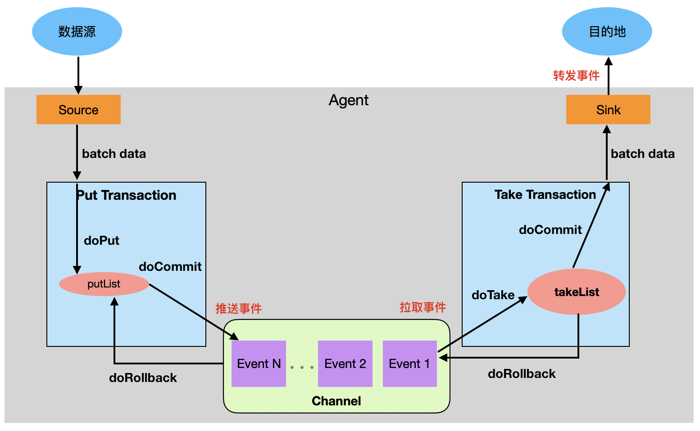
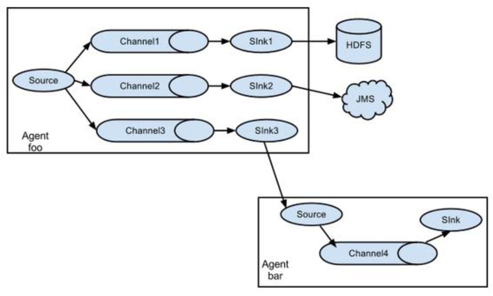
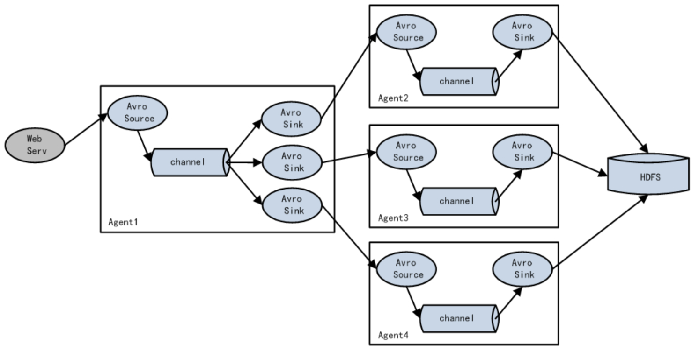
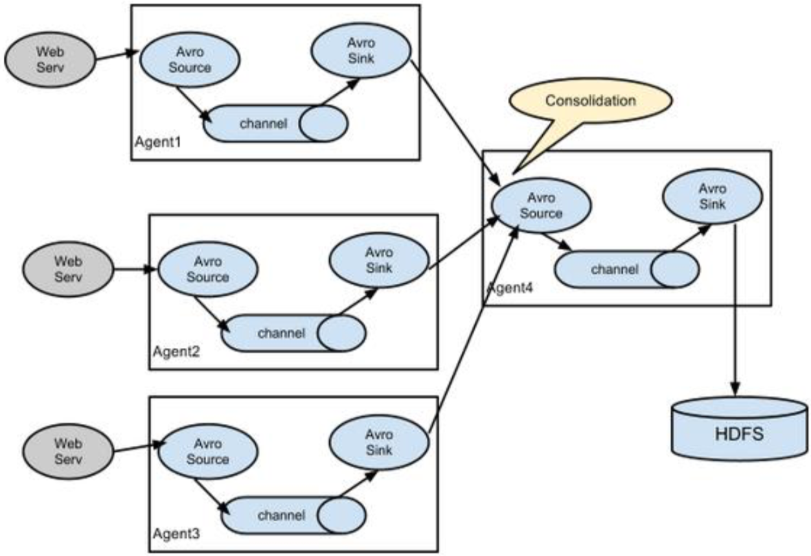

<span id="catalog"></span>

<span style='font-size:18px'>目录<span>

- [概述](#概述)
- [安装](#安装)
- [基本使用](#基本使用)
    - [监控端口数据](#监控端口数据)
    - [ExecSource实时监控单个文件](#ExecSource实时监控单个文件)
    - [ExecSource实时监控单个文件并上传HDFS](#ExecSource实时监控单个文件并上传HDFS)
    - [SpooldirSource监听目录并上传新文件到HDFS](#SpooldirSource监听目录并上传新文件到HDFS)
    - [TaildirSource实现断点续传](#TaildirSource实现断点续传)
- [flume的3中监控方式的比较](#flume的3中监控方式的比较)
- [常用sink](#常用sink)
- [Agent内部原理](#Agent内部原理)
    - [flume事务](#flume事务)
    - [数据传输的流程](#数据传输的流程)
    - [flume的拓扑结构](#flume的拓扑结构)
- [](#)
- [](#)

# 概述
[top](#catalog)
- flume 是 Cloudera 提供的一个高可用、高可靠的，分布式的海量日志采集、聚合和传输的系统
- flume 基于流式架构，灵活简单

- flume的主要作用
    - 实时读取服务器本地磁盘的数据，将数据写入到HDFS
    - <span style='color:red'>只能处理文本数据</span>
- 下载
    - http://flume.apache.org

- flume 基础架构
    - 

- flume中的组件
    - Agent
        - 本质是一个 JVM 进程
        - Agent 以 `Event` 的形式将数据从数据源发送到目的地
        - Agent的 3 个组成部分
            - Source
            - Channel
            - Sink
    - Event
        - 功能
            - flume 中的数据传输的基本单元
        - flume 以 Event 的形式将数据从数据源送到目的地
        - 组成
            - Event = Header + Body
            - Header
                - 保存内容： event 的一些属性
                - 保存结构：kv
            - Body
                - 保存内容：数据
                - 保存结构：字节数组
    - Source
        - 功能
            - 负责接收数据到
        - Source可以处理各种类型、各种格式的日志数据
            - 包括 avro、thrift、exec、jms、spooling directory、netcat、sequence generator、syslog、http、legacy
    - Sink
        - 功能
            - 轮询 Channel 中的 Event
            - 批量的删除 Event，并将 Event 批量的写入到存储或索引系统，或者被发送到另一个 Agent
        - Sink 的目的地包括； hdfs、logger、avro、thrift、ipc、file、HBase、solr、自定义目的地

    - Channel
        - 功能
            - Source 和 Sink 之间的缓冲区
        - 特点
            - Channel 允许 Source 和 Sink 的处理性能不同
            - 线程安全
                - 可以同时处理多个 Source 的写入和多个 Sink 的读取
        - flume自带的 Channel

            |chanel|特性|
            |-|-|
            |Memory Channel，内存队列|数据不安全，程序终止、机器宕机、重启都会导致数据丢失|
            |File Channel|数据安全，会将所有事件写到磁盘，不会丢失数据|
            |Kafka Channel||
        - **sink 与 channel 是 1:n 的关系**

# 安装
[top](#catalog)
- docker cp "apache-flume-1.7.0-bin.tar.gz" nn01:/opt/software
- tar -zxvf apache-flume-1.7.0-bin.tar.gz  -C /opt/module/
- cd /opt/module/apache-flume-1.7.0-bin/conf
- mv flume-env.sh.template flume-env.sh
- 修改 flume-env.sh 内的javahome
    - echo $JAVA_HOME
    - vi flume-env.sh
        - export JAVA_HOME=/opt/module/jdk1.8.0_144

- 不需要启动任务，有任务时，启动一个进程即可

# 基本使用
## 监控端口数据
[top](#catalog)
- 参考； http://flume.apache.org/FlumeUserGuide.html
- 需求
    - 使用 flume 监听端口，收集该端口数据，并打印到控制台
- 实现方式
    1. 通过 netcat 向本地的 44444 端口发送数据
    2. flume 监控本地的 44444 端口，通过 source 读取数据
    3. sink 将数据写到控制台
- 参考配置
    - 
- 实现步骤
    1. 创建 flume agent 配置文件 `flume-netcat-logger.conf`
        ```
        # example.conf: A single-node Flume configuration

        # Name the components on this agent
        # 1. 声明所有组件命名 agent 中的组件
        a1.sources = r1
        a1.sinks = k1
        a1.channels = c1

        # Describe/configure the source
        # 2. source: 指定 source 监听类型、ip、端口号
        a1.sources.r1.type = netcat
        a1.sources.r1.bind = localhost
        a1.sources.r1.port = 44444

        # Describe the sink
        # 3. sink
        a1.sinks.k1.type = logger

        # Use a channel which buffers events in memory
        # 4. channels
        a1.channels.c1.type = memory
        # 配置channel中的event容量，表示最多可以有 1000 个event
        a1.channels.c1.capacity = 1000
        # 每个事务中的event容量
        a1.channels.c1.transactionCapacity = 100

        # Bind the source and sink to the channel
        # 5. 关联 Source、Channel、Sink
        a1.sources.r1.channels = c1
        # sink 与 channel 是 1:n 的关系
        a1.sinks.k1.channel = c1
        ```
    2. 启动flume（相当于开启了一个服务端）
        - 启动指令
            ```
            bin/flume-ng agent \
            --conf conf \
            --conf-file job/flume-netcat-logger.conf \
            --name a1 \
            -Dflume.root.logger=INFO,console
            ```
        - **简写指令**
            ```
            bin/flume-ng agent \
            -n a1 \
            -c conf \
            -f job/flume-netcat-logger.conf \
            -Dflume.root.logger=INFO,console
            ```
    3. 在本地启动 nc
        - nc localhost 44444
    4. 在nc端发送数据
    5. flume接收数据
        ```
        2020-10-24 08:08:34,411 (SinkRunner-PollingRunner-DefaultSinkProcessor) [INFO - org.apache.flume.sink.LoggerSink.process(LoggerSink.java:95)] Event: { headers:{} body: 74 65 73 74                                     test }
        ```

## ExecSource实时监控单个文件
[top](#catalog)
- 需求
    - 实时监控Hive日志
- 基本实现
    1. 创建 flume 配置文件
    2. 执行配置文件，开始监控

- 整体的执行流程
    ```
    hive: 产生新的日志
           │
           │
           V
    日志写入文件: hive.log
           │
           │
           V
    flume---Exec Source: 监听 hive.log 文件
           │
           │
           V
    flume---Memory Channel
           │
           │
           V
    flume---logger Sink
    ```

- 参考配置
    - 

- 实现
    1. 添加配置
        - touch job/file-flume-logger.conf
        - 配置内容
            ```
            # 1. define source, channel, sink
            a1.sources = r1
            a1.sinks = k1
            a1.channels = c1

            # 2. source
            a1.sources.r1.type = exec
            # 监控hive日志的变化。 -f 如果日志发生滚动会失败，不会重启；-F 失败时会重启
            a1.sources.r1.command = tail -F /tmp/root/hive.log

            # 3. sink
            a1.sinks.k1.type = logger

            # 4. channels
            a1.channels.c1.type = memory
            a1.channels.c1.capacity = 1000
            a1.channels.c1.transactionCapacity = 100

            # 5. connect source、channel、sink
            a1.sources.r1.channels = c1
            a1.sinks.k1.channel = c1
            ```
    2. 启动flume任务
        ```
        bin/flume-ng agent \
        -n a1 \
        -c conf \
        -f job/file-flume-logger.conf \
        -Dflume.root.logger=INFO,console
        ```

## ExecSource实时监控单个文件并上传HDFS
[top](#catalog)
- 需求
    - 实时监控Hive日志，并上传到HDFS
- 基本实现
    1. 创建 flume 配置文件
    2. 执行配置文件，开始监控
    3. 开启 hive 生成日志
    4. 查看HDFS上的数据

- 整体的执行流程
    ```
    hive: 产生新的日志
           │
           │
           V
    日志写入文件: hive.log
           │
           │
           V
    flume---Exec Source: 监听 hive.log 文件
           │
           │
           V
    flume---Memory Channel
           │
           │
           V
    flume---HDFS Sink
           │
           │
           V
    将数据写入 HDFS
    ```

- 参考配置
    - 

- flume需要将数据上传到HDFS，所以**flume必须包含Hadoop的相关jar包**
    - 将 jar 包拷贝到 `lib/` 目录下 
        - hadoop-auth-2.x.x.jar
        - commons-io-2.4.jar
        - commons-configuration-1.6.jar
        - hadoop-common-2.x.x.jar
        - htrace-core-3.1.0-incubating.jar
        - hadoop-hdfs-2.x.x.jar
    - flume 1.7 + hadoop 2.10 环境 可以不用单独拷贝jar包
- 实现
    1. 添加配置
        - touch job/file-flume-hdfs-logger.conf
        - 配置内容
            ```
            # 1. define source, channel, sink
            a1.sources = r1
            a1.sinks = k1
            a1.channels = c1

            # 2. source
            a1.sources.r1.type = exec
            a1.sources.r1.command = tail -F /tmp/root/hive.log

            # 3. sink
            # 将输出的目的地改为hdfs
            a1.sinks.k1.type = hdfs
            a1.sinks.k1.hdfs.path = hdfs://nn01:9000/flume/%Y%m%d/%H
            # 文件的前缀 + 后缀
            a1.sinks.k1.hdfs.filePrefix = logs-
            #a1.sinks.k1.hdfs.fileSuffix
            # 文件的滚动周期，滚动大小，滚动数量
            # 滚动大小应该配置成hdfs数据块的大小，而且应该小一点，防止上传时的数据量超过数据块的大小
            # 配置周期，防止长时间没有数据时，能够按照日、时等单位进行滚动
            # 数量一般会关闭（=0）
            a1.sinks.k1.hdfs.rollInterval = 30
            a1.sinks.k1.hdfs.rollSize = 134217700
            a1.sinks.k1.hdfs.rollCount = 0
            # 目录的滚动，可以按照日、时进行目录的滚动，在用hive处理时，相当于数据已经做好了分区，可以直接在hive中使用
            a1.sinks.k1.hdfs.round = true
            a1.sinks.k1.hdfs.roundValue = 1
            a1.sinks.k1.hdfs.roundUnit = hour
            # 使用本地时间戳
            a1.sinks.k1.hdfs.useLocalTimeStamp = true
            # 积攒多少个 Event 才向 HDFS 输出一次
            a1.sinks.k1.hdfs.batchSize = 1000
            # 设置文件类型，可支持压缩
            a1.sinks.k1.hdfs.fileType = DataStream

            # 4. channels
            a1.channels.c1.type = memory
            a1.channels.c1.capacity = 1000
            a1.channels.c1.transactionCapacity = 100

            # 5. connect source、channel、sink
            a1.sources.r1.channels = c1
            a1.sinks.k1.channel = c1
            ```
    2. 启动flume任务，如果HDFS上没有正常生成文件，可以添加`-Dflume.root.logger=INFO,console` 来监视异常
        ```
        bin/flume-ng agent \
        -n a1 \
        -c conf \
        -f job/file-flume-hdfs-logger.conf
        ```

## SpooldirSource监听目录并上传新文件到HDFS
[top](#catalog)
- 需求
    - 实时监控 upload/ 目录，并将新文件上传到HDFS
- 注意事项
    - <span style='color:red'>不能</span>在目录中<span style='color:red'>持续修改文件</span>，只能持续的添加新文件
    - 上传完成的文件会以 `.COMPLETED` 后缀结尾
        - flume会自动添加后缀
        - 后缀可以在配置中修改
    - <span style='color:red'>每 500 毫秒</span>扫描一次目录下的文件变动
    - 如果添加一个 A 文件，将会上传并更名为：`A.COMPLETED`，如果在添加一个 A 文件，则数据可以上传到HDFS，但是本地目录下的文件名无法更改
- 基本实现
    1. 创建 flume 配置文件
    2. 执行配置文件，开始监控
    3. 开启 hive 生成日志
    4. 查看HDFS上的数据

- 整体的执行流程
    ```
      新的文件
           │
           │
           V
      被监控的目录: xxx/
           │
           │
           V
    flume---Spooldir Source: 监听 xxx/ 目录
           │
           │
           V
    flume---Memory Channel
           │
           │
           V
    flume---HDFS Sink
           │
           │
           V
    将文件写入 HDFS
    ```

- 参考配置
    - 

- 实现
    1. 添加配置
        - touch job/dir-flume-hdfs-logger.conf
        - 配置内容
            ```
            # 1. define source, channel, sink
            a1.sources = r1
            a1.sinks = k1
            a1.channels = c1

            # 2. source
            a1.sources.r1.type = spooldir
            a1.sources.r1.spoolDir = /opt/module/apache-flume-1.7.0-bin/upload
            # 表示已上传的文件的后缀名，如果被上传的文件中包含该后缀，则不会被上传
            a1.sources.r1.fileSuffix = .COMPLETED 
            # 忽略以 .tmp 结尾的文件
            a1.sources.r1.ignorePattern = ([^ ]*\.tmp)

            # 3. sink
            # 将输出的目的地改为hdfs
            a1.sinks.k1.type = hdfs
            a1.sinks.k1.hdfs.path = hdfs://nn01:9000/flume/%Y%m%d/%H
            # 文件的前缀 + 后缀
            a1.sinks.k1.hdfs.filePrefix = logs-
            #a1.sinks.k1.hdfs.fileSuffix
            # 文件的滚动周期，滚动大小，滚动数量
            # 滚动大小应该配置成hdfs数据块的大小，而且应该小一点，防止上传时的数据量超过数据块的大小
            # 配置周期，防止长时间没有数据时，能够按照日、时等单位进行滚动
            # 数量一般会关闭（=0）
            a1.sinks.k1.hdfs.rollInterval = 30
            a1.sinks.k1.hdfs.rollSize = 134217700
            a1.sinks.k1.hdfs.rollCount = 0
            # 目录的滚动，可以按照日、时进行目录的滚动，在用hive处理时，相当于数据已经做好了分区，可以直接在hive中使用
            a1.sinks.k1.hdfs.round = true
            a1.sinks.k1.hdfs.roundValue = 1
            a1.sinks.k1.hdfs.roundUnit = hour
            # 使用本地时间戳
            a1.sinks.k1.hdfs.useLocalTimeStamp = true
            # 积攒多少个 Event 才向 HDFS 输出一次
            a1.sinks.k1.hdfs.batchSize = 1000
            # 设置文件类型，可支持压缩
            a1.sinks.k1.hdfs.fileType = DataStream

            # 4. channels
            a1.channels.c1.type = memory
            a1.channels.c1.capacity = 1000
            a1.channels.c1.transactionCapacity = 100

            # 5. connect source、channel、sink
            a1.sources.r1.channels = c1
            a1.sinks.k1.channel = c1
            ```
    2. 启动flume任务
        ```
        bin/flume-ng agent \
        -n a1 \
        -c conf \
        -f job/dir-flume-hdfs-logger.conf
        ```

## TaildirSource实现断点续传
[top](#catalog)
- 整体的执行流程
    ```
      向被监控的文件添加内容
           │
           │
           V
      被监控的目录及文件: xxx/A.txt, yyy/B.txt
           │
           │
           V
    flume---Taildir Source: 监听目录
           │
           │
           V
    flume---Memory Channel
           │
           │
           V
    flume---HDFS Sink
           │
           │
           V
    将文件写入 HDFS
    ```

- 参考配置
    - 

- 实现
    1. 添加配置
        - touch job/tail-flume-hdfs-logger.conf
        - 配置内容
            ```
            # 1. define source, channel, sink
            a1.sources = r1
            a1.sinks = k1
            a1.channels = c1

            # 2. source
            a1.sources.r1.type = TAILDIR
            # 可以配置多个组，每个组只能对应一个文件
            a1.sources.r1.filegroups = f1 f2
            a1.sources.r1.filegroups.f1 = /opt/module/apache-flume-1.7.0-bin/taildir/A.txt
            a1.sources.r1.filegroups.f2 = /opt/module/apache-flume-1.7.0-bin/taildir/B.txt
            # 保存数据文件中的写入位置，提供断点续传的依据
            a1.sources.r1.positionFile = /opt/module/apache-flume-1.7.0-bin/tail_dir.json

            # 3. sink
            # 将输出的目的地改为hdfs
            a1.sinks.k1.type = hdfs
            a1.sinks.k1.hdfs.path = hdfs://nn01:9000/flume/%Y%m%d/%H
            # 文件的前缀 + 后缀
            a1.sinks.k1.hdfs.filePrefix = logs-
            #a1.sinks.k1.hdfs.fileSuffix
            # 文件的滚动周期，滚动大小，滚动数量
            # 滚动大小应该配置成hdfs数据块的大小，而且应该小一点，防止上传时的数据量超过数据块的大小
            # 配置周期，防止长时间没有数据时，能够按照日、时等单位进行滚动
            # 数量一般会关闭（=0）
            a1.sinks.k1.hdfs.rollInterval = 30
            a1.sinks.k1.hdfs.rollSize = 134217700
            a1.sinks.k1.hdfs.rollCount = 0
            # 目录的滚动，可以按照日、时进行目录的滚动，在用hive处理时，相当于数据已经做好了分区，可以直接在hive中使用
            a1.sinks.k1.hdfs.round = true
            a1.sinks.k1.hdfs.roundValue = 1
            a1.sinks.k1.hdfs.roundUnit = hour
            # 使用本地时间戳
            a1.sinks.k1.hdfs.useLocalTimeStamp = true
            # 积攒多少个 Event 才向 HDFS 输出一次
            a1.sinks.k1.hdfs.batchSize = 1000
            # 设置文件类型，可支持压缩
            a1.sinks.k1.hdfs.fileType = DataStream

            # 4. channels
            a1.channels.c1.type = memory
            a1.channels.c1.capacity = 1000
            a1.channels.c1.transactionCapacity = 100

            # 5. connect source、channel、sink
            a1.sources.r1.channels = c1
            a1.sinks.k1.channel = c1
            ```
    2. 启动flume任务
        ```
        bin/flume-ng agent \
        -n a1 \
        -c conf \
        -f job/tail-flume-hdfs-logger.conf \
        -Dflume.root.logger=INFO,console
        ```

# flume的3中监控方式的比较
[top](#catalog)
- Exec source 适用于监控一个实时追加的文件。因为每次读取多条，可能会导致数据丢失
- Spooldir Source 能够保证数据不丢失，且能够实现断点续传，但延迟较高，不能实时监控
- Taildir Source 既能够实现断点续传，又可以保证数据不丢失，还能够进行实时监控
    - <span style='color:red'>需要设置 position 文件，来保存断点的位置</span>

# 常用sink
[top](#catalog)
- logger 常用与测试
- hdfs
- file，输出到本地
- avro-flume，用于连接其他的flume-agent

# Agent内部原理
## flume事务
[top](#catalog)
- 事务结构
    - 

- Put事务
    1. doPut：先将数据写入临时缓冲区putList
    2. doCommit： 检查 channel 内存队列是否充足
    3. doRollback：如果channel空间不足，回滚数据到putList

- Take事务
    1. doTake：将数据写入临时缓冲区takeList
    2. doCommit：sink拉取数据，将数据发送给sink
    ，如果发送成功，则清空tableList
    3. doRollback：数据发送如果发生异常，则将 tabkelist
的数据回滚到channel队列

## 数据传输的流程
[top](#catalog)
- 传输流程图
    - 
- ChannelSelector
    - 作用
        - 选出写入 Event 的 Channel 列表
    - 两种类型
        - Replicating，副本拷贝，**默认选择器**
            - 将Event拷贝到所有已绑定的 Channel
            - 示例
                ```
                a1.sources = r1
                a1.channels = c1 c2 c3
                a1.sources.r1.selector.type = replicating
                a1.sources.r1.channels = c1 c2 c3
                a1.sources.r1.selector.optional = c3
                ```
        - Multiplexing，多路复用
            - 会在 N 个已绑定的 Channel 中进行选择
            - 需要在配置文件中添加**选择策略**
            - 需要配合**拦截器**使用，来添加`state`头信息
            - 示例
                ```
                a1.sources = r1
                a1.channels = c1 c2 c3 c4
                a1.sources.r1.selector.type = multiplexing
                # 在 Event 的 header 中添加数据: state，来辅助选择策略的执行
                # {state: CZ/US}，根据state具体的数据来选择，如果没有设置，则使用 Default 中指定的 channel
                a1.sources.r1.selector.header = state
                a1.sources.r1.selector.mapping.CZ = c1
                a1.sources.r1.selector.mapping.US = c2 c3
                a1.sources.r1.selector.default = c4
                ```

- SinkProcessor
    - DefaultSinkProcessor，对应单个的 Sink，**默认选择器**
    - LoadBalancingSinkProcessor，对应SinkGroup
        - 可以实现负载均衡
    - FailoverSinkProcessor，对应SinkGroup
        - 可以实现故障转移
        - 优先往某一个sink发送，如果sink挂了，再想其他sink发送
            - flume会定期尝试访问已经挂掉的sink。每次尝试后**重新访问的时间加倍**

## flume的拓扑结构
[top](#catalog)
- agent 串联
    - 顺序连接多个 agent，从第一个 source 开始到最终 sink 传送的目的地
    - 不建议桥接过多的 agent
        - agent 数量过多不仅会影响传输速率
        - 如果某个节点的 agent 宕机，会影响整个传输系统
    - 

- 复制和多路复用
    - 将相同数据复制到多个 channel 中，或者将不同数据分发到不同的 channel 中
    - 在 sink 端可以选择传送到不同的目的地
    - 

- 负载均衡和故障转移
    - 将多个 sink 逻辑上分到一个 sink 组
    - sink 组配合不同的 SinkProcessor 可以实现负载均衡和错误恢复
    - 

- 聚合
    - 最常见、最实用的结构
    - web 应用通常分布在成百上千个服务器，日志处理和复杂。可以通过**聚合结构**来处理
    - 处理方式
        1. 每台服务器部署一个 flume 采集日志
        2. 每个服务器再将日志**传送**到一个**集中收集日志**的 flumeX
        3. 再由 flumeX 将数据上传到 hdfs、hive、hbase 等，进行日志分析
    - 

# 实际应用
## 复制和多路复用
[top](#catalog)


[top](#catalog)

# 其他
[top](#catalog)
- 启动 nc
    - nc 启动服务端
        - nc -lk 44444
    - nc 启动客户端
        - nc 主机名 44444
- tail 是按行读取数据的，效率比较低
a1.sources.r1.command = tail -F /tmp/root/hive.log
