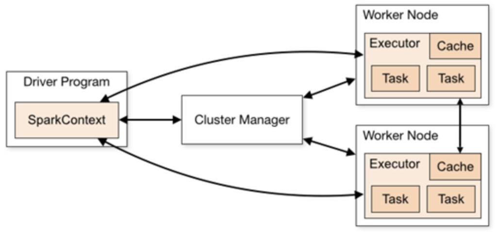
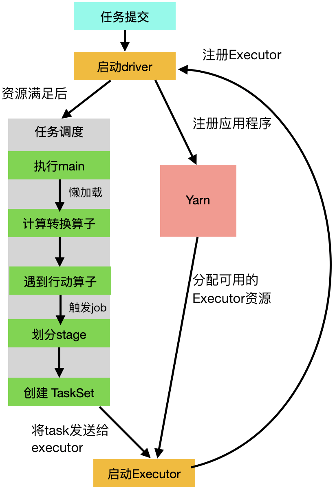

<span id="catalog"></span>

<span style='font-size:18px'>目录---spark的基本概念</span>

- [Spark说明](#Spark说明)
- [hadoop1.x版本的问题](#hadoop1.x版本的问题)
- [spark与hadoop对比](#spark与hadoop对比)
    - [spark与hadoop--主要区别](#spark与hadoop--主要区别)
    - [spark与hadoop--如何选择](#spark与hadoop--如何选择)
- [spark运行架构](#spark运行架构)
    - [spark基本架构](#spark基本架构)
    - [driver](#driver)
    - [executor](#executor)
    - [master-worker](#master-worker)
    - [ApplicationMaster](#ApplicationMaster)
- [spark的核心概念](#spark的核心概念)
    - [executor和core](#executor和core)
    - [并行度](#并行度)
    - [DAG---有向无环图](#DAG---有向无环图)
    - [提交流程---Yarn环境](#提交流程---Yarn环境)
- [](#)

# Spark说明
[top](#catalog)
- Spark是一种基于内存的快速、通用、可扩展的计算引擎
- 一般的工作方式
    - spark on yarn
    - 即: yarn负责资源管理，spark 负责计算
- 核心模块
    - spark core
        - 提供了spark中最基础、最核心的功能
    - spark sql
    - spark streaming
        - 对实时数据做流式计算的组件，提供了处理数据流的API
    - spark MLlib
    - spark GraphX
        - 图计算框架与算法库

# hadoop1.x版本的问题
[top](#catalog)
- 在架构的角度存在很多的问题
    1. namenode 是单点操作，所以容易出现单点故障，制约了HDFS的发展
    2. namenode 的内存限制也影响了HDFS的发展
    3. mapReduce是一种基于数据集的工作模式，面向数据
        - 这种工作模式的工作流程
            1. 一般从存储上加载数据集
            2. 操作数据集
            3. 最后将结果写入物理存储
        - **数据更多支持的是一次性计算，不是迭代计算**
    4. 资源调度、任务调度耦合在一起，无法扩展，所以hadoop1.x版只支持MR计算框架

# spark与hadoop对比
## spark与hadoop--主要区别
[top](#catalog)
- 核心思想
    - hadoop
        - map reduce
    - spark
        - spark核心思想基于MR
        - 优化了MR数据处理的中间过程，提升了数据处理的性能
- 开发语言
    - hadoop
        - 使用java开发
    - spark
        - 使用scala开发，支持函数式编程，所以利于迭代计算
- 计算模型
    - hadoop 只有 mapper、reducer
    - spark的计算模型更加丰富
        - spark的计算模型模糊的MR的边界，更容易使用

- 多个作业之间的数据通信问题
    - hadoop在**连续MR运算**时，中间操作结果需要<span style='color:red'>落盘</span>，才能继续下一个运算
        - 落盘操作会与硬盘发生IO操作，这严重影响了性能
            ```
            mapper -->data reduce --> disk --> mapper -->data --> reduce
                   -->data               落盘             -->data
                   -->data                            -->data
            ```
    - spark 的中间操作是基于内存的
            ```
            mapper -->data reduce --> cache --> mapper -->data --> reduce
                   -->data                             -->data
                   -->data                             -->data
            ```
- spark Task的启动时间快
- 线程的创建方式
    - spark 采用 fork 线程的方式
    - Hadoop采用创建新的进程的方式
- spark 的缓存机制比 HDFS 的缓存机制高效
- 用途不同
    - hadoop 存储
    - spark 计算

## spark与hadoop--如何选择
[top](#catalog)
- 在绝大多数的数据计算场景中，Spark比MapReduce更有优势
- spark 并不能完全替代 Hadoop，需要根据情况选择
- 内存大小导致的选择
    - spark基于内存，在生产环境中，受限与内存
        - 内存不够时，会导致 job 执行失败
    - 内存不足时，可以使用MapReduce


# spark运行架构
## spark基本架构
[top](#catalog)
- spark采用标准的 `master-slave` 结构
    - 
- driver
    - 表示 master，负责管理整个集群中的作业任务调度
- executor
    - 表示 slave，负责执行任务
- task
    - 表示任务的计算逻辑，和参与计算的数据
    - 由driver负责划分，并发送给 executor 进行执行

## driver
[top](#catalog)
- 主要作用
    - 启动程序
    - 负责执行spark任务中的 `main` 方法
    - 负责实际代码的执行
- driver 在作业执行时的任务
    - 将用户程序转化为作业 job
    - 调度 executor 需要执行的任务
    - 跟踪 executor 的执行情况
    - 通过 ui 展示、查询 job 的运行情况
- 在实际开发中，一般不会涉及到 driver
- driver 本质上是一个线程，实际的处理都由 SparkContext 来执行
    - 一般会将 SparkContext 成为 Driver

## executor
[top](#catalog)

- 主要作用
    - **负责运行计算任务**
- 也可以称为 <span style='color:red'>计算对象</span>
- executor 是集群中的某台机器上运行的一个JVM进程，**一台机器可以启动多个 executor**
    - 即: <span style='color:red'>executor 不与机器绑定</span>
- 一个 executor 内可以有**多个任务，任务间相互独立**

- executor 被调度的过程
    - spark应用启动时， executor节点同时启动
    - 存在于 spark应用的 **整个生命周期**
    - 如果某个 executor 发生故障，计算会被调度到其他 executor 节点运行

- executor 的两个主要功能
    - 负责运行 driver 发送的任务，并将结果返回给 driver
    - 通过自身的块管理器（Block Manager）在程序需要缓存RDD时，提供内存式存储
        - RDD 直接缓存在 executor 进程内，可以在运行时充分利用缓存数据加速运算

## master-worker
[top](#catalog)
- 只在 spark 集群的独立部署环境中，存在 master、worker 的概念
    - spark的独立部署环境不依赖于其他的资源调度框架，自身就实现了资源调度
    - 通过 master 和 worker 实现资源的调度、分配 和任务执行
- master
    - 负责资源的调度和分配
    - 监控集群
    - 类似于 Yarn 的 RM
- worker
    - 一个worker运行在集群中的一台服务器上
    - 由 master 分配资源，负责对数据进行并行的处理和计算
    - 类似于 Yarn 的 NM

## ApplicationMaster
[top](#catalog)
- spark 运行在 Yarn 时，需要 `ApplicationMaster`
    - 向 Yarn 集群提交应用程序时，提交程序中需要包含 `ApplicationMaster`
- `ApplicationMaster` 的功能
    -  用于向**资源调度器**申请执行任务的**资源容器 Container**
    - 在 Container 中，运行任务，并监控任务状态、处理异常
- Yarn 的RM 和 spark 的 driver 通过 `ApplicationMaster` 进行解耦

# spark的核心概念
## executor和core
[top](#catalog)
- executor 是集群中运行在工作节点中的一个JVM进程，负责计算
- 在提交应用时，可以指定 executor 使用的**内存大小**和**虚拟CPU核**数量
- 提交应用时的参数

    |参数名|功能|
    |-|-|
    |--num-executors|设置 executor 的数量|
    |--executor-memory|设置每个 executor 的内存大小|
    |--executor-cores|配置每个 executor 的虚拟 CPU core 数|

## 并行度
[top](#catalog)
- 整个集群并行执行任务的数量称为 `并行度`

## DAG---有向无环图
[top](#catalog)
- spark 中的 DAG是: 由 spark 程序直接映射成的**数据流**的**高级抽象模型**
    - 本质就是: 用**图形**表示**执行过程**
    - 更易于表示程序的拓扑结构

## 提交流程---Yarn环境
[top](#catalog)
- 在 Yarn 环境中的基本提交流程
    - 
- 提交流程中的两个任务
    - 两个任务
        1. 申请资源
        2. 计算任务调度
    - 两个任务基本上是同时进行的
    - 最后，两个任务会汇总到各个 executor 中
    - 当 executor 获取到 **资源** 与 **任务** 后，就可以开始计算了

- Yarn Client 模式
    - Client 模式
        - 监控和调度的 Driver 任务提交时的本地机器上运行
        - 一般用于测试
    - 执行流程
        1. 启动 Driver
        2. Driver 和 RM 通讯，申请启动 ApplicationMaster
        3. RM 分配计算资源，在闲置的 NN 上启动 ApplicationMaster
        4. ApplicationMaster 向 RM 申请 Executor 的内存
        5. RM 分配计算资源，将 Executor 发送给闲置的 NN，并启动 Executor 进程
        6. Executor 进程启动后会向Driver反向注册，Executor全部注册完成后Driver开始执行main函数
        7. 遇到行动算子时，触发一个Job，并根据宽依赖开始划分 stage，每个 stage 生成对应的 TaskSet
        8. Driver 将 task 分发到各个 Executor，并执行

- Yarn Cluster 模式
    - Cluster模式
        - 监控和调度的 Driver 在Yarn集群资源中执行
        - 一般应用于实际生产环境
    - 执行流程
        1. 提交任务到 Yarn 
        2. RM 搜素空闲 NN，并启动 ApplicationMaster，并**作为 Driver**
        3. Driver 向 RM 申请Executor内存
        4. RM 搜索空闲 NN，并在空闲的 NN 上启动 Executor 进程
        5. Executor 启动后，向 Driver 反向注册
        6. Executor 全部注册完成后，Driver 开始执行 main 函数
        7. 遇到行动算子时，触发一个Job，并根据宽依赖开始划分 stage，每个 stage 生成对应的 TaskSet
        8. Driver 将 task 分发到各个 Executor，并执行

[top](#catalog)