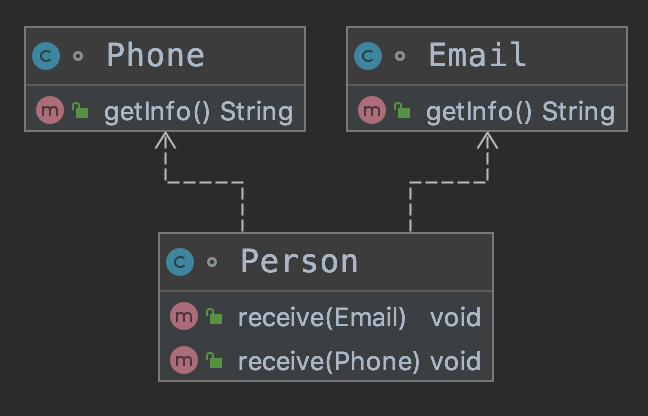

- 参考
    - https://www.bilibili.com/video/av57936239

<span id="catalog"></span>

### 目录
- [设计模式简介](#设计模式简介)
- [设计模式七大原则](#设计模式七大原则)
- [单一职责原则](#单一职责原则)
- [接口隔离原则](#接口隔离原则)
- [依赖倒转原则](#依赖倒转原则)
    - [如何使用依赖倒转原则](#如何使用依赖倒转原则)
    - [依赖关系传递的三种方式和应用案例](#依赖关系传递的三种方式和应用案例)
    - [依赖倒转原则的注意事项和细节](#依赖倒转原则的注意事项和细节)
- [](#)
- [](#)
- [](#)
- [](#)

# 设计模式简介
[top](#catalog)
- 经常会被问到的问题：用过什么设计模式，怎么使用的，解决了什么问题
- 软件使用设计模式的目的

    |No|目的|实际意义|
    |-|-|-|
    |1|代码重用|相同功能的代码，不用多次编写|
    |2|可读性|待的规范性，便于其他人的阅读和理解|
    |3|可扩展性|当需要添加新的功能是，非常的方便，也称为可维护性|
    |4|可靠性|当增加新的功能后，对原来的功能没有影响|
    |5|高内聚，低耦合||
    
- 设计模式需要思考内容：**如何使用项目结构更加合理**，而不是如何实现
- 设计模式包含了面向对象的精髓
- 设计模式在软件中的那些位置会用到？
    - 功能模块 = 设计模式 + 算法(数据结构)
    - 框架 = 多种设计模式

# 设计模式七大原则
[top](#catalog)
- 什么是设计原则
    - 设计原则就是**编写程序时，应该遵守的原则**
    - 设计原则是**各种设计模式的基础**，即各个模式的设计依据
    
- 设计模式常用的七大原则
    1. 单一职责原则
    2. 接口隔离原则
    3. 依赖倒转原则
    4. 里氏替换原则
    5. 开闭原则ocp
    6. 迪米特法则
    7. 合成复用原则
    
# 单一职责原则
[top](#catalog)
- SingleReponsibility
- 基本介绍：对类来说，即<label style="color:red">一个类应该只负责一项职责</label>
- 多职责的问题？
    - 如果存在A负责两个不同职责：`职责1`、`职责2`，当`职责1`需要改变A时，可能会造成`职责2`的执行错误
    - 为了避免为题，可以将类A分解为A1、A2
    
- 结合实例说明:交通工具的功能分解
    - 方案1
        - 参考：[/designPattern/dplearn/dplearn-base/src/main/java/com/ljs/learn/principle/singleresponsibility/SingleResponsibility1.java](/designPattern/dplearn/dplearn-base/src/main/java/com/ljs/learn/principle/singleresponsibility/SingleResponsibility1.java)
        - 打印结果的问题：`vehicle.run("飞机");`，打印了飞机正在路上行驶，这不符合常识
        - 方案1的问题：所有功能集中在run方法中，违反了单一职责原则，导致了不符合常识的打印内容
        - 解决方案：根据交通工具的运行方法，分解成不同类 --> 方案2
        - 代码
            ```java
            // 客户端
            public class SingleResponsibility1 {
                public static void main(String[] args) {
                    Vehicle vehicle = new Vehicle();
                    vehicle.run("摩托车");//摩托车正在路上行驶
                    vehicle.run("汽车"); //汽车正在路上行驶
                    vehicle.run("飞机"); //打印：飞机正在路上行驶，不符合常识
                }
            }
            
            // 交通工具
            class Vehicle{
                public void run(String vehicle){
                    System.out.println(vehicle + "正在路上行驶");
                }
            }
            ```
    - 方案2
        - 参考：[/designPattern/dplearn/dplearn-base/src/main/java/com/ljs/learn/principle/singleresponsibility/SingleResponsibility2.java](/designPattern/dplearn/dplearn-base/src/main/java/com/ljs/learn/principle/singleresponsibility/SingleResponsibility2.java)
        - 方案2的优点：不同的类负责不同的功能，遵守了单一职责原则
        - 方案2的问题：在方案1的基础上**做了非常大的改动**，同时修改了类和客户端
        - 解决方案：直接修改Vehicle类，改动的代码会比较少 --> 方案3
        - 代码：
            ```java
            // 客户端
            public class SingleResponsibility2 {
                public static void main(String[] args) {
                    RoadVehicle roadVehicle = new RoadVehicle();
                    roadVehicle.run("摩托车");//摩托车正在路上行驶
            
                    AirVehicle airVehicle = new AirVehicle();
                    airVehicle.run("飞机");//飞机正在飞行
            
                    WaterVehicle waterVehicle = new WaterVehicle();
                    waterVehicle.run("船"); //船正在水中行驶
                }
            }
            
            // 交通工具
            class RoadVehicle{
                public void run(String vehicle){
                    System.out.println(vehicle + "正在路上行驶");
                }
            }
            
            class AirVehicle{
                public void run(String vehicle){
                    System.out.println(vehicle + "正在飞行");
                }
            }
            
            class WaterVehicle{
                public void run(String vehicle){
                    System.out.println(vehicle + "正在水中行驶");
                }
            }
            ```
    - 方案3
        - 参考：[/designPattern/dplearn/dplearn-base/src/main/java/com/ljs/learn/principle/singleresponsibility/SingleResponsibility3.java](/designPattern/dplearn/dplearn-base/src/main/java/com/ljs/learn/principle/singleresponsibility/SingleResponsibility3.java)
        - 方案3的优点：这种修改方法没有对原来的类做过多的修改，只是增加了方法
        - 方案3的问题：没有在类这个级别上遵守单一职责原则，**只是在方法级别上，遵守了单一职责**
        - 代码
            ```java
            // 客户端
            public class SingleResponsibility3 {
                public static void main(String[] args) {
                    Vehicle2 vehicle2 = new Vehicle2();
                    vehicle2.run("汽车");
                    vehicle2.runAir("飞机");
                    vehicle2.runWater("船");
                }
            }
            
            // 交通工具
            class Vehicle2{
                public void run(String vehicle){
                    System.out.println(vehicle + "正在路上行驶");
                }
            
                public void runAir(String vehicle){
                    System.out.println(vehicle + "正在飞行");
                }
            
                public void runWater(String vehicle){
                    System.out.println(vehicle + "正在水中行驶");
                }
            }
            ```
        
- **单一原则的注意事项和细节**
    - 降低类的复杂度，一个类只负责一项职责
    - 提高类的可读性，可维护性
    - 降低变更带来的风险
        - 如使使用的是`方式2`，则哪种类别需要变更就改哪个类，不会影响其他类的功能
        - 如果使用的是`方式3`，则哪种别需要变更就改哪个方法，不会影响其他方法的功能
        - 如果使用方式1，则改动都集中在一个方法中，会降低可维护性
    - 通常情况下，应当遵守单一职责原则，但是特殊情况下可以进行**退化**
        1. 只有在逻辑足够简单时，才能在代码级别违反单一职责原则
        2. 只有类中方法数量足够少时，才可以在方法级别保持单一职责原则，如`方式2`
    
# 接口隔离原则
[top](#catalog)
- Interface Segregation Principle
- 基本介绍：客户端不应该依赖他不需要的接口，即<label style="color:red">一个类对另一个类的依赖应该建立在最小的接口上</label>
- 接口冗余的示例说明
    - 示例的UML图
        - 
    - 示例代码：[/designPattern/dplearn/dplearn-base/src/main/java/com/ljs/learn/principle/interfaceSegregation/origian/Segregation1.java](/designPattern/dplearn/dplearn-base/src/main/java/com/ljs/learn/principle/interfaceSegregation/origian/Segregation1.java)
    - 依赖关系
        1. B、D是接口Interface1的接口
        2. A通过Interface1依赖B，但是A只会使用到接口中的1、2、3方法；4、5方法没有使用，导致B中产生了多余的实现
        3. C通过Interface1依赖D，但是C只会使用到接口中的1、4、5方法；2、3方法没有使用，导致D中产生了多余的实现
    - 接口冗余的问题
        - 类A通过接口Interface1依赖类B，类C通过接口Interface1依赖D，**如果接口Interface1对于类A和类C不是最小接口，那么类B和类B必须去实现他们不需要的方法**
- 接口隔离原则的处理方式
    - 将接口Interface1拆分为独立的几个接口，类A和类C分别与他们需要的接口建立依赖关系
    - 将接口Interface1中出现的方法，根据实际情况拆分为3个接口
- 接口冗余的改进
    - 改进的UML图
        - 
    - 示例代码：[/designPattern/dplearn/dplearn-base/src/main/java/com/ljs/learn/principle/interfaceSegregation/improve/Segregation2.java](/designPattern/dplearn/dplearn-base/src/main/java/com/ljs/learn/principle/interfaceSegregation/improve/Segregation2.java)
    - 依赖关系
        - B实现了`Interface1`和`Interface2`
        - D实现了`Interface1`和`Interface3`
        - A通过`Interface1`和`Interface2`接口来依赖B
        - C通过`Interface1`和`Interface2`接口来依赖D
    - 改进后的优点
        - 接口实现类中没有多余的实现
        - 类之间的依赖都建立在最小的接口上


# 依赖倒转原则
## 如何使用依赖倒转原则
[top](#catalog)
- Dependency Inversion Principle
- 中心思想
    - 中心思想是面向接口编程
    - 高层模块不应该依赖低层模块，二者都应该依赖抽象
    - 抽象不应该依赖细节，细节应该依赖抽象
- 依赖倒转原则的设计理念
    - 相对于细节的多变性，抽象的东西要稳定的多，以抽象为基础搭建的架构比以细节为基础搭建的架构要稳定的多。
- 依赖倒转原则在java中的体现
    - `抽象=接口、抽象类`
    - `细节=具体的实现类`
    - 使用接口或抽象类的目的是制定好规范，**而不涉及任何具体的操作**，把展现细节的任务交给他们的实现类去完成

- 直接依赖的示例说明：接受消息的功能
    - 示例的UML图
        - 
    - 代码：[/designPattern/dplearn/dplearn-base/src/main/java/com/ljs/learn/principle/dependencyInversion/origian/DependencyInversion1.java](/designPattern/dplearn/dplearn-base/src/main/java/com/ljs/learn/principle/dependencyInversion/origian/DependencyInversion1.java)
        
        ```java
        public class DependencyInversion1 {
            public static void main(String[] args) {
                Person person = new Person();
                person.receive(new Email());
                person.receive(new Phone());
            }
        }
        
        class Email{
            public String getInfo(){
                return "email Info ";
            }
        }
        
        class Phone{
            public String getInfo(){
                return "phone Infor";
            }
        }
        
        // 完成接受消息的功能
        class Person {
            // 分别接收不同信息
            public void receive(Email email){
                System.out.println(email.getInfo());
            }
        
            public void receive(Phone phone){
                System.out.println(phone.getInfo());
            }
        }
        ```
    - 直接依赖的问题
        - 每当新增信息源时，都需要新增一个对应类，并且在Person中也要增加相应的接收方法重载
    - 解决方案：
        - 引入一个接口IReceive，表示接收者，使Person类只与接口IReceive发生依赖
        - Email，Wexin等等都属于接收者的范畴，这些类分别实现IReceive接口，来完成依赖的倒转

- 通过依赖倒转原则来解决示例的问题
    - 改善后的UML图
        - 
        - 代码：[/designPattern/dplearn/dplearn-base/src/main/java/com/ljs/learn/principle/dependencyInversion/improve/DependencyInversion2.java](/designPattern/dplearn/dplearn-base/src/main/java/com/ljs/learn/principle/dependencyInversion/improve/DependencyInversion2.java)
            ```java
            public class DependencyInversion2 {
                public static void main(String[] args) {
                    Person person = new Person();
                    person.receive(new Email());
                    person.receive(new Phone());
                    person.receive(new Weixin());
                }
            }
            
            // 引入一个接口IReceive，表示接受者
            interface IReceive{
                String getInfo();
            }
            class Email implements IReceive{
                public String getInfo(){
                    return "email Info ";
                }
            }
            
            class Phone implements IReceive{
                public String getInfo(){
                    return "phone Infor";
                }
            }
            
            class Weixin implements IReceive{
                public String getInfo(){
                    return "weixin Infor";
                }
            }
            
            // 完成接受消息的功能
            class Person {
                // 与接口IReceive发生依赖，来接收不同的信息
                public void receive(IReceive receiver){
                    System.out.println(receiver.getInfo());
                }
            }
            ```
    - 改进后的优点
        - Person依赖于接口IReceive，每次增加新的信息源时，不需要修改Person，只需要添加IReceive的实现类
        - 由由于Person依赖于接口IReceive，自需要一个方法来处理接口的实例对象，减少了不必要的重载方法
        
## 依赖关系传递的三种方式和应用案例
[top](#catalog)
- 三种传递方式
    1. 接口传递
    2. 构造方法传递
    3. setter方式传递

- **接口传递**的应用
    - 使用方法：在主要方法中声明接口参数，来传递依赖
    - 参考代码：[/designPattern/dplearn/dplearn-base/src/main/java/com/ljs/learn/principle/dependencyInversion/threePattern/first/DeliverByInterface.java](/designPattern/dplearn/dplearn-base/src/main/java/com/ljs/learn/principle/dependencyInversion/threePattern/first/DeliverByInterface.java)
        ```java
        public class DeliverByInterface {
            public static void main(String[] args) {
                //创建一个电视机
                ITV mytv = new MyTV();
                //创建一个开关
                IOpenAndClose openAndClose = new OpenAndClose();
        
                //通过接口将依赖传递到类中
                openAndClose.open(mytv);
            }
        }
        
        //电视机接口
        interface ITV{
            void play();
        }
        
        //电视机开关接口 通过接口来传递依赖
        interface IOpenAndClose {
           void open(ITV tv);
        }
        
        //电视机开关接口的实现
        class OpenAndClose implements IOpenAndClose{
        
            // 通过接口将依赖传递到了类内部
            @Override
            public void open(ITV tv) {
                tv.play();
            }
        }
        
        // 电视机接口
        class MyTV implements ITV {
        
            @Override
            public void play() {
                System.out.println("myTV is showing");
            }
        }
        ```
    - UML类图
        - 
        
- 构造方法传递
    - 接口之间完全看不出依赖关系，只是通过实现类的构造器来关联
    - 使用方法：
        1. 在实现类中添加用来保存依赖接口对象的属性
        2. 创建带参数的构造器，将依赖传入，并保存在对象中
        3. 使用时，直接使用对象内部保存的依赖对象
    - 参考代码：[/designPattern/dplearn/dplearn-base/src/main/java/com/ljs/learn/principle/dependencyInversion/threePattern/second/DeliverByConstructor.java](/designPattern/dplearn/dplearn-base/src/main/java/com/ljs/learn/principle/dependencyInversion/threePattern/second/DeliverByConstructor.java)
        ```java
        // 依赖关系传递的三种方式和应用案例
        // 构造方法传递
        public class DeliverByConstructor {
            public static void main(String[] args) {
                // 创建一个电视
                ITV mytv = new MyTV();
                // 创建一个开关
                // 创建时，将电视作为依赖传递到开关中
                IOpenAndClose openAndClose = new OpenAndClose(mytv);
        
                // 直接调用方法
                openAndClose.open();
            }
        }
        
        // 从接口上看，两个接口ITV和IOpenAndClose没有直接的关系
        interface ITV {
            void play();
        }
        
        interface IOpenAndClose{
            void open();
        }
        
        // 在实现类中，将ITV的实现类对象作为私有属性，通过构造方法传递依赖
        class OpenAndClose implements IOpenAndClose{
            private ITV tv;
        
            public OpenAndClose(ITV tv) {
                this.tv = tv;
            }
        
            // 调用依赖对象的方法
            @Override
            public void open() {
                tv.play();
            }
        }
        
        class MyTV implements ITV{
        
            @Override
            public void play() {
                System.out.println("MyTV is showing");
            }
        }
        ```
    - UML类图
        - 
        
- setter方式传递
    - 使用方法
        1. 在实现类中添加用来保存依赖接口对象的属性
        2. 在接口中添加一个setter方法，用来保存依赖
        3. 使用时，直接使用对象内部保存的依赖对象
    - 与`构造方法传递`类似，只不过**传递依赖的时间被推迟了**
    - 参考代码：[/designPattern/dplearn/dplearn-base/src/main/java/com/ljs/learn/principle/dependencyInversion/threePattern/third/DeliverBySetter.java](/designPattern/dplearn/dplearn-base/src/main/java/com/ljs/learn/principle/dependencyInversion/threePattern/third/DeliverBySetter.java)
        ```java
        public class DeliverBySetter {
            public static void main(String[] args) {
                //创建一个电视机
                ITV mytv = new MyTV();
                //创建一个开关
                IOpenAndClose openAndClose = new OpenAndClose();
        
                //通过setter将依赖传递到开关中
                openAndClose.setTv(mytv);
                //执行fangf
                openAndClose.open();
            }
        }
        
        interface ITV {
            void play();
        }
        
        interface IOpenAndClose{
            void open();
            void setTv(ITV tv);
        }
        
        // 在实现类中，将ITV的实现类对象作为私有属性，通过setter方法传递依赖
        class OpenAndClose implements IOpenAndClose{
            private ITV tv;
        
            public void setTv(ITV tv) {
                this.tv = tv;
            }
        
            @Override
            public void open() {
                tv.play();
            }
        }
        
        class MyTV implements ITV {
        
            @Override
            public void play() {
                System.out.println("MyTV is showing");
            }
        }
        ```
    - UML类图
        - 
        
## 依赖倒转原则的注意事项和细节
[top](#catalog)
- 底层模块尽量都要有抽象类或接口，或者两者都有，程序的稳定性更好
- **变量的声明类型尽量是抽象类或接口**，这样我们的变量引用和实际对象间，就存在一个缓冲层，利于程序扩展和优化
- 继承时需要遵守里氏替换原则