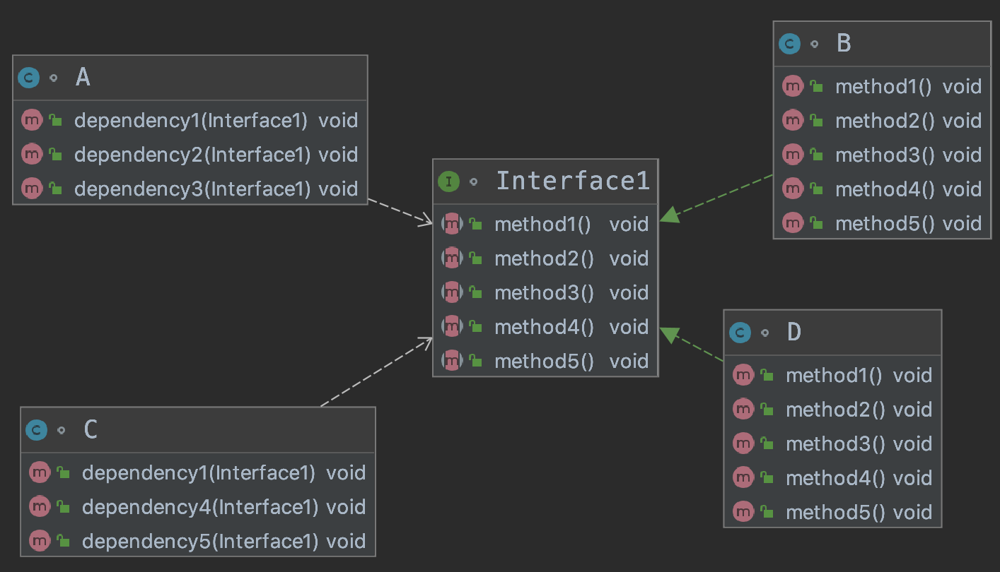
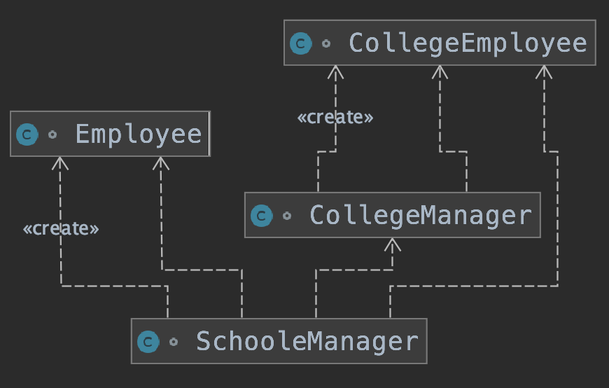
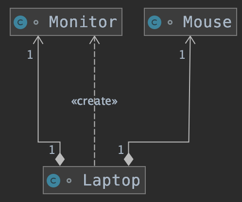

- 参考
    - https://www.bilibili.com/video/av57936239

<span id="catalog"></span>

### 目录
- [设计模式简介](#设计模式简介)
- 设计原则
    - [设计模式七大原则](#设计模式七大原则)
    - [设计原则核心思想](#设计原则核心思想)
    - [单一职责原则](#单一职责原则)
    - [接口隔离原则](#接口隔离原则)
    - [依赖倒转原则](#依赖倒转原则)
        - [如何使用依赖倒转原则](#如何使用依赖倒转原则)
        - [依赖关系传递的三种方式和应用案例](#依赖关系传递的三种方式和应用案例)
        - [依赖倒转原则的注意事项和细节](#依赖倒转原则的注意事项和细节)
    - [里氏替换原则](#里氏替换原则)
        - [什么是里氏替换原则](#什么是里氏替换原则)
        - [OO中的继承性思考和说明](#OO中的继承性思考和说明)
    - [开闭原则](#开闭原则)
    - [迪米特法则](#迪米特法则)
    - [合成复用原则](#合成复用原则)
- [UML类图](#UML类图)
    - [UML图简介](#UML图简介)
    - [UML类图](#UML类图)
    - [UML类图的6种实体关系](#UML类图的6种实体关系)
- [](#)

# 设计模式简介
[top](#catalog)
- 经常会被问到的问题：用过什么设计模式，怎么使用的，解决了什么问题
- 软件使用设计模式的目的

    |No|目的|实际意义|
    |-|-|-|
    |1|代码重用|相同功能的代码，不用多次编写|
    |2|可读性|待的规范性，便于其他人的阅读和理解|
    |3|可扩展性|当需要添加新的功能是，非常的方便，也称为可维护性|
    |4|可靠性|当增加新的功能后，对原来的功能没有影响|
    |5|高内聚，低耦合||
    
- 设计模式需要思考内容：**如何使用项目结构更加合理**，而不是如何实现
- 设计模式包含了面向对象的精髓
- 设计模式在软件中的那些位置会用到？
    - 功能模块 = 设计模式 + 算法(数据结构)
    - 框架 = 多种设计模式

# 设计原则
## 设计模式七大原则
[top](#catalog)
- 什么是设计原则
    - 设计原则就是**编写程序时，应该遵守的原则**
    - 设计原则是**各种设计模式的基础**，即各个模式的设计依据
    
- 设计模式常用的七大原则
    1. 单一职责原则
    2. 接口隔离原则
    3. 依赖倒转原则
    4. 里氏替换原则
    5. 开闭原则ocp
    6. 迪米特法则
    7. 合成复用原则

## 设计原则核心思想
[top](#catalog)
- 分离应用中经常变化和固定不变的部分
- 针对接口编程，而不是针对实现编程
- 为了交互对象之间的松耦合设计而努力

## 单一职责原则
[top](#catalog)
- SingleReponsibility
- 基本介绍：对类来说，即<label style="color:red">一个类应该只负责一项职责</label>
- 多职责的问题？
    - 如果存在A负责两个不同职责：`职责1`、`职责2`，当`职责1`需要改变A时，可能会造成`职责2`的执行错误
    - 为了避免为题，可以将类A分解为A1、A2
    
- 结合实例说明:交通工具的功能分解
    - 方案1
        - 参考：[/designPattern/dplearn/dplearn-base/src/main/java/com/ljs/learn/principle/singleresponsibility/SingleResponsibility1.java](/designPattern/dplearn/dplearn-base/src/main/java/com/ljs/learn/principle/singleresponsibility/SingleResponsibility1.java)
        - 打印结果的问题：`vehicle.run("飞机");`，打印了飞机正在路上行驶，这不符合常识
        - 方案1的问题：所有功能集中在run方法中，违反了单一职责原则，导致了不符合常识的打印内容
        - 解决方案：根据交通工具的运行方法，分解成不同类 --> 方案2
        - 代码
            ```java
            // 客户端
            public class SingleResponsibility1 {
                public static void main(String[] args) {
                    Vehicle vehicle = new Vehicle();
                    vehicle.run("摩托车");//摩托车正在路上行驶
                    vehicle.run("汽车"); //汽车正在路上行驶
                    vehicle.run("飞机"); //打印：飞机正在路上行驶，不符合常识
                }
            }
            
            // 交通工具
            class Vehicle{
                public void run(String vehicle){
                    System.out.println(vehicle + "正在路上行驶");
                }
            }
            ```
    - 方案2
        - 参考：[/designPattern/dplearn/dplearn-base/src/main/java/com/ljs/learn/principle/singleresponsibility/SingleResponsibility2.java](/designPattern/dplearn/dplearn-base/src/main/java/com/ljs/learn/principle/singleresponsibility/SingleResponsibility2.java)
        - 方案2的优点：不同的类负责不同的功能，遵守了单一职责原则
        - 方案2的问题：在方案1的基础上**做了非常大的改动**，同时修改了类和客户端
        - 解决方案：直接修改Vehicle类，改动的代码会比较少 --> 方案3
        - 代码：
            ```java
            // 客户端
            public class SingleResponsibility2 {
                public static void main(String[] args) {
                    RoadVehicle roadVehicle = new RoadVehicle();
                    roadVehicle.run("摩托车");//摩托车正在路上行驶
            
                    AirVehicle airVehicle = new AirVehicle();
                    airVehicle.run("飞机");//飞机正在飞行
            
                    WaterVehicle waterVehicle = new WaterVehicle();
                    waterVehicle.run("船"); //船正在水中行驶
                }
            }
            
            // 交通工具
            class RoadVehicle{
                public void run(String vehicle){
                    System.out.println(vehicle + "正在路上行驶");
                }
            }
            
            class AirVehicle{
                public void run(String vehicle){
                    System.out.println(vehicle + "正在飞行");
                }
            }
            
            class WaterVehicle{
                public void run(String vehicle){
                    System.out.println(vehicle + "正在水中行驶");
                }
            }
            ```
    - 方案3
        - 参考：[/designPattern/dplearn/dplearn-base/src/main/java/com/ljs/learn/principle/singleresponsibility/SingleResponsibility3.java](/designPattern/dplearn/dplearn-base/src/main/java/com/ljs/learn/principle/singleresponsibility/SingleResponsibility3.java)
        - 方案3的优点：这种修改方法没有对原来的类做过多的修改，只是增加了方法
        - 方案3的问题：没有在类这个级别上遵守单一职责原则，**只是在方法级别上，遵守了单一职责**
        - 代码
            ```java
            // 客户端
            public class SingleResponsibility3 {
                public static void main(String[] args) {
                    Vehicle2 vehicle2 = new Vehicle2();
                    vehicle2.run("汽车");
                    vehicle2.runAir("飞机");
                    vehicle2.runWater("船");
                }
            }
            
            // 交通工具
            class Vehicle2{
                public void run(String vehicle){
                    System.out.println(vehicle + "正在路上行驶");
                }
            
                public void runAir(String vehicle){
                    System.out.println(vehicle + "正在飞行");
                }
            
                public void runWater(String vehicle){
                    System.out.println(vehicle + "正在水中行驶");
                }
            }
            ```
        
- **单一原则的注意事项和细节**
    - 降低类的复杂度，一个类只负责一项职责
    - 提高类的可读性，可维护性
    - 降低变更带来的风险
        - 如果使用的是`方式2`，则哪种类别需要变更就改哪个类，不会影响其他类的功能
        - 如果使用的是`方式3`，则哪种别需要变更就改哪个方法，不会影响其他方法的功能
        - 如果使用方式1，则改动都集中在一个方法中，会降低可维护性
    - 通常情况下，应当遵守单一职责原则，但是特殊情况下可以进行**退化**
        1. 只有在逻辑足够简单时，才能在代码级别违反单一职责原则
        2. 只有类中方法数量足够少时，才可以在方法级别保持单一职责原则，如`方式2`
    
## 接口隔离原则
[top](#catalog)
- Interface Segregation Principle
- 基本介绍：客户端不应该依赖他不需要的接口，即<label style="color:red">一个类对另一个类的依赖应该建立在最小的接口上</label>
- 接口冗余的示例说明
    - 示例的UML图
        - 
    - 示例代码：[/designPattern/dplearn/dplearn-base/src/main/java/com/ljs/learn/principle/interfaceSegregation/origian/Segregation1.java](/designPattern/dplearn/dplearn-base/src/main/java/com/ljs/learn/principle/interfaceSegregation/origian/Segregation1.java)
    - 依赖关系
        1. B、D是接口Interface1的接口
        2. A通过Interface1依赖B，但是A只会使用到接口中的1、2、3方法；4、5方法没有使用，导致B中产生了多余的实现
        3. C通过Interface1依赖D，但是C只会使用到接口中的1、4、5方法；2、3方法没有使用，导致D中产生了多余的实现
    - 接口冗余的问题
        - 类A通过接口Interface1依赖类B，类C通过接口Interface1依赖D，**如果接口Interface1对于类A和类C不是最小接口，那么类B和类B必须去实现他们不需要的方法**
- 接口隔离原则的处理方式
    - 将接口Interface1拆分为独立的几个接口，类A和类C分别与他们需要的接口建立依赖关系
    - 将接口Interface1中出现的方法，根据实际情况拆分为3个接口
- 接口冗余的改进
    - 改进的UML图
        - 
    - 示例代码：[/designPattern/dplearn/dplearn-base/src/main/java/com/ljs/learn/principle/interfaceSegregation/improve/Segregation2.java](/designPattern/dplearn/dplearn-base/src/main/java/com/ljs/learn/principle/interfaceSegregation/improve/Segregation2.java)
    - 依赖关系
        - B实现了`Interface1`和`Interface2`
        - D实现了`Interface1`和`Interface3`
        - A通过`Interface1`和`Interface2`接口来依赖B
        - C通过`Interface1`和`Interface2`接口来依赖D
    - 改进后的优点
        - 接口实现类中没有多余的实现
        - 类之间的依赖都建立在最小的接口上


## 依赖倒转原则
### 如何使用依赖倒转原则
[top](#catalog)
- Dependency Inversion Principle
- 中心思想
    - 中心思想是面向接口编程
    - 高层模块不应该依赖低层模块，二者都应该依赖抽象
    - 抽象不应该依赖细节，细节应该依赖抽象
- 依赖倒转原则的设计理念
    - 相对于细节的多变性，抽象的东西要稳定的多，以抽象为基础搭建的架构比以细节为基础搭建的架构要稳定的多。
- 依赖倒转原则在java中的体现
    - `抽象=接口、抽象类`
    - `细节=具体的实现类`
    - 使用接口或抽象类的目的是制定好规范，**而不涉及任何具体的操作**，把展现细节的任务交给他们的实现类去完成

- 直接依赖的示例说明：接受消息的功能
    - 示例的UML图
        - 
    - 代码：[/designPattern/dplearn/dplearn-base/src/main/java/com/ljs/learn/principle/dependencyInversion/origian/DependencyInversion1.java](/designPattern/dplearn/dplearn-base/src/main/java/com/ljs/learn/principle/dependencyInversion/origian/DependencyInversion1.java)
        
        ```java
        public class DependencyInversion1 {
            public static void main(String[] args) {
                Person person = new Person();
                person.receive(new Email());
                person.receive(new Phone());
            }
        }
        
        class Email{
            public String getInfo(){
                return "email Info ";
            }
        }
        
        class Phone{
            public String getInfo(){
                return "phone Infor";
            }
        }
        
        // 完成接受消息的功能
        class Person {
            // 分别接收不同信息
            public void receive(Email email){
                System.out.println(email.getInfo());
            }
        
            public void receive(Phone phone){
                System.out.println(phone.getInfo());
            }
        }
        ```
    - 直接依赖的问题
        - 每当新增信息源时，都需要新增一个对应类，并且在Person中也要增加相应的接收方法重载
    - 解决方案：
        - 引入一个接口IReceive，表示接收者，使Person类只与接口IReceive发生依赖
        - Email，Wexin等等都属于接收者的范畴，这些类分别实现IReceive接口，来完成依赖的倒转

- 通过依赖倒转原则来解决示例的问题
    - 改善后的UML图
        - 
        - 代码：[/designPattern/dplearn/dplearn-base/src/main/java/com/ljs/learn/principle/dependencyInversion/improve/DependencyInversion2.java](/designPattern/dplearn/dplearn-base/src/main/java/com/ljs/learn/principle/dependencyInversion/improve/DependencyInversion2.java)
            ```java
            public class DependencyInversion2 {
                public static void main(String[] args) {
                    Person person = new Person();
                    person.receive(new Email());
                    person.receive(new Phone());
                    person.receive(new Weixin());
                }
            }
            
            // 引入一个接口IReceive，表示接受者
            interface IReceive{
                String getInfo();
            }
            class Email implements IReceive{
                public String getInfo(){
                    return "email Info ";
                }
            }
            
            class Phone implements IReceive{
                public String getInfo(){
                    return "phone Infor";
                }
            }
            
            class Weixin implements IReceive{
                public String getInfo(){
                    return "weixin Infor";
                }
            }
            
            // 完成接受消息的功能
            class Person {
                // 与接口IReceive发生依赖，来接收不同的信息
                public void receive(IReceive receiver){
                    System.out.println(receiver.getInfo());
                }
            }
            ```
    - 改进后的优点
        - Person依赖于接口IReceive，每次增加新的信息源时，不需要修改Person，只需要添加IReceive的实现类
        - 由由于Person依赖于接口IReceive，自需要一个方法来处理接口的实例对象，减少了不必要的重载方法
        
### 依赖关系传递的三种方式和应用案例
[top](#catalog)
- 三种传递方式
    1. 接口传递
    2. 构造方法传递
    3. setter方式传递

- **接口传递**的应用
    - 使用方法：在主要方法中声明接口参数，来传递依赖
    - 参考代码：[/designPattern/dplearn/dplearn-base/src/main/java/com/ljs/learn/principle/dependencyInversion/threePattern/first/DeliverByInterface.java](/designPattern/dplearn/dplearn-base/src/main/java/com/ljs/learn/principle/dependencyInversion/threePattern/first/DeliverByInterface.java)
        ```java
        public class DeliverByInterface {
            public static void main(String[] args) {
                //创建一个电视机
                ITV mytv = new MyTV();
                //创建一个开关
                IOpenAndClose openAndClose = new OpenAndClose();
        
                //通过接口将依赖传递到类中
                openAndClose.open(mytv);
            }
        }
        
        //电视机接口
        interface ITV{
            void play();
        }
        
        //电视机开关接口 通过接口来传递依赖
        interface IOpenAndClose {
           void open(ITV tv);
        }
        
        //电视机开关接口的实现
        class OpenAndClose implements IOpenAndClose{
        
            // 通过接口将依赖传递到了类内部
            @Override
            public void open(ITV tv) {
                tv.play();
            }
        }
        
        // 电视机接口
        class MyTV implements ITV {
        
            @Override
            public void play() {
                System.out.println("myTV is showing");
            }
        }
        ```
    - UML类图
        - 
        
- 构造方法传递
    - 接口之间完全看不出依赖关系，只是通过实现类的构造器来关联
    - 使用方法：
        1. 在实现类中添加用来保存依赖接口对象的属性
        2. 创建带参数的构造器，将依赖传入，并保存在对象中
        3. 使用时，直接使用对象内部保存的依赖对象
    - 参考代码：[/designPattern/dplearn/dplearn-base/src/main/java/com/ljs/learn/principle/dependencyInversion/threePattern/second/DeliverByConstructor.java](/designPattern/dplearn/dplearn-base/src/main/java/com/ljs/learn/principle/dependencyInversion/threePattern/second/DeliverByConstructor.java)
        ```java
        // 依赖关系传递的三种方式和应用案例
        // 构造方法传递
        public class DeliverByConstructor {
            public static void main(String[] args) {
                // 创建一个电视
                ITV mytv = new MyTV();
                // 创建一个开关
                // 创建时，将电视作为依赖传递到开关中
                IOpenAndClose openAndClose = new OpenAndClose(mytv);
        
                // 直接调用方法
                openAndClose.open();
            }
        }
        
        // 从接口上看，两个接口ITV和IOpenAndClose没有直接的关系
        interface ITV {
            void play();
        }
        
        interface IOpenAndClose{
            void open();
        }
        
        // 在实现类中，将ITV的实现类对象作为私有属性，通过构造方法传递依赖
        class OpenAndClose implements IOpenAndClose{
            private ITV tv;
        
            public OpenAndClose(ITV tv) {
                this.tv = tv;
            }
        
            // 调用依赖对象的方法
            @Override
            public void open() {
                tv.play();
            }
        }
        
        class MyTV implements ITV{
        
            @Override
            public void play() {
                System.out.println("MyTV is showing");
            }
        }
        ```
    - UML类图
        - 
        
- setter方式传递
    - 使用方法
        1. 在实现类中添加用来保存依赖接口对象的属性
        2. 在接口中添加一个setter方法，用来保存依赖
        3. 使用时，直接使用对象内部保存的依赖对象
    - 与`构造方法传递`类似，只不过**传递依赖的时间被推迟了**
    - 参考代码：[/designPattern/dplearn/dplearn-base/src/main/java/com/ljs/learn/principle/dependencyInversion/threePattern/third/DeliverBySetter.java](/designPattern/dplearn/dplearn-base/src/main/java/com/ljs/learn/principle/dependencyInversion/threePattern/third/DeliverBySetter.java)
        ```java
        public class DeliverBySetter {
            public static void main(String[] args) {
                //创建一个电视机
                ITV mytv = new MyTV();
                //创建一个开关
                IOpenAndClose openAndClose = new OpenAndClose();
        
                //通过setter将依赖传递到开关中
                openAndClose.setTv(mytv);
                //执行fangf
                openAndClose.open();
            }
        }
        
        interface ITV {
            void play();
        }
        
        interface IOpenAndClose{
            void open();
            void setTv(ITV tv);
        }
        
        // 在实现类中，将ITV的实现类对象作为私有属性，通过setter方法传递依赖
        class OpenAndClose implements IOpenAndClose{
            private ITV tv;
        
            public void setTv(ITV tv) {
                this.tv = tv;
            }
        
            @Override
            public void open() {
                tv.play();
            }
        }
        
        class MyTV implements ITV {
        
            @Override
            public void play() {
                System.out.println("MyTV is showing");
            }
        }
        ```
    - UML类图
        - 
        
### 依赖倒转原则的注意事项和细节
[top](#catalog)
- 底层模块尽量都要有抽象类或接口，或者两者都有，程序的稳定性更好
- **变量的声明类型尽量使用抽象类或接口**，这样我们的变量引用和实际对象间，就存在一个缓冲层，利于程序扩展和优化
- 继承时需要遵守里氏替换原则

## 里氏替换原则
### OO中的继承性思考和说明
[top](#catalog)
- 继承包含的另一层含义
    - 父类中已经实现的方法，实际上是在设定一直规范和契约。但是不强制子类必须遵守这些规范
    - 如果子类对已经实现的方法进行**任意修改，将会破坏整个继承体系**
- 继承带来的弊端
    - 使用继承会给程序带来侵入性，导致程序的可移植性降低、增加对象间的耦合度
    - 如果一个类A被其他的类所继承，当类A需要修改时，**必须考虑到所有的子类**。并且父类修改后，**所有涉及到子类的功能都可能产生故障**
- 在编程中，如何正确的使用继承：里氏替换原则

### 什么是里氏替换原则
[top](#catalog)
- 里氏替换原则的概念
    - 详细描述：如果对每个类型为T1的对象o1，都有类型为T2的对象o2，使得以T1定义的所有程序P在所有的对象o1都代换成o2时，程序P的行为没有发生变化，那么类型T2是类型T1的子类型
    - 简单来说，即：所有引用基类的地方必须能透明的使用其子类的对象
- 里氏替换原则的中心思想： **在子类中尽量不要重写父类的方法**
- 继承实际上使两个类耦合性增强了，在适当的情况下，可以通过**聚合、组合、依赖、抽象出更高阶的父类**来解决问题

### 示例说明里氏替换原则
[top](#catalog)
- 不实用里氏替换原则
    - 参考代码：[/designPattern/dplearn/dplearn-base/src/main/java/com/ljs/learn/principle/liskov/LiskovOrigian.java](/designPattern/dplearn/dplearn-base/src/main/java/com/ljs/learn/principle/liskov/LiskovOrigian.java)
    - B继承了A，但是重写方法时，更改了父类方法的功能，导致调用时会有不同的结果
    - 代码
        ```java
        public class LiskovOrigian {
            public static void main(String[] args) {
                A a = new A();
                B b = new B();

                // 虽然有继承关系，但是B重写了父类的方法，导致同样的方法结果不同
                a.func1(11,8);
                b.func1(11,8);
            }
        }


        class A{
            public int func1(int num1, int num2){
                return num1 - num2;
            }
        }

        class B extends A {
            //B无意中重写了A的方法，并且两个方法的含义完全不同
            public int func1(int a, int b){
                return a + b;
            }

            public int func2(int a, int b){
                return func1(a, b) + 9;
            }
        }
        ```

- 使用里氏替换原则来改进：抽象出更高阶的父类
    - 参考：[/designPattern/dplearn/dplearn-base/src/main/java/com/ljs/learn/principle/liskov/LiskovImprove.java](/designPattern/dplearn/dplearn-base/src/main/java/com/ljs/learn/principle/liskov/LiskovImprove.java)
    - 抽象出一个更基本的类Base，A和B都继承Base，并提供相同的方法，但实现内容各不相同。
    - 在调用A和B的功能时更加清晰，不会被A和B的继承关系误导
    - 在B中组合A，使得通过B也能完成A的功能
    - 改进之后的UML图
        
    - 代码
        ```java
        public class LiskovImprove {
            public static void main(String[] args) {
                A2 a = new A2();
                B2 b = new B2();

                // A和B通过父类Base进行了解耦，在调用时，各方法的意义更加明确
                a.func1(11,8);
                b.func1(11,8);

                // 如果在B中仍然想使用A的方法，可以通过组合关系来调用
                b.func3(11, 8);
            }
        }

        // 构造更基础的类，来降低耦合
        abstract class Base{
            public abstract int func1(int num1, int num2);
        }

        class A2 extends Base{
            public int func1(int num1, int num2){
                return num1 - num2;
            }
        }

        // 在B中，与A使用组合关系，并通过A来实现部分功能
        class B2 extends Base {
            private A2 a = new A2();
            //B无意中重写了A的方法，并且两个方法的含义完全不同
            public int func1(int a, int b){
                return a + b;
            }

            public int func2(int a, int b){
                return func1(a, b) + 9;
            }

            //使用A的方法来实现功能
            public int func3(int a, int b){
                return this.a.func1(a, b);
            }
        }
        ```

## 开闭原则
[top](#catalog)
- Open Closed Principle
- 开闭原则是编程中最基础，最重要的设计原则
- **基本原则**
    - 一个软件实体如类、模块、函数应该对扩展开放(**对提供方**)，对修改关闭(**对使用方**)。用抽象构建框架，用实现扩展细节
    - 当软件需要变化时，尽量通过扩展软件实体的行为来实现变化，而不是通过修改已有的代码来实现变化
    - 编程中遵循其他原则，以及使用设计模式的目的就是遵循开闭原则
    
- 结合示例说明
    - 参照：[/designPattern/dplearn/dplearn-base/src/main/java/com/ljs/learn/principle/openClose/origian/OcpOrigian.java](/designPattern/dplearn/dplearn-base/src/main/java/com/ljs/learn/principle/openClose/origian/OcpOrigian.java)
    - 该示例的问题
        - 没有遵守ocp原则，当新增一个三角形时，绘图类(即使用方)需要修改判断逻辑，并添加相应的处理方法，修改比较大
    - 代码
        ```java
        public class OcpOrigian {
            public static void main(String[] args) {
                GraphicEditor graphicEditor = new GraphicEditor();
        
                graphicEditor.drawShape(new Rectangle());
                graphicEditor.drawShape(new Circle());
        
                graphicEditor.drawShape(new Triangle());
        
            }
        }
        
        class Shape{
            int m_type;
        }
        
        class Rectangle extends Shape{
            public Rectangle() {
                super.m_type = 1;
            }
        }
        
        class Circle extends Shape {
            public Circle() {
                super.m_type = 2;
            }
        }
        
        // 新增一个三角形
        class Triangle extends Shape{
            public Triangle() {
                super.m_type = 3;
            }
        }
        
        // 一个用于绘图的类
        class GraphicEditor{
            //根据Shape的值，来绘制不通过的图形
            public void drawShape(Shape s){
                if (s.m_type == 1)
                    drawRectangle(s);
                else if (s.m_type == 2)
                    drawCircle(s);
                //如果新增了一个三角形，则需要添加判断逻辑
                else if (s.m_type == 3)
                    drawTriangle(s);
            }
        
            public void drawRectangle(Shape r){
                System.out.println("Rectangle");
            }
        
            public void drawCircle(Shape r){
                System.out.println("Circle");
            }
        
            //如果新增了一个三角形，则需要单独添加处理方法
            public void drawTriangle(Shape s){
                System.out.println("Triangle");
            }
        }
        ```
      
- 使用开闭原则来修改示例
    - 参考：[/designPattern/dplearn/dplearn-base/src/main/java/com/ljs/learn/principle/openClose/improve/OcpImprove.java](/designPattern/dplearn/dplearn-base/src/main/java/com/ljs/learn/principle/openClose/improve/OcpImprove.java)
    - 解决方案
        1. 将Shape类作为抽象类，提供一个抽象的draw方法，让子类去实
        2. 当出现新的图形类别时，让图形继承Shape，并实现draw方法，防止修改使用方的代码
    - 修改后的UML图
        - 
    - 代码
        ```java
        public class OcpImprove {
            public static void main(String[] args) {
                GraphicEditor graphicEditor = new GraphicEditor();
        
                graphicEditor.drawShape(new Rectangle());
                graphicEditor.drawShape(new Circle());
        
                graphicEditor.drawShape(new Triangle());
        
            }
        }
        
        // 创建抽象类
        abstract class Shape{
            public abstract void draw();
        }
        
        // 个图形分别实现绘制方法
        class Rectangle extends Shape {
            @Override
            public void draw() {
                System.out.println("Rectangle");
            }
        }
        
        class Circle extends Shape {
            @Override
            public void draw() {
                System.out.println("Circle");
            }
        }
        
        //如果新增了一个三角形，则只需要添加图形类即可，不需要修改绘图类
        class Triangle extends Shape {
            @Override
            public void draw() {
                System.out.println("Triangle");
            }
        }
        
        // 一个用于绘图的类
        class GraphicEditor{
            //根据Shape的值，来绘制不通过的图形
            public void drawShape(Shape s) {
                s.draw();
            }
        }
        ```

## 迪米特法则
[top](#catalog)
- Demeter Principle
- 迪米特法则也称为**最少知道原则**，即一个类对自己依赖的类知道的越少越好
    - 类与类关系越密切，耦合度越大
    - 即：对于被依赖的类不管多么复杂，都尽量将逻辑封装在类的内部，对外除了提供public方法，不对外暴露任何信息
    - 类与类之间只通过public方法来通信
- 迪米特法则的简单定义：**只与直接的朋友通信**
- 朋友类
    - 什么是朋友关系
        - 每个对象都会与其他对象有耦合关系，只要两个对象之间有耦合关系，就称这两个对象是朋友关系
        - 耦合的方式很多：依赖、关联、组合、聚合等等
    - 直接的朋友：出现在成员变量、方法参数、方法返回值中的类
    - 不是直接的朋友：出现在局部变量中的类
    - 陌生的类最好不要以局部变量的形式出现在类的内部
- 迪米特法则注意事项和细节
    - 迪米特法则的核心是是**降低类之间的耦合**
    - 由于每个类都减少了不必要的依赖，因此迪米特法则只是要求**降低**类之间的耦合关系，**并不是要求完全没有依赖关系**

- 违反迪米特法则的示例
    - 参考代码：[/designPattern/dplearn/dplearn-base/src/main/java/com/ljs/learn/principle/demeter/origian/Demeter.java](/designPattern/dplearn/dplearn-base/src/main/java/com/ljs/learn/principle/demeter/origian/Demeter.java)
    - 基本功能
        - 通过`CollegeManager`创建`CollegeEmployee`
        - 通过`SchooleManager`创建`Employee`
        - `SchooleManager`可以打印所有`CollegeEmployee`和`Employee`的信息
    - `SchooleManager`的分析
        - 直接朋友类：Employee，CollegeManager
        - 非直接朋友：CollegeEmployee，
            - CollegeEmployee以局部变量的形式出现在printAllEmployee方法中，违背了迪米特法则
    - 代码
        ```java
        //学校员工类
        class Employee{
            private String id;
        
            public String getId() {return id;}
        
            public void setId(String id) {this.id = id;}
        }
        
        //学院员工
        class CollegeEmployee{
            private String id;
        
            public String getId() {return id;}
        
            public void setId(String id) {this.id = id;}
        }
        
        // 学院员工管理类
        class CollegeManager{
            //返回所有员工
            public List<CollegeEmployee> getAllEmployee(){
                List<CollegeEmployee> list = new ArrayList<>();
                for (int i = 0; i < 10; i++) {//添加10个员工
                    CollegeEmployee emp = new CollegeEmployee();
                    emp.setId("collegeID="+i);
                    list.add(emp);
                }
                return list;
            }
        }
        
        // 学校员工管理类
        class SchooleManager{
            // 返回所有总部员工
            public List<Employee> getAllEmployee(){
                List<Employee> list = new ArrayList<>();
                for (int i = 0; i < 5; i++) {
                    Employee emp = new Employee();
                    emp.setId("schoolID="+i);
                    list.add(emp);
                }
                return list;
            }
        
            // 输出学校总部和学院员工学校的方法
            void printAllEmployee(CollegeManager cm){
                //输出学院员工
                List<CollegeEmployee> list1 = cm.getAllEmployee();
                System.out.println("----------CollegeEmployee-----------");
                for (CollegeEmployee e : list1) {
                    System.out.println(e.getId());
                }
        
                //输出学校员工
                List<Employee> list2 = this.getAllEmployee();
                for (Employee e : list2) {
                    System.out.println(e.getId());
                }
            }
        }
        ```
    - 示例UML图
        - `SchooleManager`与`CollegeEmployee`产生了依赖，增加了耦合度
        - 
        
- 示例的改进
    - 参考代码：[/designPattern/dplearn/dplearn-base/src/main/java/com/ljs/learn/principle/demeter/improve/Demeter.java](/designPattern/dplearn/dplearn-base/src/main/java/com/ljs/learn/principle/demeter/improve/Demeter.java)
    - 改进方法
        - 将`CollegeEmployee`的打印逻辑从`SchooleManager`抽出，移动到直接朋友类`CollegeManager`中
    - 代码
        ```java
        // 学院员工管理类
        class CollegeManager {
            //返回所有员工
            public List<CollegeEmployee> getAllEmployee() {
                List<CollegeEmployee> list = new ArrayList<>();
                for (int i = 0; i < 10; i++) {//添加10个员工
                    CollegeEmployee emp = new CollegeEmployee();
                    emp.setId("collegeID=" + i);
                    list.add(emp);
                }
                return list;
            }
        
            //输出学院员工
            public void printAllEmployee() {
                List<CollegeEmployee> list1 = this.getAllEmployee();
                System.out.println("----------CollegeEmployee-----------");
                for (CollegeEmployee e : list1) {
                    System.out.println(e.getId());
                }
            }
        
        }
        
        // 学校员工管理类
        // 直接朋友类：Employee，CollegeManager
        // 非直接朋友：CollegeEmployee，
        // CollegeEmployee以局部变量的形式出现在printAllEmployee方法中，违背了迪米特法则
        class SchooleManager{
            // 返回所有总部员工
            public List<Employee> getAllEmployee(){
                List<Employee> list = new ArrayList<>();
                for (int i = 0; i < 5; i++) {
                    Employee emp = new Employee();
                    emp.setId("schoolID="+i);
                    list.add(emp);
                }
                return list;
            }
        
            // 输出学校总部和学院员工学校的方法
            void printAllEmployee(CollegeManager cm){
                //输出学院员工
                // 使用迪米特法则将逻辑封装在被依赖类中
                cm.printAllEmployee();
        
                //输出学校员工
                List<Employee> list2 = this.getAllEmployee();
                for (Employee e : list2) {
                    System.out.println(e.getId());
                }
            }
        }
        ```
    - UML图
        - 去除了`SchooleManager`与`CollegeEmployee`之间的依赖
        - 

## 合成复用原则
[top](#catalog)
- Composite Reuse Priciple
- 基本原则：尽量使用合成/聚合的方式，而不是使用继承
- 示例
    - 参考代码：[/designPattern/dplearn/dplearn-base/src/main/java/com/ljs/learn/principle/compositeReuse/CompositeReuse.java](/designPattern/dplearn/dplearn-base/src/main/java/com/ljs/learn/principle/compositeReuse/CompositeReuse.java)
    - 功能类`A`
        ```java
        class A{
            public void method01(){}
            public void method02(){}
        }
        ```
    - 类B使用A的方法的几种方式
        1. 继承
            - 继承后B可以直接使用A的方法
            - 继承使得B和A的耦合性增强
            - 如果A增加了其他方法，B也会增加
            - 如果A发生了修改，可能会A影响到B
            ```java
            class B1 extends A{
            }
            ```
        2. 依赖
            ```java
            class B2{
                public void method01(A a){
                    a.method01();
                }
            }
            ```

        3. 聚合
            ```java
            class B3{
                private A a;
            
                public A getA() {
                    return a;
                }
            
                public void setA(A a) {
                    this.a = a;
                }
            
                public void method01(){
                    a.method01();
                }
            }
            ```

        4. 组合
            - 创建B时，A也被创建好了
            ```java
            class B4{
                private A a = new A();
            
                public void method01(){
                    a.method01();
                }
            }
            ```
    - 四种合成方式的UML图
        - 


# UML类图
[top](#catalog)
## UML图简介
- UML，Unified modeling language，统一建模语言
- UML是一种用于软件系统分析和设计的语言工具。UML本身是一套符号的规定，这些符号用于描述软件模型中的各个元素和他们之间的关系 
- UML图分类
    - 用例图(use case)
    - 静态结构图: 类图、对象图、包图、组件图、部署图
    - 动态行为图: 交互图(时序图与协作图)、状态图、活动图

## UML类图
[top](#catalog)
- 类图是UML图中最核心的图
- 类图用于描述系统中的类(对象)本身的组成和类(对象)之间的各种静态关系
- UML实体
    - 类 Class
    - 实体 Interface
- 实体间6种关系
    - 依赖
    - 关联
    - 继承/泛化（类）
    - 实现(接口) 
    - 聚合
    - 组合

- 实体间关系的表示方法
    - 
    
## UML类图的6种实体关系
[top](#catalog)
1. 依赖关系：Dependence
    - 表示方式：**箭头+虚线**
    - **只要在类图中用到了对方，那么他们之间就存在依赖关系**，如果没有对方连就无法编译
    - 产生依赖关系的前提：类中用到了对方
    - 会产生依赖关系的情况
        - 类的成员属性
        - 方法的返回值类型
        - 方法的参数
        - 方法中的局部变量

2. 继承/泛化关系：Generalization
    - 表示方式：**三角+实线**
    - 继承/泛化关系是依赖关系的特例
    
3. 实现关系：Implementation
    - 表示方式：**三角+虚线**
    - 实现关系是依赖关系的特例
    - 实际上就是A类实现B类
    
4. 关联关系：Association
    - 表示方式：**箭头+实线**
    - 关联关系实际上是类与类之间的关系，它是依赖关系的特例
        - 这种关系经常表现为<label style="color:red">类的成员属性</label>
    - 关联关系具有**导航性**，即双向关系或单向关系
    - 关联关系的多重性：1:1、1:n、n:m的关系
    - 单向1:1关系
        - 参考：[/designPattern/dplearn/dplearn-base/src/main/java/com/ljs/learn/UML/association/oneway/OneWay.java](/designPattern/dplearn/dplearn-base/src/main/java/com/ljs/learn/UML/association/oneway/OneWay.java)
            ```java
            //一个人对应一个身份证ID
            class Person{
                private IDCard card; 
            }
            
            class IDCard{}
            ```
        - 
        
    - 双向1:1关系
        - 参考：[/designPattern/dplearn/dplearn-base/src/main/java/com/ljs/learn/UML/association/twoway/TwoWay.java](/designPattern/dplearn/dplearn-base/src/main/java/com/ljs/learn/UML/association/twoway/TwoWay.java)
            ```java
            class Person{
                private IDCard card; 
            }
            
            class IDCard{
                private Person person;
            }
            ```
        - 
    
5. 聚合关系：Aggregation
    - 表示方式：**空心菱形+实线**
        - 菱形指向整体
    - 聚合关系表示的是整体和部分的关系，整体与部分可以分开
    - **聚合关系是关联关系的特例**，所以他具有关联关系的导航性与多重性
    - 示例
        - 参考代码：[/designPattern/dplearn/dplearn-base/src/main/java/com/ljs/learn/UML/aggregation/Aggregation.java](/designPattern/dplearn/dplearn-base/src/main/java/com/ljs/learn/UML/aggregation/Aggregation.java)
            ```java
            class Computer{
                private Mouse mouse;
                private Monitor monitor1;
            }
            
            class Mouse{}
            class Monitor{}
            ```
        - `Computer`与`Mouse`、`Monitor`具有1:1的聚合关系
        - UML图
            - 
6. 组合关系：Composition
    - 表示方式：**实心菱形+实线**
        - 菱形指向整体
    - 组合关系也是整体和部分的关系，但是**整体和部分不可分开**
        - 不可分开即同时创建，同时销毁，无法相互分离
        - 如：
    - 示例
        - 参考代码：[/designPattern/dplearn/dplearn-base/src/main/java/com/ljs/learn/UML/composition/Composition.java](/designPattern/dplearn/dplearn-base/src/main/java/com/ljs/learn/UML/composition/Composition.java)
            ```java
            class Laptop {
                private Mouse mouse;
                private Monitor monitor = new Monitor();
            }
            
            class Monitor {}
            class Mouse{}
            ```
        - `Computer`与`Monitor`同时创建、同时销毁，两者不可分离，是组合关系
        - `Computer`与`Mouse`可以分离，是聚合关系
        - UML图
            - 
        
        