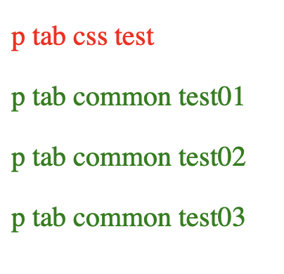
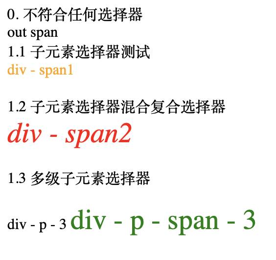
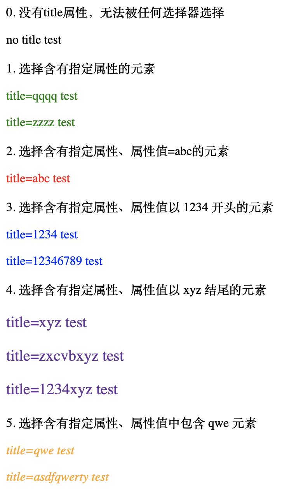

- 参考
    - https://www.bilibili.com/video/av77217003

<span id="catalog"></span>

### 目录
- [CSS简介](#CSS简介)
- [CSS的使用方式](#CSS的使用方式)
    - [内联样式](#内联样式)
    - [内部css](#内部css)
    - [外部css](#外部css)
- [css语法](#css语法)
- [选择器](#选择器)
    - [基本选择器](#基本选择器)
    - [复合选择器](#复合选择器)
    - [关系选择器](#关系选择器)
    - [属性选择器](#属性选择器)
    - [伪类选择器](#伪类选择器)
- [](#)
- [](#)
- [](#)

# CSS简介
[top](#catalog)
- 层叠样式表
- 网页实际上是一个多层的结构，通过CSS可以分别为网页的每一个层来设置样式，最终看到的只是网页最上边的一层

# CSS的使用方式
## 内联样式
[top](#catalog)
- 使用方法：
    - 在标签内部通过`style`属性来设置元素的样式
    - 通过`样式名:样式值`的方式设置样式
    - 可以同时设置多个样式，使用`;`来分割
    ```html
    <tag style="样式1:value1; 样式2:value2; 样式3:value3;">
    ```

- 示例
    - 参考：[/frontend/css/base/src/usage/usage.html](/frontend/css/base/src/usage/usage.html)
    - 代码
        ```html
        <p style="color:red; font-size: 20px;">
            p tab css test
        </p>
        ```
- 在实际开发中不推荐使用
    - 维护困难
    - css和html耦合在一起

## 内部css
[top](#catalog)
- 使用方法
    - 将css写到`<head>`中的`<style>`标签中
    - 通过css选择器为元素设置样式，可以同时设置多种元素的样式
    ```html
    <head>
        <style>
            选择器{
                样式1:value1;
                样式2:value2;
                样式3:value3;
            }
            
        </style>  
    </head>
    ```
- **内联样式可以覆盖内部css**
- 内部css不能跨页面使用
- 示例
    - 代码：[/frontend/css/base/src/usage/usage.html](/frontend/css/base/src/usage/usage.html)
      
        ```html
        <head>
            <style>
                p{
                    color:green; 
                    font-size: 20px;
                }
            </style>
        </head>
        <body>
            <p style="color:red; font-size: 20px;">
                p tab css test
            </p>

            <p>p tab common test01</p>
            <p>p tab common test02</p>
            <p>p tab common test03</p>
        </body>
        ```
    - 结果：
        - 按照设置显示，但是第一个`<p>`被覆盖了
        - 
        
## 外部css
[top](#catalog)
- 使用方法：   
    1. 需要将css样式写到一个外部`*.css`文件中
    2. 通过`<head>`下的`<link>`来引入外部的css文件，引入之后css会自动生效

    ```html
    <head>
        <link rel="stylesheet" href="*.css文件路径">
    </head>
    ```
- **内联样式可以覆盖内部css**
- 外部css和内部css同时存在时的原则：**后加载的优先**
    - 如果外部css和内部css中有相同的css选择器，则后声明的覆盖先声明的
- 优点：
    1. 使用外部css可以在不同页面之间进行复用
    2. 将css写到外部文件中，可以使用浏览器的缓存机制，从而加快页面的加载速度
        - 第一次某个`*.css`文件被加载过之后，会保存到浏览器缓存中，之后再次需要时，直接从缓存中获取
- 示例
    - css文件：[/frontend/css/base/src/usage/usage.css](/frontend/css/base/src/usage.css)

        ```css
        p{
            color: blueviolet;
            font-size: 30px;
        }
        ```

    - 页面：[/frontend/css/base/src/usage/usage.html](/frontend/css/base/src/usage/usage.html)

        ```html
        <!doctype html>
        <html>
            <head>
                <link rel="stylesheet" href="mystyle.css">
            </head>
            <body>
                <!-- 覆盖外部css -->
                <p style="color:red; font-size: 20px;">
                    p tab css test
                </p>

                <p>p tab common test01</p>
                <p>p tab common test02</p>
                <p>p tab common test03</p>
            </body>
        </html>
        ```
    - 页面结果
        - 按照设置显示，但是第一个`<p>`被覆盖了
        - 

# css语法
[top](#catalog)
- 注释：`/* .... */`
- css的基本语法：`选择器{ 声明块 }`
- 选择器
    - 通过选择器可以选择页面中的指定元素
        - 如：`p{....}`，表示选择页面中所有的p元素

- 声明块
    - 通过声明块指定需要为元素设置的样式
    - 声明块有多个声明组成
    - 声明是一个名值对结构，`样式名:样式值;`

- **多个css中如果出现的重复的部分，则使用后声明的部分**

# 选择器
## 基本选择器
[top](#catalog)
- 4中基本选择器
    1. 元素选择器
    2. id选择器
    3. class选择器
    4. 通配选择器

- 元素选择器
    - 根据标签名来选择指定元素
    - 语法：`标签名{ 声明块 }`

- id选择器
    - 根据元素的id属性值选中元素
    - 语法：`#id属性值{ 声明块 }`
    - id选择器的缺点，只能设置一个元素

- class选择器
    - 根据标签的class属性来选择(一组)元素，**开发中比较常用**
    - 语法：`.class值{ 声明块 }`
    - class可以重复使用
    - **可以为一个元素指定多个class，多个class之间通过空格分割**

- 通配选择器
    - 选中页面中的**所有元素**
    - 语法：`*`

- 示例
    - 代码：[/frontend/css/base/src/selector/base.html](/frontend/css/base/src/selector/base.html)
    - css
        ```css
        /* 4.通配选择器 */
        * {
            /* 斜体字符 */
            font-style: italic; 
        }

        /* 1.元素选择器*/
        p{
            color:green; 
            font-size: 20px;
        }

        /* 2.id选择器 */
        #redPTag{
            color: red;
        }

        /* 3.class选择器 */
        .blue{
            color:blue;
            /* 斜体字符 */
            font-style: normal;
        }

        .font30{
            font-size: 30px;
        }
        ```
    - html
        ```html
        <body>
            <!-- 2.id选择器测试 -->
            <p id='redPTag'>p 01 test</p>

            <!-- 3.class选择器测试 -->
            <p class='blue'>p 02 test</p>
            
            <!-- 3.多个class选择器 测试 -->
            <p class='blue font30'>p 03 test</p>
            
            <!-- 1.元素选择器 -->
            <p>p 04 test</p>
            <p>p 05 test</p>
        </body>
        ```
    - 页面结果
        - 由于先设定了通配符选择器，所以`p01`、`p04`、`p05`是斜体；在后边的`.blue`选择器中，又重新设定了字体格式，覆盖了前面的样式，所以`p02`、`p03`是正常显示
        - 

## 复合选择器
[top](#catalog)
- 两种复合选择器
    1. 交集选择器
    2. 并集选择器

- 交集选择器
    - 选中同时包含多个选择器的元素
    - 语法：`选择器1选择器2选择器3{ 声明块 }`
        - 选择器中**如果有元素选择器，则必须以元素选择器开头**
- 并集选择器 (选择器分组)
    - 同时选择多种选择器对应的元素
    - 语法：`选择器1, 选择器2, 选择器3{ 声明块 }`

- 并集选择器中混合交集选择器
    - 如：
        ```css
        h2.complex, h3.complex, h4.complex {
            color:coral;
            font-style: normal;
        }
        ```

- 示例
    - 参考：[/frontend/css/base/src/selector/complex.html](/frontend/css/base/src/selector/complex.html)
    - css 
        ```css
        /* 1.交集选择器 */
        /* 条件：使用blue类，并且是div */
        div.blue{
            /* 加粗字符 */
            font-style: italic;
            font-size: 30px;
        }

        /* 2.并集选择器 */
        h1, span{
            color: green;
        }

        /* 3.并集选择器中混合交集选择器 */
        h2.complex, h3.complex, h4.complex {
            color:coral;
            font-style: normal;
        }
        ```
    - html
        ```html
        <body>
            <!-- 1.交集选择器测试 -->
            <div class="blue">div 01 test</div>
            <p class="blue">p 01 test</p>

            <!-- 2.并集选择器测试 -->
            <H1> h1 test</H1>
            <span>span 01 test</span>

            <!-- 3.并集选择器中混合交集选择器测试 -->
            <h2 class="complex">h2 complex test</h2>
            <h3 class="complex">h3 complex test</h3>
            <h4 class="complex">h4 complex test</h4>
        </body>
        ```
    - 页面结果
        - 

## 关系选择器
[top](#catalog)
- 三种关系选择器
    1. 子元素选择器
    2. 后代选择器
    3. 兄弟选择器

- 子元素选择器
    - 语法：
        - 1级：`选择器1 > 子元素 {声明块}`
        - 多级：`选择器1 > 选择器2 > ... > 子元素 {声明块}`
    - 子元素选择器可以可复合选择器进行混合
    - 示例
        - 参考：[/frontend/css/base/src/selector/relation_son.html](/frontend/css/base/src/selector/relation_son.html)
        - css
            ```css
            /* 1. 子元素选择器 */
            /* 1.1 子元素选择器：设置 div 下 span 的样式 */
            div > span {
                color: orange;
            }

            /* 1.2 子元素选择器混合复合选择器：设置 class是red的div 下 span 的样式 */
            div.red > span {
                color: red;
                font-style: italic;
                font-size: 30px;
            }

            /* 1.3 多级子元素选择器：设置 div 下 p 下 span 的样式 */
            div > p > span  {
                color: green;
                font-size: 30px;
            }
            ```
        - html
            ```html
            <body>
                <section>0. 不符合任何选择器</section>
                <span>out span</span>

                <section>1.1 子元素选择器测试</section>
                <div>
                    <span>div - span1 </span>
                </div>
                <br>

                <section>1.2 子元素选择器混合复合选择器</section>
                <div class="red">
                    <span>div - span2 </span>
                </div>
                <br>

                <section>1.3 多级子元素选择器</section>
                <div>
                    <p>
                        div - p - 3
                        <span>div - p - span - 3 </span>
                    </p>
                </div>
                <br>

            </body>
            ```
        - 页面结果
            - 

- 后代选择器
    - 语法：`祖先元素选择器 后代元素选择器{声明块}`
    - 使用后，**所有的后代元素**都会应用样式，无论元素之间有多少嵌套关系
    - 子元素选择器可以可复合选择器进行混合
    - 示例
        - 参考：[/frontend/css/base/src/selector/relation_later.html](/frontend/css/base/src/selector/relation_later.html)
        - css
            ```css
            /* 2. 后代选择器 */
            /* 选择 div下的所有p后代元素 */
            div p{
                color: mediumblue;
                font-weight: bold;
            }
            ```
        - html
            ```html
            <body>
                <section>0. 不符合任何选择器</section>

                <section>2. 后代选择器</section>
                <div>
                    <div>
                        <p>div - p - 4 - 1 </p>
                    </div>
                    <p>div - p - 4 - 2</p>
                </div>
                <br>
            </body>
            ```
        - 页面结果
            - 


- 兄弟选择器
    - 语法
        - 选择`兄弟元素1选择器`**后边紧挨的第一个兄弟元素**：`兄弟元素1选择器 + 兄弟元素2选择器{ 声明块 }`
            - 兄弟元素1和兄弟元素2之间必须紧挨，如果出现其他元素则无法选择
        - 选择`兄弟元素1选择器`**后边的所有兄弟元素**：`兄弟元素1选择器 + 兄弟元素2选择器{ 声明块 }`
            - 兄弟元素之间可以有其他元素，不会影响选择结果
    - **兄弟选择器只能选择`兄弟元素1`后面的元素，无法选择前面的元素**
    - 可以混合复合选择器
    - 示例
        - 参考：[/frontend/css/base/src/selector/relation_brother.html](/frontend/css/base/src/selector/relation_brother.html)
        - css
            ```css
            /* 3. 兄弟选择器 */
            /* 3.1 选择 兄弟元素1选择器 后边紧挨的第一个兄弟元素 */
            /* 选择p后面的第一个span */
            p + span{
                color:mediumpurple;
                text-decoration:underline;
                font-size: 20px;
            }

            /* 3.2 选择 兄弟元素1选择器 后边的所有兄弟元素 */
            /* 选择 p 后边所有的 ul 和 ol 兄弟元素 */
            p ~ ul,ol{
                color:red;
                text-decoration:underline;
                font-size: 20px;
            }
            ```
        - html
            ```html
            <body>
                <section>0. 不符合任何选择器</section>
                
                <section>3. 兄弟选择器</section>
                <section>3.1-1 选择 兄弟元素1选择器后边紧挨的第一个兄弟元素，选择p后面的第一个span</section>
                <p>p1</p>
                <span>p1 - span1</span><br>
                <span>p1 - span2</span><br>
                <br>

                <section>3.1-2 兄弟元素1与兄弟元素2之间有其他元素，选择p后面的第一个span</section>
                <p>p2</p>
                <div>p2 - div</div>
                <span>p2 - span1</span><br>
                <span>p2 - span2</span><br>
                <br>

                <section>3.1-2 兄弟元素1与兄弟元素2之间有其他元素，选择 p 后边所有的 ul 和 ol 兄弟元素 </section>
                <p>p2</p>
                <div></div>
                <ul>
                    <li>p2-list1-item1</li>
                    <li>p2-list1-item2</li>
                </ul>
                <div></div>
                <ol>
                    <li>p2-list2-item1</li>
                    <li>p2-list2-item2</li>
                </ul>
                <ul>
                    <li>p2-list3-item1</li>
                    <li>p2-list3-item2</li>
                </ul>
                <br>

            </body>
            ```
        - 页面结果
            - 

## 属性选择器
[top](#catalog)
- 语法
    1. `元素[属性名] {声明块}`， 选择含有指定属性的元素
    2. `元素[属性名=属性值] {声明块}`， 选择含有指定属性、指定属性值的元素
    3. `元素[属性名^=属性值] {声明块}`， 选择含有指定属性、以指定属性值**开头**的元素
    4. `元素[属性名$=属性值] {声明块}`， 选择含有指定属性、以指定属性值**结尾**的元素
    5. `元素[属性名*=属性值] {声明块}`， 选择含有指定属性、**包含**指定属性值的元素

- `属性值`是否需要加引号
    - 可以加引号也可以不加
    - 单引号、双引号都可以
    - <label style="color:red">如果属性值是数字，则必须加引号，否则选择无法选中元素</labe>
- 示例
    - 代码：[/frontend/css/base/src/selector/property.html](/frontend/css/base/src/selector/property.html)
    - css
        ```css
        /* 1. 选择含有指定属性的元素 */
        p[title] {
            color: green;
        }

        /* 2. 选择含有指定属性、属性值=abc的元素 */
        p[title="abc"] {
            color:red;
        }
        
        /* 3. 选择含有指定属性、属性值以 1234 开头的元素 */
        p[title^='1234']{
            color:blue;
        }

        /* 4. 选择含有指定属性、属性值以 xyz 结尾的元素 */
        p[title$="xyz"]{
            font-size: 20px;
            color: rebeccapurple;
        }

        /* 5. 选择含有指定属性、属性值中包含 qwe 元素 */
        p[title*="qwe"]{
            font-style: italic;
            color: orange;
        }
        ```
    
    - html
        ```html
        <body>
            <section>0. 没有title属性，无法被任何选择器选择</section>
            <p>no title test</p>

            <section>1. 选择含有指定属性的元素</section>
            <p title="qqqq">title=qqqq test</p>
            <p title="zzzz">title=zzzz test</p>

            <section>2. 选择含有指定属性、属性值=abc的元素</section>
            <p title="abc">title=abc test</p>
            
            <section>3. 选择含有指定属性、属性值以 1234 开头的元素</section>
            <p title="1234">title=1234 test</p>
            <p title="12346789">title=12346789 test</p>
            
            <section>4. 选择含有指定属性、属性值以 xyz 结尾的元素</section>
            <p title="xyz">title=xyz test</p>
            <p title="zxcvbxyz">title=zxcvbxyz test</p>
            <p title="1234xyz">title=1234xyz test</p>
            
            <section>5. 选择含有指定属性、属性值中包含 qwe 元素</section>
            <p title="qwe">title=qwe test</p>
            <p title="asdfqwerty">title=asdfqwerty test</p>
        </body>
        ```
    
    - 页面结果
        - 

## 伪类选择器
[top](#catalog)
