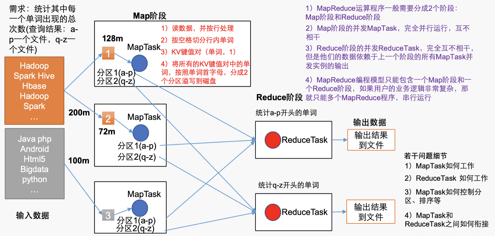
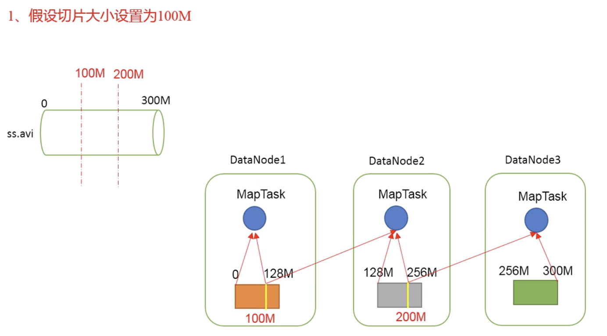
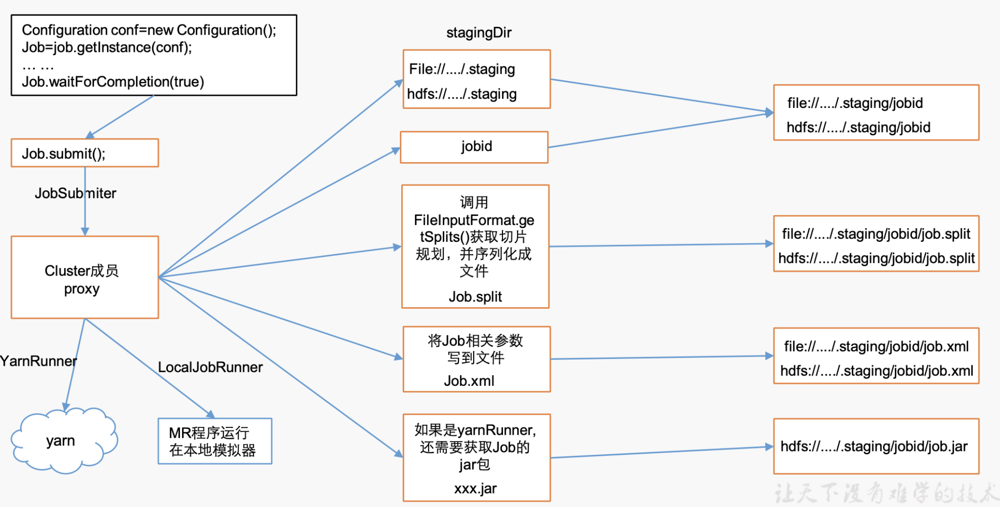
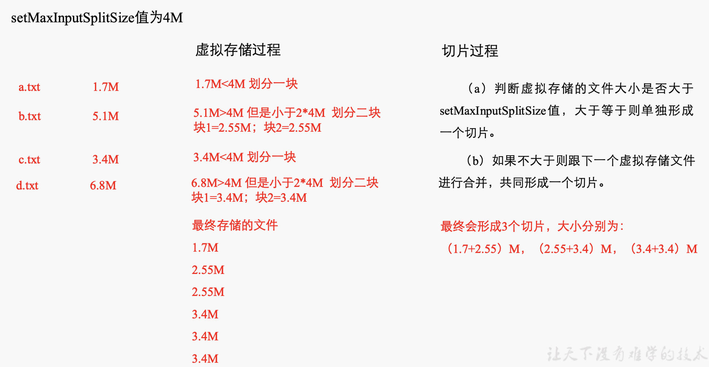

<span id="catalog"></span>
- [基本使用](#基本使用)
- [hadoop序列化](#hadoop序列化)
- [MR框架原理](#MR框架原理)
    - [InputFormat数据输入](#inputformat数据输入)
        - [切片与MapTask并行度决定机制](#切片与maptask并行度决定机制)
        - [Job提交流程](#job提交流程)
        - [切片源码解析](#切片源码解析)
        - [FileInputFormat切片机制](#fileinputformat切片机制)

# 基本使用
[top](#catalog)
* MapReduce定义
    * 一个分布式运算程序的编程框架，是开发基于Hadoop的**数据分析应用**的核心框架
    * 核心功能：将**业务逻辑代码**和**自带默认组件**做和成一个完整的**分布式运算程序**，并发的运行在Hadoop集群上

* MapReduce优缺点
    * 优点
        1. MapReduce易于编程
            * 简单的实现一些接口，就可以完成一个分布式程序
        2. 良好的扩展性
            * 通过增加机器来扩展计算能力
        3. 高容错性
            * 可运行在廉价的PC上
        4. 适合PB级以上的海量数据的离线处理
    * 缺点
        1. 不擅长实时计算
            * 无法在秒级内返回结果
        2. 不擅长流式计算
            * MapReduce的输入数据集是静态的，不能动态变化。MapReduce自身的设计特点决定了数据源必须是静态的
        3. 不擅长DAG（有向图）的计算
            * 每个MapReduce作业的输出结果都会写入磁盘，造成大量的磁盘IO，导致性能低下，所以不擅长处理这种多个程序相互依赖的操作

* MapReduce核心思想
    * 核心编程思想: 
    * **MapReduce程序分为两个阶段:Map 和 Reduce**
    * MapReduce编程模型只能包含**一个Map阶段和一个Reduce阶段**，如果用户的业务逻辑非常复杂，那就只能多个MapReduce程序串联，串行运行
    * 统计单次次数的流程
        1. Map阶段，对各个数据块执行并发的MapTask，完全并行运行，互不干扰
            * MapTask
                * 读取数据:一行一行读数据，并按行进行处理
                * 切分数据:按照空格切分数据
                * 数据kv化:将数据转换成key-value键值对：{单词:次数}
                * 保存:将所有的KV对中的单词按照单词首字母分成两个分区写到磁盘
                    * 分区1：a-p
                    * 分区2：q-z,
        2. Reduce阶段的并发RedeceTask，完全并行互不干扰，但它们的数据依赖于上一阶段的所有MapTask并发实例的输出
            * 统计a-p单词的从各MapTask的分区1**拉取数据**，处理后将结果输出到文件
            * 统计q-z单词的从各MapTask的分区2**拉取数据**，处理后将结果输出到文件

* MapTask如何工作？
* ReduceTask如何工作？
* MapTask如何控制分区、排序等？
* MapTask和ReduceTask之间如何衔接？

* MapReduce进程：MR程序在分布式运行时有三类实例进程
    * MrAppMaster：负责整个程序的过程调度及状态协调
        * 它是一个Job资源的控制者
        * 协调CPU等资源
        * 如何开启Map和Reduce阶段的处理
    * MapTask：负责Map阶段的整个数据流处理流程
    * ReduceTask：负责Reduce阶段的整个数据流处理流程

* 常用数据序列化类型

|java类型|hadoop writable类型|
|-|-|
|boolean|BooleanWritable|
|byte|ByteWritable|
|int|IntWritable|
|float|FloatWritable|
|long|LongWritable|
|double|DOubleWritable|
|**String**|**Text**|
|map|MapWritable|
|array|ArrayWritable|

* MapReduce编程规范
    * 程序分为三个部分：Mapper，Reducer，Driver
    * Mapper阶段
        1. **继承**父类Map
        2. Mapper的输入数据都是KV形式，KV的数据类型可以自定义
        3. 业务逻辑写在一个map()方法中
        4. Mapper的输出数据都是KV形式，KV的数据类型可以自定义
        5. map()方法对每一个<K,V>只调用一次
    * Reducer阶段
        1. **继承**父类Reduce
        2. Reduce的输入数据类型 = Mapper的输出数据类型，也是KV
        3. 业务逻辑写在reduce()方法中
        4. ReduceTask进程对每一组相同k的<K,V>组调用一次reduce()方法
    * Driver阶段
        * 相当与YARN集群的客户端，用于提交整个程序到YARN集群
        * 提交的内容是封装了MapReduce程序相关运行参数的job对象

* Mapper 类 组成
    * Context:操作过程中使用的上下文内容
    * setup:执行开始时调用(初始化程序)
    * map:应用程序重写
    * cleanup:操作结束后的处理
    * run:串联所有方法
        * setup
        * while{map}
        * cleanup
* Reducer类 组成
    * Context:操作过程中使用的上下文内容
    * setup:执行开始时调用(初始化程序)
    * reduce:应用程序重写
    * cleanup:操作结束后的处理
    * run：串联所有方法
        * setup
        * while{reduce}
        * cleanup

* WordCount案例
    * Mapper
        1. Mapper将输入的文本内容转换成String
        2. 根据空格切分单词
        3. 将单词输出为：`<单词, 1>`
            * 此时不对结果进行合并，只创建形如`<单词, 1>`的kv对象
    * Reducer
        1. 汇总各个Key的个数
            * 在该阶段进行kv的聚合，计算每个单词出现的次数
        2. 输出该key的总次数
    * Driver
        1. 获取配置信息，获取job对象实例
        2. 指定本程序的jar包所在的本地路径
        3. 将Mapper/Reducer的业务类关联到job
        4. 指定Mapper输出数据的kv类型
        5. 指定最终输出的数据的kv类型
        6. 指定job的输入原始文件所在的目录
        7. 指定job的输出结果所在目录
            * **输出路径必须不能存在**
        8. 提交作业到集群中 
            * 对于输出结果：如果正常执行结束则job返回true，此时系统会输出0；如果正常执行结束则job返回false，此时系统会输出1

* 将MR程序放到服务器上运行
    * 添加MAVEN配置
        ```
        <build>
            <plugins>
                <plugin>
                    <artifactId>maven-compiler-plugin</artifactId>
                    <version>2.3.2</version>
                    <configuration>
                        <source>1.8</source>
                        <target>1.8</target>
                    </configuration>
                </plugin>
                <plugin>
                    <artifactId>maven-assembly-plugin </artifactId>
                    <configuration>
                        <descriptorRefs>
                            <descriptorRef>jar-with-dependencies</descriptorRef>
                        </descriptorRefs>
                        <archive>
                            <manifest>
                                <mainClass>driver类的主类名</mainClass>
                            </manifest>
                        </archive>
                    </configuration>
                    <executions>
                        <execution>
                            <id>make-assembly</id>
                            <phase>package</phase>
                            <goals>
                                <goal>single</goal>
                            </goals>
                        </execution>
                    </executions>
                </plugin>
            </plugins>
        </build>
        ```
    * maven install 打包
    * 放到服务器上
    * 执行：`hadoop jar jar包路径 driver类的主类名 集群上的输入数据路径 集群上未存在的输出数据路径`

# hadoop序列化
[top](#catalog)
* 为什么不用java的序列化
    * java的Serializable是一个重量级的序列化框架
    * 一个对象被序列化后，会附带很多额外的信息：校验信息，header，继承体系等，不便于在网络中高效传输
* hadoop的序列化特点
    * 紧凑：高效使用存储空间
    * 快速：读写数据的额外开销小
    * 可扩展：随着通信协议的升级而可升级
    * 互操作：支持多语言的交互
* 自定义bean对象实现序列化接口：Writable
    * 实现步骤
        1. 必须实现Writable接口
        2. 反序列化时，需要反射调用空参构造函数，所以必须有空参构造
        3. 重写序列化方法
        4. 重写反序列化方法
        5. 序列化与反序列化的顺序一致
            * 序列化过程相当于对队列的操作，所以两端的处理顺序必须一致
        6. 如果要把结果显示在文件中，需要重写toString()，可用`\t`分开，方便后续使用
        7. 如果需要自定义的bean放在key中传输，还需要实现Comparable接口，因为MapReduce框架中的Shuffle过程要求key必须能排序
    
# MR框架原理
## InputFormat数据输入
### 切片与MapTask并行度决定机制
[top](#catalog)
* MapTask的并行度决定Map阶段的任务处理并发度，会影响到整个Job的处理速度
    * 如1G数据，启动8个MapTask，每个处理128M数据；1K数据就不能启动8个MapTask
* MapTask并行度决定机制
    * 数据块：Block是HDFS物理上把数据分成一块一块
    * 数据切片：数据切片只是在逻辑上对输入进行分片，不会对磁盘数据做切片存储
        * 如将数据划分为0~128，把0～64的数据放到一个集合中进行处理，65～128放到另一个集合中
    * 实例：处理300M的数据
        1. 按照100M来对数据进行切片，会跨节点导致产生IO传输消耗
        
        2. 按照128M来对数据进行切片，不会产生IO传输消耗，效率是最高的
        
    * 机制
        1. 一个Job的Map阶段的并行度由客户端在提交Job时的**切片数决定**
        2. 每一个切片分配一个MapTask并行实例处理
        3. **默认情况下，切片大小=BlockSize**
        4. 切片时不考虑数据集整体，而是逐个针对每一个文件单独切片
            * 即多个文件的情况，每个文件单独切片，不考虑整体

### Job提交流程
[top](#catalog)
* job提交流程：
* 最终需要提交的信息
    1. 切片信息
    2. xml配置
    3. jar包

### 切片源码解析
[top](#catalog)
* 主要参考类：`org.apache.hadoop.mapreduce.lib.input.FileInputFormat.class`
* 本地运行时，默认数据块大小为32M；在yarn集群上使用128M
    * yarn中，hadoop1.x使用64M，hadoop2.x使用128M
* 切片流程：
    1. 找到数据存储的目录
    2. 开始遍历目录下的每一个文件
    3. 对于每一个文件进行切片
        * 获取当前文件大小
        * 计算适用于该文件的切片大小
            * 默认情况下=块大小
        * 进行切片
            * 0-splitSize，splitSize-2*splitSize,....
            * **每次必须判断切完剩下的部分是否大于切片的1.1倍，如果不大于则不切分**
        * 将切片信息写到一个切片规划文件中
        * 切片处理在`public List<InputSplit> getSplits(JobCOntext job)`中完成
            * InputSplit只记录的切片的元数据信息：起始位置、长度、所在的节点列表等
    4. 提交切片规划文件到yarn，**yarn上的MrAppMaster就可以根据切片规划文件计算MapTask个数**
* 代码分析
    1. 切片大小的计算()
        ```java
        public List<InputSplit> getSplits(JobCOntext job) throws IOException{
            ...
            if (this.isSplitable(job, path)){
                // 获取块大小
                long blockSize = file.getBlockSize(); //本地=32，yarn=128
                // 计算适用于当前文件的切片大小
                long splitSize = this.computeSplitSize(blockSize, minSize, maxSize);
            }
        }
        protected long computeSplitSize(long blockSize, long minSize, long maxSize){
            return Math.max(minSize, Math.min(maxSize, blockSize))
        }
        // 先计算：最大值和块大小的小值，再计算和最小值中的大值
        // minSize=1，maxSize=9223372036854775807
        // 默认情况下=块大小
        ```
    2. 判断是否对数据文件进行切片
        ```java
        public List<InputSplit> getSplits(JobCOntext job) throws IOException{
            ...
            // 即数据文件的长度必须是切片大小的1.1倍以上时才进行切片
            // 一边且一般与切片大小进行比较
            for(bytesRemaining = length; (double)bytesREmaining/(double)splitSize > 1.1D; bytesRemaining -= splitSize){
                blkIndex = this.getBlockIndex(blkLocations, length - bytesRemaining);
                splits.add(this.makeSplit(path, length - bytesRemaining, splitSize, blkLocations[blkIndex].getHosts(), blkLocations[blkIndex].getCachedHosts()));
            }
        }
        ```
        * 例如在yarn集群上，一个**129M的文件分为2个block存储，切片时只有1个切片(因为129/128<1.1)**

### FileInputFormat切片机制
[top](#catalog)
* 切片机制
    1. 简单的按照文件的内容长度进行切片
    2. 切片大小，默认等于Block
        * 本地=32M，yarn=128M，老版本yarn=64M
    3. 每个文件单独切片，切片时不考虑数据集整体

* FileInputFormat切片大小的参数配置
    * 计算公式：`Math.max(minSize, Math.min(maxSize, blockSize))`
        * mapreduce.input.fileinputformat.split.minsize=1
        * mapreduce.input.fileinputformat.split.maxsize=Long.MAXValue
    * 切片大小设置
        * 让切片变小：设置`maxSize<blockSize`
            * Math.min(maxSize, blockSize) = maxSize
            * Math.max(minSize, maxSize) = maxSize
        * 让切片变大：设置`minSize>blockSize`
            * Math.min(maxSize, blockSize) = blockSize
            * Math.max(minSize, blockSize) = minSize
    * 获取切片信息API
        ```java
        // 获取切片信息API
        String name = inputSplit.getPath().getName();
        // 根据文件类型获取切片信息
        FileSplit inputSplit = (FileSplit) context.getInputSplit();
        ```

### CombineTextInputFormat切片机制
* 应用
    * 默认的切片机制是对每个文件进行切片，无论文件多小，都单独切片交给一个MapTask。**如果存在大量小文件，会产生大量MapTask，降低处理效率**
    * CombineTextInputFormat用于处理小文件，可以将多个小文件从**逻辑上规划到一个切片中，将多个小文件交给一个MapTask处理
* 虚拟存储切片最大值设置
    ```java
    CombineTextInputFormat.setMaxInputSplitSize(job,4194304) //4M
    ```
    * 需要根据实际小文件的大小情况来设置具体的值
* 切片机制 