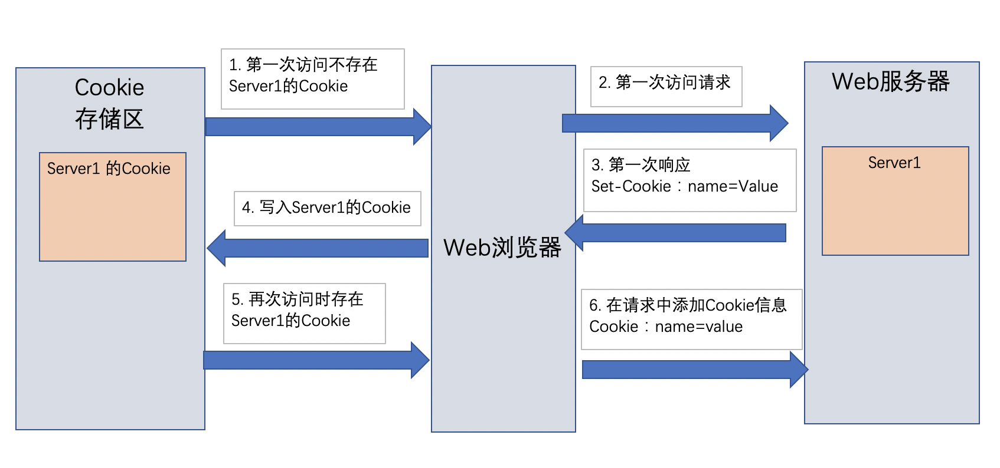

<span id="catalog"></span>

### 目录
- [HTTP简介](#http简介)
- [HTTP的会话方式](#http的会话方式)
- [HTTP消息结构](#http消息结构)
    - [HTTP请求信息格式](#http请求信息格式)
    - [常用请求信息字段](#常用请求信息字段)
    - [HTTP响应信息格式](#http响应信息格式)
    - [常用响应信息字段](#常用响应信息字段)
- [get和post请求](#get和post请求)
    - [get请求](#get请求)
    - [post请求](#post请求)
    - [get和post传递参数方式](#get和post传递参数方式)
    - [重定向问题](#重定向问题)
- [Cookie机制](#Cookie机制)
- [Referer防盗链](#referer防盗链)
- [HTTP协议缓存控制](#http协议缓存控制)
- [HTTP与内容压缩](#http与内容压缩)
- [反向ajax](#反向ajax)
- [其他注意事项](#其他注意事项)
- [](#)

# HTTP简介
[top](#catalog)
- ftp,http,stmp,pop,tcp/ip ?????????
- 浏览器与web服务器之间的交互过程需要遵守的规则就是http协议
- http协议是tcp/ip协议集中的一个应用层协议
    - 用于定义web浏览器和web服务器之间交互数据的过程以及数据本身的格式
- http协议的版本
    - HTTP/1.0
    - HTTP/1.1
    - HTTP-NG

- HTTP协议是一种无状态的协议，WEB服务器本身不能识别出哪些请求是同一个浏览器发出的，浏览器的每一次请求都是完全孤立的
    - 即使HTTP1.1支持持续连接，但当用户有一段时间没有提交请求，连接也会关闭

# HTTP的会话方式
[top](#catalog)
- 4个步骤
    1. 建立连接
        - 连接指`网络上的虚拟电路`
        - <label style="color:red">建立连接之前，客户端和服务器之间没有任何关系</label>
    2. 发送请求信息
        - 发送`Request Headers`
    3. 返回响应信息
        - 沿着连接，返回响应：`Response Headers`
    4. 关闭连接
        - 断开连接，电路消失

- 浏览器与服务器的每次连接都是暂时的，每次连接只处理一个请求和响应，每个页面和web服务器交互都要建立一次单独的连接
- 浏览器到web服务器之间的所有通信都是**完全独立分开的请求-响应对**
- 示例：浏览器访问多图网页的过程
    - 如果有N个图片，一共要发送N次请求
    ```
          ---->图片1请求---->
          <----返回图片1<----

    浏览器 ---->图片2请求---->   服务器
          <----返回图片2<----
          
          ---->图片3请求---->
          <----返回图片3<----  
    ```

# HTTP消息结构
## HTTP请求信息格式
[top](#catalog)
- 基本构成
    - 请求行
    - 请求头
    - 空行分隔(无论后面有没有请求主体信息，后边都会有一个空行)
    - 请求主体(**可以没有**)
- 一些消息头和实体内容都是可选的

- 请求行
    - 请求方法
        - 协议规定的方法
            - GET
            - POST
            - HEAD
                - 和GET基本相同，只是不返回内容
                - 例如只确认某个资源是否存在，而不需要返回该资源
            - PUT
            - DELETE
            - TRACE
                - 如果用了代理上网，可以用TRACE来测试代理有没有修改原始的HTTP请求
            - OPTIONS
                - 返回服务器可用的请求方法
        - 协议里规定的方法WebServer中不一定支持这些方法
    - 请求路径/资源
        - URL的一个部分
    - 使用的协议(协议的版本)

- 请求头信息
    - 格式为：`key:value`
    - `Host:.....`
    - `Content-length:信息长度`：发送的信息的长度，在该信息之后才能输入主体信息，用于POST等的发送

- 请求主体(**可以没有**)
    - GET方法请求的消息中不能包含实体内容
    - POST、PUT、DELETE的请求消息中可以包含实体内容

- 实例
    ```
    POST XXXXX HTTP/1.1
    Host:localhost
    Content-type:application/x-www-form-urlencoded
    Content-length:20

    ....(请求主体信息)
    ```

## 常用请求信息字段
[top](#catalog)

## HTTP响应信息格式
[top](#catalog)
- 基本构成
    - 响应行/状态行
    - 响应头
    - 空行分隔(无论后面有没有请求主体信息，后边都会有一个空行)
    - 实体内容：就是网页文件的内容
- 一些消息头和实体内容都是可选的

- 响应行/状态行
    - 协议版本
    - 状态码
        - 用来反应服务器响应得分情况
        - 常见码：
            - 200：服务器成功返回网页
            - 301：永久重定向
            - 302：临时重定向
            - 304：未修改（NOT MODIFIED）
                - 从缓存取数据，减轻服务器压力
                - `If-Modified-Since`、`If-None-Match`，通过两个字段：时间戳、标识符来判别
            - 404：请求的网页不存在
            - 503：服务器暂时不可用
            - 500：服务器内部错误
        - 5个系列

            |状态码|定义|说明|
            |-|-|-|
            |1XX|信息|接收到请求，继续处理|
            |2XX|成功|操作成功的收到，理解和接受|
            |3XX|重定向|为了完成请求，必须采取进一步措施|
            |4XX|客户端错误|请求的语法有错误或不能完全被满足|
            |5XX|服务端错误|服务器无法完成请求|
    - 状态文字
        - 描述状态码，便于观察

- 响应头
    - 多个key:value
        - content-length:主体长度
- 响应主体(可以没有)
- 实例
    ```
    HTTP/1.1 200 OK
    Content-type:text/html
    Content-length:5

    ....(响应主体)
    ```

## 常用响应信息字段
[top](#catalog)
- 禁止浏览器缓存当前页面
    - 可以使用的三种字段
        1. Expires=-1
        2. Cache-Control=no-cache
        3. Pragma=no-cache
    - 不是所有的浏览器都支持这三种字段
    
# get和post请求
## get请求
[top](#catalog)
- 常见的GET请求方式
    - 在浏览器地址栏中输入URL
    - 点击网页上的一个超连接
    - 网页中的`<form>`表单元素的method属性被设置为GET
- 传输的数据量较小，一般限制在1KB以下

## post请求
[top](#catalog)
- 主要用于向web服务器端提交**FORM表单**中的数据
    - `<form>`表单的`method=post`
- POST方式将所有表单字段元素及其数据作为HTTP消息的实体内容发送给web服务器
- 传输的数据量比GET大
- **文件上传时必须使用POST请求**
- `content-type:application/x-www-form-urlencoded`，添加此信息后，服务器才能正常读取POST请求
- `Content-length:信息长度`，添加此信息服务器才能正常读取
- 请求主体形式：`key=val&key=val...`  ???????

## get和post传递参数方式
[top](#catalog)
- GET请求会将请求参数附加在url后边
    - 如：http://localhost:8080/weblearn_war_exploded/loginServlet?user=1111&password=2222
    - 如果有关键信息，最好不要使用GET
    - 这种形式导致GET的数据传输量是有限的，一般限制在1KB以下
    
- POST请求的url不变，请求参数会在`Form Data`中，即请求体中
    - 传输的数据量要比GET大的多

## 重定向问题
[top](#catalog)
- GET请求
    - 无影响
- POST请求
    - 重定向会导致数据丢失
    - 原始请求为POST，重定向请求变为GET
    - 可以使用状态码：**307**，在重定向中保持原有的请求数据
        - 使用307后，原始请求和重定向请求都是POST请求
    
# Cookie机制
[top](#catalog)
- Cookie机制是在客户端保持HTTP状态信息的方案，<label style="color:red">是一种会话跟踪机制</label>
- Cookie机制的表现
    - 服务器-->浏览器：浏览器访问Web服务器的某个资源时，WEB服务器会在**HTTP响应消息头**中附带传送一个**小文本文件**作为Cookie
    - 浏览器-->服务器：<label style="color:red">如果WEB浏览器保持了某个Cookie，那么它在以后每次访问该WEB服务器时，都会自动在HTTP请求头中添加这个Cookie，然后回传给WEB服务器</label>
    - 浏览器中的显示内容
        - 
- 底层的实现原理：
    - 服务器-->浏览器：WEB服务器在HTTP响应消息中增加`Set-Cookie:name=value`响应头字段，来将Cookie信息发送给浏览器
    - 浏览器-->服务器：浏览器通过在HTTP请求消息中增加`Cookie:name=value`请求头字段，来将Cookie回传给Web服务器
    - 示意图
        - 
    
- 一个Cookie只能标识一种信息，它至少含有一个标识该信息的名称(Name)和值(Value)

- Cookie的发送量
    - 服务器-->浏览器：可以发送多个Cookie

- 浏览器的Cookie存储量
    - 一个WEB浏览器也可以存储多个WEB站点提供的Cookie
    - 浏览器一般只允许存放300个Cookie
    - 每个站点最多存放20个Cookie
    - 每个Cookie的大小限制为4KB
        - 如果都是会话Cookie，全部保存在内存中将会消耗1M的内存

- <label style="color:red">会话Cookie和持久Cookie</label>
    - 不可保存的Cookie
        - 如果Cookie的最大时效被设为0，浏览器会自动删除该Cookie
    - 会话Cookie
        - 会话cookie生命周期为浏览器会话期间，只要关闭浏览器窗口，Cookie就消失了，这种就称为会话Cookie
        - 会话Cookie不设置过期时间
        - 会话Cookie一般不保存在硬盘上，而是**保存在内存里**
    - 持久Cookie
        - 如果设置了过期时间，浏览器就会把Cookie保存在硬盘上
        - 关闭后再次打开浏览器，这些Cookie依然有效，直到超过过期时间

- Cookie能否跨浏览器窗口使用
    - 存储在硬盘上的Cookie可以在不同的浏览器进程间共享，如两个IE窗口
    - 保存在内存的Cookie，不同的浏览器有不同的处理方式
        - ???????

# Referer防盗链
[top](#catalog)
- 在请求头中
- Referer代表网页的来源，即上一页的地址
- 如果直接在浏览器上输入地址进入，则没有Refer
- 通过Referer，服务器能够识别来源
- 如何配置apache服务器来做防盗链
    - 原理：
        - 在web服务器层面，根据http协议的referer头信息来判断
        - 如果判断Referer来自站外，则可以将请求内容**重写到一个防盗链资源上(如图片)**
    - 具体步骤：
        1. 打开apache重写模块mod_rewrite
        2. 在需要防盗的网站或目录，编写`.htaccess`文件，并指定防盗链规则   
            ```php
            RewriteEngine On //启动防盗脸
            Rewrite Base ... //指定监控哪部分页面
            RewriteCond  ... //指定规则
            //图片防盗
            RewriteCond %<REQUEST_FILENAME>.*\.(jpg|jpeg|gif|png) [NC] //[NC]不区分大小写
            //指定访问来源，如果来源不是指定地址，则执行防盗处理
            RewriteCond %<REQUEST_REFERER> !localhost [NC]

            RewriteRule .- 防盗地址 //设定重写的地址
            ```
- 可以通过仿造Referer来反防盗链

# HTTP协议缓存控制
[top](#catalog)
- 在网络上有一些缓存服务器，另外浏览器自身也有缓存功能
    - 如图片的缓存
        - 图片的下载过程
            1. 第一次请求时，是200
            2. 之后再请求时，是304 Not Modified 未修改状态
        - 原理
            - 当第一次访问时，图片会正常下载，返回200
            - 基于一个前提：图片不会经常改动，服务器在返回200的同时，还会返回该图片的签名(Etag)(在响应头中)
            - 当浏览器再次访问该图片时，去服务器校验签名
            - 如果图片签名没有变化，直接使用缓存中的图片，以此来减轻服务器的负担
        - 关于第一次请求的响应头信息
            - `Etag`:图片的签名
            - `Last-Modified: 上次修改的具体时间`
        - 关于再次请求的请求头
            - `If-Modified-Since: Thu, 10 Oct 2019 22:22:32 GMT`，表示在该时间点之后，如果图片修改过，则重新请求
                - 对应于响应头的`Last-Modified`
            - `If-None-Match: "56d9db4bfa8961083f8afbc3796ebf18"`，如果图片的Etag值和服务器中的不匹配则重新请求
                - 对应于响应头的`Etag`
- 如果网站比较大，有N台缓存服务器，那么这N台缓存服务器如何缓存主服务器上文件？
    - 需要解决的问题
        - 是否需要缓存
        - 缓存多久
    - 缓存服务器和主服务器之间使用一些协议来约定问题的解决方法
        - 使用的协议：http协议，**用头信息`cache-control`来控制**
        - 具体用法
            - 在主服务，：打开apache的扩展expires模块：`mod_expires`，利用该扩展来控制图片、css、html等资源的缓存生命周期
            - `.htaccess`文件的用法
                ```php
                ExpiresActive On
                ExpiresDefault "<base> [plus] {<num><type>}*"
                ExpiresByType type/encoding "<base> [plus] {<num> <type>}*"
                ```
                - ExpiresDefault:设置默认的缓存参数
                - ExpiresByType:按照文件类型来设计不同的缓存参数
                - type/encoding：资源类型/资源的具体内容
                    - 如图片：`imamg/jpeg`
                - base:基于哪个时间点来计算缓存有效期
                    - Access/now:基于请求响应的那一瞬间
                        - 例如:从此瞬间开始到1个月之内的时间有效
                    - modification:基于被请求文件的最后修改日期来计算
                        - 例如:从最后的修改日期到1周之内的时间有效
                - [plus] {<num> <type>}
                    - num：缓存时间的大小
                    - type：缓存的时间单位
            - 示例，图片缓存设定
                ```php
                ExpiresActive On
                ExpiresByType imamg/jpeg "base plus 30 days" //缓存30天
                ```
                - 设定结果最终会反映到响应头信息中：`Date`、`Expires`，这两者的时间差上
- 设置某些资源不允许使用缓存
    - 如，个人信息不允许缓存服务器缓存，必须到主服务器去请求
    - 利用apach的head模块：`headers_module`
        ```php
        <FilesMatch "\.(gif)$"> // 过滤文件
        header set Cache-control:"no-store, must-revalidate"
        </FilesMatch>
        ```
    - `control-cache: no-store, must-revalidate;`，表示不允许缓存，必须去服务器验证

# HTTP与内容压缩
[top](#catalog)
- `content-type:gzip`
- 原理
    - 为了加快数据在网络中的传递速度，服务器会对**主体信息**进行压缩
        - 常见的压缩方法：gzip、deflate、compress、sdch(来源于google chrome)
    - 服务器返回的是压缩内容
    - 客户端接收到压缩内容，再解压缩，再渲染页面
    - `contente-length`，此时表示压缩后的长度
- 在apache启动压缩功能
    - 开启gzip模块，或deflate模块：`deflate_module`
    - 在conf文件中，写入配置信息
        ```php
        <ifmodule mod_deflate.c>
        DeflateCompressionLevel 6 // 表示压缩的级别，1-9，推荐为6
        AddOutputFilterByType DEFLATE text/plain //指定压缩文本文件
        AddOutputFilterByType DEFLATE text/html //指定压缩html文件
        AddOutputFilterByType DEFLATE text/xml //指定压缩xml文件
        </ifmodule>
        ```
- 为什么需要指定文件类型来压缩
    - 压缩本身是需要消耗cpu资源的。压缩的级别越高消耗的cpu资源也越高
    - 图片、视频的压缩效果不好
    - 一般压缩文本格式
        - text/plain
        - text/html
        - text/xml
        - text/css
        - text/javascript
        - application/xhtml+xml
        - application/xml
        - application/rss+xml
        - application/atom_xml
        - application/x-javascript
        - application/x-httpd-php
        - image/svg+xml
- 服务器如何知道浏览器支持zip
    - 客户端运行发送一个`Accept-Encoding`头信息、与服务端协商
- 在爬虫里可以不添加`Accept-Encoding`信息，这样从服务端返回的是源码

# 反向ajax
[top](#catalog)
- HTTP协议与持久连接+分块传输-->反向ajax
- 反向ajax，也称comet、server push、服务器推技术
- 应用范围：网页聊天服务器，google mail
- 分块传输的原理
    ```php
    123H\r\n`
    将长度为123H的内容传输给客户端\r\n
    ....
    41H\r\n
    将长度为41H的内容传输给客户端\r\n
    0\r\n (此时表示内容发送完毕)
    ```
- 原理：
    - HTTP协议的特点，先连接再断开
        - 服务器会响应：`content-length`，当收到指定length长度的内容时，就断开了
    - 在HTTP 1.1协议中，允许不写`content-length`，例如无法确定发送的内容长度
        - 这种情况需要一个特殊的`content-type:chunked`

# 其他注意事项
[top](#catalog)
- 标准HTTP协议的换行符是:`\r\n`
