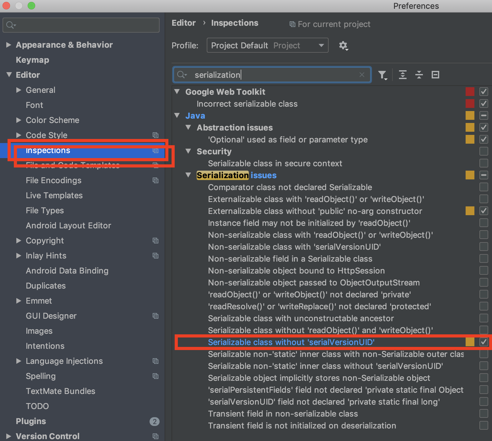
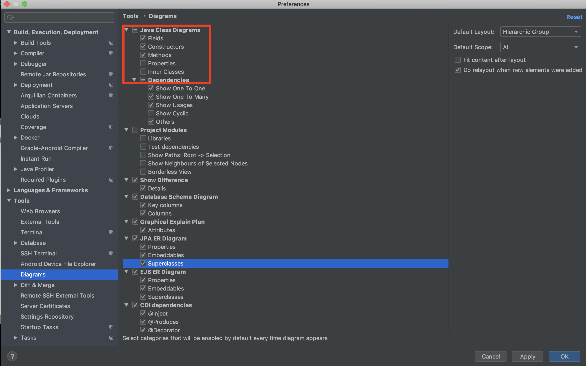
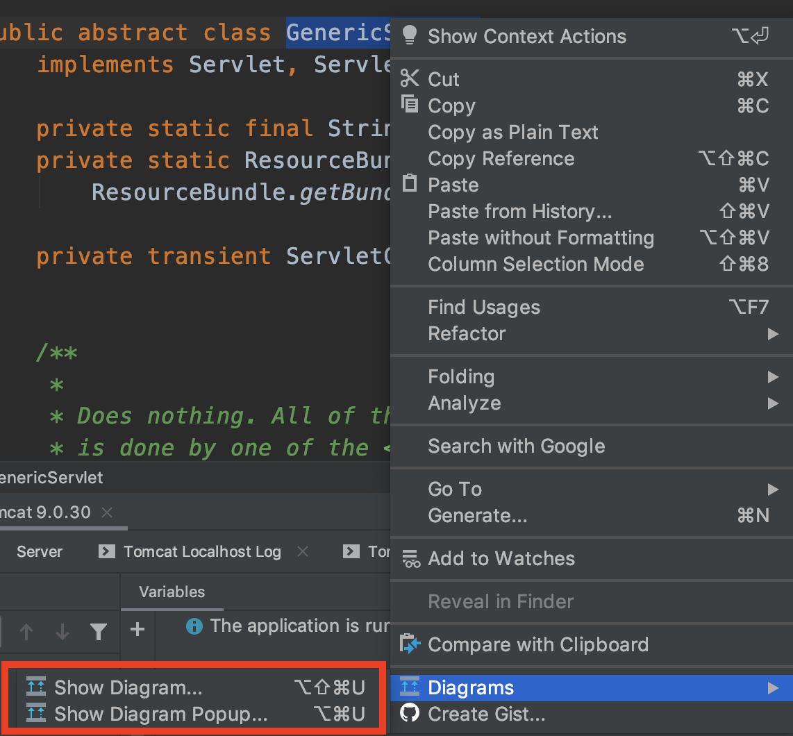

### 目录
- [配置文件与编译结果的保存位置](#配置文件与编译结果的保存位置)
- [工程结构](#工程结构)
- [工具设置](#工具设置)
    - [通用设置](#通用设置)
    - [java开发设置](#java开发设置)
    - [git相关设置](#git相关设置)
- [快捷键keymap](#快捷键keymap)
- [自定义开发模版](#自定义开发模版)
- [显示uml图](#显示uml图)
- 

# 配置文件与编译结果的保存位置
[top](#catalog)
- 配置文件
    - 初次启动后会在用户家目录下创建一个IntelliJIdea的文件夹，里面自动生成默认的配置文件。
    - 如果将配置文件改坏了，直接删除IntelliJIdea这个文件夹，然后重启工具，会重新生成该文件夹
- tomcat的编译位置/jsp的编译结果
    - $HOME/Library/Caches/IntelliJIdea2019.2/tomcat/工程名/work/Catalina/localhost/工程名

# 工程结构
[top](#catalog)
- project和module
    - 每一窗口只能显示一个project
    - project下以module来区分
    - module的删除方法
        1. project右键-->Open Module Settings-->选择Module-->Delete
        2. 操作1并没有真正从磁盘中删除，若需要从磁盘中删除，需要在project中选择module右键删除

# 工具设置
## 通用设置
[top](#catalog)
- 启动设置：File-->Settings
    - mac：intellij idea--> Preferences
- 设置工具的主题
    - Appearance&Behavior-->Appearance-->theme
- 修改当前主题的字体、字体大小、字体行间距
    - Editor-->Color Scheme-->Color Scheme Font
- 使用Ctrl+鼠标滚轮来调整文字大小
    - Editor-->General-->Mouse-->**Change font size(Zoom) with Ctrl+Mouse Wheel**
- 鼠标放在方法/类上显示Doc信息
    - Editor-->General-->Other-->**Show quick documentation on mouse move**
    - Delay参数设定显示的延迟时间
- 设置显示行号
    - Editor-->General-->Appearance-->Show line numbers
- 方法间的分隔符
    - Editor-->General-->Appearance-->Show method separators
    - 设置后每个方法之间使用虚线进行分割
- 忽略大小写的情况下进行提示
    - Editor-->General-->Code Completion-->
        - case sensitive completion: None
        - 或者取消：match case
- 取消单行显示tags
    - Editor-->General-->Editor Tabs-->
        - 取消：Show tabs in one row
    - 取消后，当打开的文件特别多时，顶部显示tags的部分会自动换行，进行多行显示
- 手动执行文字大小，样式，文字间隔的设置
    - Editor-->Font
- 修改注释颜色
    - Editor-->Color Scheme-->Language Defaults
        - 选择Commnets，可以分别对单行、多行、说明注释进行调整
- 注释不在行首
    - Editor-->Color Style-->Java
        - 右边选择：`Code Generatoin`
        - `Comment Code`关闭两个选项
            - `Line comment at first column`
            - `Block comment at first column`
- 修改类头的文档注释信息
    - Editor-->File and Code Templates-->
        - 选择Includes-->File Header，进行手动添加
- 设置项目文件的编码
    - 文件的编码最好都设定成**utf-8**
    - 也可用通过工具右下角的选项进行当前文件的编码变换
    - Editor-->File Encodings-->
        - Global Encoding
        - Project Encoding 
        - Default encoding for properties files
        - transparent native-to-assii conversion，涉及到ascii码时也进行自动转换
- 设置自动编译 
    - Intellij IDEA默认状态为不自动编译
    - Build,Execution,Deployment-->Compiler-->
        - Build project automatically 是否进行自动编译
        - Compile independent modules in parallel 是否并行的对多个模块编译
- 省电模式
    - File-->Power Save Mode
    - 在省电模式下，将自动关闭代码检查和代码提示等功能。可以理解为这是一种阅读模式

## java开发设置 
[top](#catalog)
- 设置超过指定的inport个数时，自动将import改为 `import xxx.*` （不常用）
    - Editor-->Code Style-->Java-->
        - 选择import
        - 单个包导入时的设定：Class count to use import with '*'，默认是5
        - 静态导入时(方法/类/变量等)的设定：Names count to use static import with '*'，默认是3

- 自动导包
    - 手动导包快捷键：alt+enter
    - Editor-->General-->Auto Import-->Java-->
        - Insert inports on paste: All
        - 选中：
            - Add unambiguous inports on the fly
            - Optimize imports on the fly

- java编译版本
    - Settings-->Bulid, Execution,Deployment-->Java Compiler
- 排除某个目录，不进行index
    - 右键 --> Mark Directory as --> Excluded
- 设置alt+enter可添加序列化id
    - 
- 去掉被忽略的maven工程：
    1. settings
    2. build,execution,deployment
    3. build tool
    4. maven
    5. ignored files
- 调整java的内存使用
    - idea.vmoptions
- 添加SDKS
    - File-->Project Structure

## git相关设置
[top](#catalog)
- 从git拉取项目
    - File-->New-->Project from version control--->git
- 使从git上克隆的java项目可用
    - File-->Project Structure
        - Projcet：添加out目录，SDK
        - Modules：设置src路径

# 快捷键keymap
[top](#catalog)

|快捷键|功能|
|-|-|
|shift + enter|光标向下移动一行|
|alt + enter|万能解错/生成返回值变量|
|alt + 左/右|在工作窗口进行移动|
|ctrl + h|查看类继承关系|
|ctrl + alt + L|代码格式化|
|ctrl +/-|代码折叠|
|ctrl+alt+T|增加对一段代码的某种处理|
|查看类的树形结构|ctrl + alt + U|
|ctrl + alt + h|查看方法的多层重写结构|
|alt+shift+f|添加收藏|
|ctrl + shift + U|切换代码文字的大小写
|alt+ insert|创建get/set，构造器|
|ctrl + D|复制一行代码|
|ctrl + alt + B|查看接口的实现类|
|ctrl + alt + B mac = option + commond + B|查看方法的实现|
|ctrl + alt + shift + n|查找某个类|
|ctrl + shift + t|创建测试类|
|ctrl + F7 mac = command + 7|列出当前类的大纲|
|shift + ctrl mac = command + /|多行注释|
|shift + shift|搜索|

# 自定义开发模版
[top](#catalog)
- 配置一些常用代码字母缩写，输入简写时可以使用
- 不可修改预定以设置：settings-->Editor-->General-->Postfix Completion
- 可修改预定义设置：settings-->Editor-->Live Templates
    - 同时可在该处添加自定义设置
- 常用模版
    - main方法=psvm
    - 控制台输出
        - sout
        - soutp 输出当前方法的形参 
        - soutm 输出当前的方法名
        - soutv 输出参数的值
        - xxx.sout xxx表示某个参数，加.sout后等同于直接输出该参数
    - for循环
        - fori 普通循环
        - iter 增强for循环 
        - itar 对某个参数进行计数
    - list for 集合遍历
        - xxx.for 增强for循环
        - xxx.fori 普通for循环
        - xxx.forr 倒叙for循环
    - 条件判断
        - ifn/xxx.null = if (xx==null)
        - inn/xxx.nn = if (xx!=null)
    - 变量类型
        - 私有静态=prsf
        - 公有静态=psf
        - 公有静态int型=psfi
        - 公有静态string型=psfs
- 自定义模版
    - ?????

# 显示uml图
[top](#catalog)
- 显示设定
- 显示uml图

[top](#catalog)
