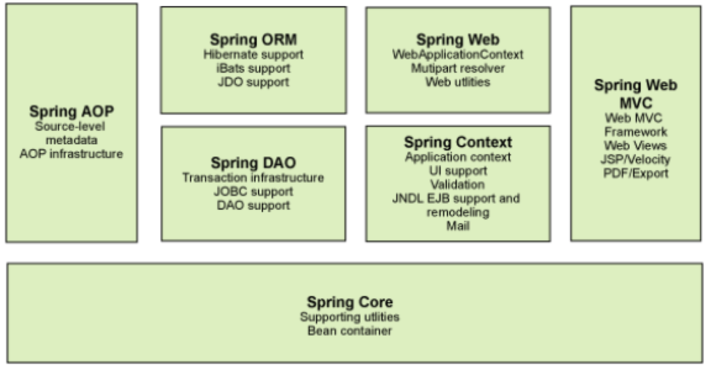
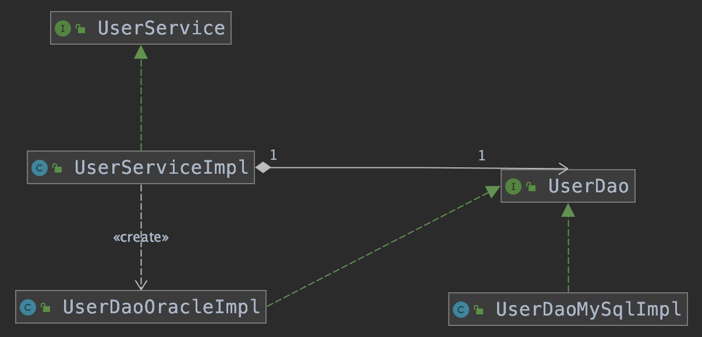
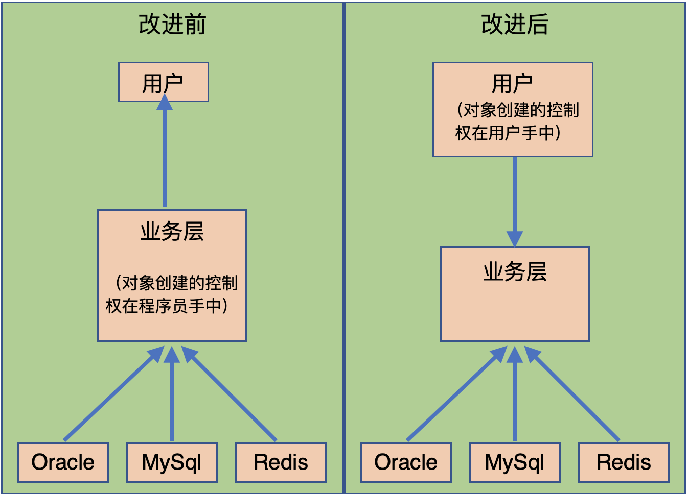
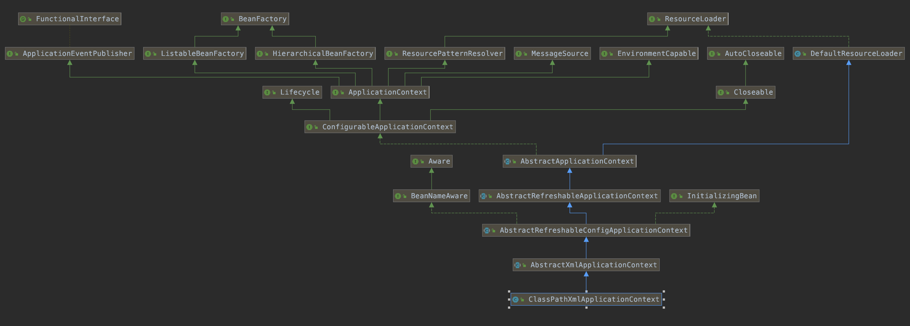

- 参考
    - https://www.bilibili.com/video/av71110355 
    - https://blog.kuangstudy.com/index.php
    - 官方说明文档地址：
        - https://spring.io/projects/spring-framework#learn
        - https://docs.spring.io/spring/docs/

<span id="catalog"></span>

### 目录

- [Spring简介](#Spring简介)
- [Spring的组成](#Spring的组成)
- [ioc理论](#ioc理论)
    - [引入问题-分层调用](#引入问题-分层调用)
    - [改进引入问题](#改进引入问题)
    - [IoC的本质](#IoC的本质)
    - [示例-XML配置来创建对象Hello](#示例-XML配置来创建对象Hello)
    - [对创建Hello对象的分析](#对创建Hello对象的分析)
    - [使用Spring改进引入问题](#使用Spring改进引入问题)
- [Spring最终解决的问题](#spring最终解决的问题)
- [spring配置与对象获取](#spring配置与对象获取)
- [对象获取](#对象获取)
- [配置方法](#配置方法)
- [常用的复杂类型配置](#常用的复杂类型配置)
- [命名空间注入](#命名空间注入)
- [bean的作用域](#bean的作用域)
- [自动装配的配置](#自动装配的配置)
- [DI依赖注入](#di依赖注入)
- [bean的自动装配](#bean的自动装配)
    - [在xml中做自动装配](#在xml中做自动装配)
    - [使用注解实现自动装配](#使用注解实现自动装配)
- [](#)

# Spring简介
[top](#catalog)
- 2002年，首次退出了Spring框架的雏形：interface21
- 2004年3月24日，Spring发布：以interface21框架为基础，经过重新设计，并不断丰富其内涵
- Spring的设计理念
    - 保持向后兼容性
    - 使现有的技术更加容易使用，整合了现有的技术框架
- SSH：Struct2 + Spring + Hibernate
- SSM：SpringMvc + SPring + Mybatis
- 官网说明文档入口
    - https://spring.io/projects/spring-framework#learn
- github地址
    - https://github.com/spring-projects/spring-framework
- maven导入
    - 导入包含依赖最多的spring-webmvc
        - maven配置
            ```xml
            <!-- https://mvnrepository.com/artifact/org.springframework/spring-webmvc -->
            <dependency>
                <groupId>org.springframework</groupId>
                <artifactId>spring-webmvc</artifactId>
                <version>5.2.4.RELEASE</version>
            </dependency>
            ```
        - 导入该包后，会同时导入
            ```
            org.springframework:spring-aop:5.2.4.RELEASE
            org.springframework:spring-beans:5.2.4.RELEASE
            org.springframework:spring-context:5.2.4.RELEASE
            org.springframework:spring-core:5.2.4.RELEASE
            org.springframework:spring-expression:5.2.4.RELEASE
            org.springframework:spring-web:5.2.4.RELEASE
            ```
    - 导入与jdbc的整合
        ```xml
        <!-- https://mvnrepository.com/artifact/org.springframework/spring-jdbc -->
        <dependency>
            <groupId>org.springframework</groupId>
            <artifactId>spring-jdbc</artifactId>
            <version>5.2.4.RELEASE</version>
        </dependency>
        ```
      
- Spring的优点
    - Spring是一个开源免费的框架（容器）
    - Spring是一个轻量级的、非入侵式的框架
        - 非入侵式：引入Spring之后不会影响原来的代码
- Spring的缺点
    - 配置十分繁琐（配置地狱）
        - 现阶段需要使用SpringBoot来解决
    
- **Spring框架的特点**
    - 控制反转，IOC
    - 面向切面编程，AOP
    - 支持事务处理
    - 可以对框架进行整合
    
- <label style="color:red">一句话描述Spring：Spring就是一个轻量级的控制反转和面向切面编程的框架</label>

# Spring的组成
[top](#catalog)
- 7大功能模块
    - 
- Spring Boot
    - 一个快速开发的脚手架
    - 可以快速的开发单个微服务
    - 学习SpringBoot的前提，是需要完全掌握Spring及SpringMVC
    - **约定大于配置**
- Spring Cloud
    - 基于Spring Boot实现的
    
# ioc理论
## 引入问题-分层调用
[top](#catalog)
- 需求
    - 分别创建service层和dao层
    - 在service是实现类中类中**组合**dao，并在方法中调用dao

- 最基本的实现方式：service与dao层的依赖关系
    - 

- 这种方式的问题
    - 外在：程序是主动创建对象，**创建哪种对象、如何创建对象**的控制权都在程序员手上，有需求就要直接修改类
    - 内在：dao与service之间因为组合关系发生了强耦合，如果需求发生变化，需要使用其他类型的dao实现，则**需要直接修改代码**。如果代码量很大，修改的成本会很高
    
- `UserDao`及其实现类
    - 参考代码
        - [/java/mylearn/myspring/src/main/java/com/ljs/learn/ioc/improve/dao/UserDao.java]/java/mylearn/myspring/src/main/java/com/ljs/learn/ioc/improve/dao/UserDao.java
        - [/java/mylearn/myspring/src/main/java/com/ljs/learn/ioc/improve/dao/UserDaoMySqlImpl.java]/java/mylearn/myspring/src/main/java/com/ljs/learn/ioc/improve/dao/UserDaoMySqlImpl.java
        - [/java/mylearn/myspring/src/main/java/com/ljs/learn/ioc/improve/dao/UserDaoOracleImpl.java]/java/mylearn/myspring/src/main/java/com/ljs/learn/ioc/improve/dao/UserDaoOracleImpl.java
    - 代码内容
        ```java
        public interface UserDao {
            String getUserName();
        }
      
        public class UserDaoMySqlImpl implements UserDao {
            @Override
            public String getUserName() {
                return "Mysql User";
            }
        }
      
        public class UserDaoOracleImpl implements UserDao {
            @Override
            public String getUserName() {
                return "Oracle User";
            }
        }
        ```
- `UserService`及其实现类
    - 参考代码
        - [/java/mylearn/myspring/src/main/java/com/ljs/learn/ioc/base/service/UserService.java](/java/mylearn/myspring/src/main/java/com/ljs/learn/ioc/base/service/UserService.java)
        - [/java/mylearn/myspring/src/main/java/com/ljs/learn/ioc/base/service/UserServiceImpl.java](/java/mylearn/myspring/src/main/java/com/ljs/learn/ioc/base/service/UserServiceImpl.java)
    - 代码内容
        ```java
        public interface UserService {
            void printUserName();
        }
      
        public class UserServiceImpl implements UserService {
        
            // 组合一个UserDao
            // private UserDao dao = new UserDaoMySqlImpl();
            // 当需求发生变化时，需要直接修改代码，替换接口实现
            private UserDao dao = new UserDaoOracleImpl();
        
            @Override
            public void printUserName() {
                System.out.println(dao.getUserName());
            }
        }
        ```
      
- 测试类
    - 参考代码
        - [/java/mylearn/myspring/src/test/java/com/ljs/learn/ioc/base/IocBaseTest.java](/java/mylearn/myspring/src/test/java/com/ljs/learn/ioc/base/IocBaseTest.java)
    - 代码内容
        ```java
        @Test
        public void test01(){
            UserService service = new UserServiceImpl();
            service.printUserName();
        }
        ```

## 改进引入问题
[top](#catalog)
- 在基本实现方式中，直接将dao**组合**到service中，导致了强耦合
- 改进方法：在**service**中通过构造器或setter**将组合改为聚合**，在使用时**从外部注入依赖**
- 改进后的优点
    - 需求发生变化时修改外部的注入即可，不需要直接修改类本身
    - 使用set/构造器注入之后，程序不再具有主动性，而是变成被动地接受对象
    - 使用注入之后，不用再去管理对象的创建了
    - 系统的耦合性降低，可以更加专注在业务的实现上
    - <label style="color:red">这种方式是IoC的原型</label>

- 改进后的service实现
    - 参考代码
        - [/java/mylearn/myspring/src/main/java/com/ljs/learn/ioc/improve/service/UserServiceImpl.java](/java/mylearn/myspring/src/main/java/com/ljs/learn/ioc/improve/service/UserServiceImpl.java)
    - 代码内容
        ```java
        public class UserServiceImpl implements UserService {
        
            // 将组合dao改为聚合dao，并在构造器或setter中完成依赖关系的传递
            private UserDao dao;
        
            public UserServiceImpl(UserDao dao) {
                this.dao = dao;
            }
        
            public void setDao(UserDao dao) {
                this.dao = dao;
            }
        
            @Override
            public void printUserName() {
                System.out.println(dao.getUserName());
            }
        }
        ```
- 测试内容
    - 参考代码
        - [/java/mylearn/myspring/src/test/java/com/ljs/learn/ioc/improve/IocImporveTest.java](/java/mylearn/myspring/src/test/java/com/ljs/learn/ioc/improve/IocImporveTest.java)
    - 代码内容
        ```java
        @Test
        public void test01(){
            // 实例化service对象的同时，注入dao的依赖
            UserService service01 = new UserServiceImpl(new UserDaoMySqlImpl());
            service01.printUserName();
    
            System.out.println("-----");
    
            // 当需求变化，需要改变dao的实现时，不需要修改源码，直接修改注入的dao对象
            UserService service02 = new UserServiceImpl(new UserDaoOracleImpl());
            service02.printUserName();
        }
        ```
      
- 改进前后的控制关系对比
    - 创建对象的控制权从类自身/程序员手中移动到了用户
    - 
    
    
## IoC的本质
[top](#catalog)
- 控制反转（Inversion of Control）是一种设计思想，依赖注入(DI)是实现Ioc的一种方式
- 在面向对象编程中，IoC的一种思考方式：**获取依赖对象的方式**
    - 不使用IoC，依赖对象的创建由程序自身/程序员来控制
    - 使用IoC，依赖对象的创建转移给第三方
- 两种对Spring中IoC的精要描述
    - <label style="color:red">Spring的IoC是一种通过描述(XML或注解)并通过第三方生产或获取特定对象的方式</label>
    - <label style="color:red">IoC就是对象由Spring来创建、管理、装配</label>
- IoC是Spring的核心内容
    - Spring中实现控制反转的是**Ioc容器**，实现方法是依赖注入
    - 多种IoC的实现方式
        - xml配置
            - xml配置Bean时，Bean的定义信息和实现是**分离的**
        - 注解
            - 注解配置Bean时，Bean的定义信息和实现是**一体的** 
        - 新版本Spring也可以实现零配置实现IoC
    - 创建过程
        - Spring容器在初始化时先读取配置文件
        - 根据配置文件或元数据创建与组织对象存入容器
        - 程序使用时再从IoC容器中去除需要的对象
        - [springIoC_HowWork](imgs/ioc/springIoC_HowWork.png)


## 示例-XML配置来创建对象Hello
[top](#catalog)
- 从Spring中获取类时，可以通过Spring的上下文对象来获取
    - `ApplicationContext context = new ClassPathXmlApplicationContext("services.xml", "daos.xml");`
- Hello类
    - 参考代码
        - [/java/mylearn/myspring/src/main/java/com/ljs/learn/ioc/springHello/Hello.java](/java/mylearn/myspring/src/main/java/com/ljs/learn/ioc/springHello/Hello.java)  
    - 代码内容
        ```java
        public class Hello {
            private String str;
        
            public Hello() {
            }
        
            public Hello(String str) {
                this.str = str;
            }
        
            public String getStr() {
                return str;
            }
        
            public void setStr(String str) {
                this.str = str;
            }
        
            @Override
            public String toString() {
                return "Hello{" +
                        "str='" + str + '\'' +
                        '}';
            }
        }
        ```

- Spring配置
    - 配置文件
        - [/java/mylearn/myspring/src/main/resources/ioc/springHello/bean.xml](/java/mylearn/myspring/src/main/resources/ioc/springHello/bean.xml)
    - 配置内容
        ```java
        <?xml version="1.0" encoding="UTF-8"?>
        <beans xmlns="http://www.springframework.org/schema/beans"
               xmlns:xsi="http://www.w3.org/2001/XMLSchema-instance"
               xsi:schemaLocation="http://www.springframework.org/schema/beans
                https://www.springframework.org/schema/beans/spring-beans.xsd">
        
        <!--使用Spring来创建对象，-->
        <!--分别配置类的全类名及类对应的id-->
        <bean id="hello" class="com.ljs.learn.ioc.springHello.Hello">
            <!--通过该标签为实例对象中的属性设值-->
            <property name="str" value="helloTest"/>
        </bean>
        
        </beans>
        ```
- 测试类
    - 参考代码
        - [/java/mylearn/myspring/src/test/java/com/ljs/learn/ioc/springHello/HelloTest.java](/java/mylearn/myspring/src/test/java/com/ljs/learn/ioc/springHello/HelloTest.java)
    - 代码内容
        ```java
        import org.junit.Test;
        import org.springframework.context.ApplicationContext;
        import org.springframework.context.support.ClassPathXmlApplicationContext;
        
        public class HelloTest {
            @Test
            public void test01(){
                // 获取Spring的上下文对象
                ApplicationContext context = new ClassPathXmlApplicationContext("ioc/springHello/bean.xml");
                // 类配置到Spring之后，所有的对象都有Spring管理，使用时直接到上下文中获取
                Hello hello = (Hello) context.getBean("hello");
                System.out.println(hello.toString());
            }
        }
        ```
      
## 对创建Hello对象的分析
[top](#catalog)
- 控制
    - 传统应用程序的对象由程序本身创建，使用Spring后对象有Spring创建
    - 即没有直接通过代码`Hello obj = new Hello()`来实例化对象，而是从Spring上下文对象中获取
- 反转
    - 类本身不创建对象，而是被动的接收对象
    - 即没有直接通过代码`Hello obj = new Hello()`来实例化对象，而是从Spring上下文对象中获取
- 依赖注入
    - 类中的成员变量`str`通过配置的方式，在执行过程中使用`setter`来注入

- 使用Spring之后，实现不同需求的时候，只要修改配置就可以了
   
## 使用Spring改进引入问题
[top](#catalog)
- service实现类的修改：只保留`setter`注入方式，并且提供空参构造器
    - 参考代码
        - [/java/mylearn/myspring/src/main/java/com/ljs/learn/ioc/springBaseImprove/service/UserServiceImpl.java](/java/mylearn/myspring/src/main/java/com/ljs/learn/ioc/springBaseImprove/service/UserServiceImpl.java)
    - 代码内容
        ```java
        public class UserServiceImpl implements UserService {
        
            // 将组合dao改为聚合dao，并在setter中完成依赖关系的传递
            private UserDao dao;
        
            public void setDao(UserDao dao) {
                this.dao = dao;
            }
        
            @Override
            public void printUserName() {
                System.out.println(dao.getUserName());
            }
        }
        ```
- XML配置
    - 配置文件
        - [/java/mylearn/myspring/src/main/resources/ioc/springBaseImprove/bean.xml](/java/mylearn/myspring/src/main/resources/ioc/springBaseImprove/bean.xml)
    - 配置内容
        ```xml
        <?xml version="1.0" encoding="UTF-8"?>
        <beans xmlns="http://www.springframework.org/schema/beans"
               xmlns:xsi="http://www.w3.org/2001/XMLSchema-instance"
               xsi:schemaLocation="http://www.springframework.org/schema/beans http://www.springframework.org/schema/beans/spring-beans.xsd">
        
            <bean id="mySqlImpl" class="com.ljs.learn.ioc.springBaseImprove.dao.UserDaoMySqlImpl"/>
            <bean id="oracleImpl" class="com.ljs.learn.ioc.springBaseImprove.dao.UserDaoOracleImpl"/>
        
            <!--想service中注入MySql的实现对象-->
            <bean id="serviceMysql" class="com.ljs.learn.ioc.springBaseImprove.service.UserServiceImpl">
                <!--直接使用Spring容器中创建的对象-->
                <property name="dao" ref="mySqlImpl"/>
            </bean>
        
            <!--想service中注入Oracle的实现对象-->
            <bean id="serviceOracle" class="com.ljs.learn.ioc.springBaseImprove.service.UserServiceImpl">
                <!--直接使用Spring容器中创建的对象-->
                <property name="dao" ref="oracleImpl"/>
            </bean>
        </beans>
        ```
- 测试类
    - 测试代码
        - [/java/mylearn/myspring/src/test/java/com/ljs/learn/ioc/springBaseImprove/UserTest.java](/java/mylearn/myspring/src/test/java/com/ljs/learn/ioc/springBaseImprove/UserTest.java)
    - 代码内容
        ```java
        public class UserTest {
            // 不修改任何代码，直接通过ID，从Spring中获取聚合了两种dao实例的service对象
            @Test
            public void test01(){
                ApplicationContext context = new ClassPathXmlApplicationContext("ioc/springBaseImprove/bean.xml");
                UserServiceImpl serviceMysql = (UserServiceImpl) context.getBean("serviceMysql");
                serviceMysql.printUserName();
            }
        
            @Test
            public void test02(){
                ApplicationContext context = new ClassPathXmlApplicationContext("ioc/springBaseImprove/bean.xml");
                UserServiceImpl serviceOracle = (UserServiceImpl) context.getBean("serviceOracle");
                serviceOracle.printUserName();
            }
        }
        ```

# spring最终解决的问题
[top](#catalog)
- 对象完全由Spring创建
    - 在配置文件加载的时候，容器中管理的对象就已经完成初始化了
- 对象的属性通过xml配置，由Spring容器自动进行设定
- 使用对象时，直接从容器中通过`id`获取


# spring配置与对象获取
## 对象获取
[top](#catalog)
- `resources`目录下添加`beans.xml`文件
-  官方说明：`docs.spring.io/spring/docs/5.2.0.RELEASE/spring-framework-reference/core.html`
- 实例化容器
    - `ApplicationContext context = new ClassPathXmlApplicationContext("services.xml", "daos.xml");`
        - 获取spring的上下文对象
            - 使用xml来配置必须使用`ClassPathXmlApplicationContext`
            - 可以传入多个配置文件明
    - 

## 配置方法
[top](#catalog)
- 基本配置框架
    ```xml
    <?xml version="1.0" encoding="UTF-8"?>
    <beans xmlns="http://www.springframework.org/schema/beans"
        xmlns:xsi="http://www.w3.org/2001/XMLSchema-instance"
        xsi:schemaLocation="http://www.springframework.org/schema/beans
            https://www.springframework.org/schema/beans/spring-beans.xsd">

        <bean id="..." class="...">
            <!-- collaborators and configuration for this bean go here -->
        </bean>

        <bean id="..." class="...">
            <!-- collaborators and configuration for this bean go here -->
        </bean>

        <!-- more bean definitions go here -->

    </beans>
    ```
- Bean的配置
    - 同一个`class`下，不同的`id`代表不同的实例对象
    - `name`也相当于别名
        - 可以有多个别名
        - 多个别名可以用`,`、空格、`;`分隔
    ```xml
    <bean id="hello" class="com.ljs.pojo.Hello" name="h1, h2, h3">
        <property name="str" value="Spring"></property>
    </bean>
    ```
- 别名
    - 使用时，通过bean名或别名都可以从容器中获取对象
    ```xml
    <bean id="user" class="com.ljs.pojo.User">
        <constructor-arg name="name" value="MyName"></constructor-arg>
    </bean>

    <alias name="user" alias="otheruser"></alias>
    ```
- import
    - 一般用于团队开发使用，可以将多个配置文件，引入合并为一个配置
    - 标准的配置文件名：`applicationContext.xml`
    - 使用的时候直接使用合并后的配置
    ```xml
    <import resource="其他配置文件的文件名"></import>
    ```
- 构造函数配置
    - 默认使用无参构造创建对象
    - 对于有参构造函数的配置
        - 构造函数的参数类型进行匹配
            - 通过`type="属性"`显示指定构造参数的类型，容器可以使用简单类型的类型匹配
            - 不推荐使用，不好处理多个类型相同参数的构造函数
            ```xml
            <bean id="exampleBean" class="examples.ExampleBean">
                <constructor-arg type="int" value="7500000"/>
                <constructor-arg type="java.lang.String" value="42"/>
            </bean>
            ```
        - 构造函数的参数下标
            - 通过`index="XX"`来明确指定构造参数的索引
            - 这种方式，可以解决多个简单值的歧义性
            ```xml
            <bean id="exampleBean" class="examples.ExampleBean">
                <constructor-arg index="0" value="7500000"/>
                <constructor-arg index="1" value="42"/>
            </bean>
            ```
        - 直接同参数名来创建
            ```xml
            <bean id="user" class="com.ljs.pojo.User">
                <constructor-arg name="name" value="MyName"></constructor-arg>
            </bean>
            ```
## 常用的复杂类型配置
[top](#catalog)
- 类
    ```java
    public class Student {
        private String name;
        private Adderss adderss;
        private String[] books;
        private List<String> hobbies;
        private Map<String, String> card;
        private Set<String> games;
        private String wifi;
        private Properties info;
        ...
    }
    ```
- 配置
    ```xml
    <bean id="address" class="com.ljs.pojo.Adderss">
        <property name="adderss" value="Test Address"></property>
    </bean>
    <bean id="student" class="com.ljs.pojo.Student">
        <property name="name" value="MyName"></property>

        <!--注入类Adderss-->
        <property name="adderss" ref="address"></property>

        <!--数组 -->
        <property name="books">
            <array>
                <value>books-01</value>
                <value>books-02</value>
                <value>books-03</value>
                <value>books-04</value>
            </array>
        </property>

        <!--list -->
        <property name="hobbies">
            <list>
                <value>hobby01</value>
                <value>hobby02</value>
                <value>hobby03</value>
            </list>
        </property>

        <!--Map -->
        <property name="card">
            <map>
                <entry key="id01" value="v1"></entry>
                <entry key="id02" value="v2"></entry>
                <entry key="id03" value="v3"></entry>
            </map>
        </property>

        <!--Set -->
        <property name="games">
            <set>
                <value>game01</value>
                <value>game02</value>
                <value>game03</value>
            </set>
        </property>

        <!--null -->
        <property name="wifi">
            <null></null>
        </property>

        <!--Properties -->
        <property name="info">
            <props>
                <prop key="p1">pv1</prop>
                <prop key="p2">pv2</prop>
                <prop key="p3">pv3</prop>
            </props>
        </property>
    </bean>
    ```
## 命名空间注入
[top](#catalog)
- p命名空间注入
    - 参考:`https://docs.spring.io/spring/docs/5.2.0.RELEASE/spring-framework-reference/core.html#beans-p-namespace`
    - 是对类型的注入
    - xml头部添加：`xmlns:p="http://www.springframework.org/schema/p"`
    - 注入方式
        ```xml
        <bean id="user" class="com.ljs.pojo.User" p:name="Myname" p:age="18"></bean>
        ```
- c命名空间
    - 参考:`https://docs.spring.io/spring/docs/5.2.0.RELEASE/spring-framework-reference/core.html#beans-c-namespace`
    - 是对构造器参数的配置
    - xml头部添加：`xmlns:c="http://www.springframework.org/schema/c"`
    - 注入方式
        ```xml
        <bean id="user3" class="com.ljs.pojo.User" c:age="20" c:name="CName"></bean>
        ```

## bean的作用域
[top](#catalog)
- scope
- 基本作用域
    - singleton，单例模式，默认实现
    - prototype，原型模式
        - 每次get时都会产生一个新对象
- 只能在web开发中使用的作用域
    - request
    - session
    - application
    - websocket

## 自动装配的配置
- [在xml中做自动装配](#在xml中做自动装配)

# DI依赖注入
[top](#catalog)
- 依赖：bean对象的创建依赖与容器
- 注入：bean对象中的所有属性，有容器来注入
- 三种方式
    - 构造器注入
        - `bean`下通过`constructor-arg`设定
        - c命名空间注入
    - 通过set方式注入
        - `bean`下通过`property`设定
        - p命名空间注入
    - 第三方提供的其他注入方式

# bean的自动装配
[top](#catalog)
- 自动装配是**Spring满足bean依赖的一种方式**
- Spring会在上下文中自动寻找，并自动给bean装配属性
- 在Spring中有三种装配的方式
    1. 在xml中显示的配置
    2. 在java中显示配置
    3. **隐式的自动装配**

## 在xml中做自动装配
[top](#catalog)
- 类
    ```java
    public class Dog {
        public void shut(){
            System.out.println("wang");
        }
    }

    public class Cat {
        public void shut(){
            System.out.println("miao");
        }
    }

    public class People {
        private Cat cat;
        private Dog dog;
        private String name;

        @Override
        public String toString() {
            return "People{" +
                    "cat=" + cat +
                    ", dog=" + dog +
                    ", name='" + name + '\'' +
                    '}';
        }

        public Cat getCat() {
            return cat;
        }

        public void setCat(Cat cat) {
            this.cat = cat;
        }

        public Dog getDog() {
            return dog;
        }

        public void setDog(Dog dog) {
            this.dog = dog;
        }

        public String getName() {
            return name;
        }

        public void setName(String name) {
            this.name = name;
        }
    }
    ```
- xml配置
    - 在`bean`的配置下添加`autowire`属性
        ```xml
        <bean id="people" class="com.ljs.pojo.People" autowire="byName">
            <property name="name" value="Myname"></property>
        </bean>
        ```
    - `autowire`的装配方式
        - `byname`:会自动在容器上下文中查找和自己对象`set`方法后面的值对应的`beanid`
            - 如`people`中有`setDog`,`setCat`，容器会去寻找`beanid`是`dog`、`cat`的`bean`
            - 需要`beanid`是小写的
        - `byType`:会自动在容器上下文中查找和自己对象属性类型相同的`bean`
            - 必须保证需要使用`bean`是**全局唯一的**，否则无法使用
            - 在这种模式下，目标`bean`也可以不写`id`

## 使用注解实现自动装配
[top](#catalog)
- Spring2.5开始支持注解
- 参考：`https://docs.spring.io/spring/docs/5.2.0.RELEASE/spring-framework-reference/core.html#beans-annotation-config`
- 使用方法
    1. 导入约束:context约束
        - 需要同时导入aop部分
    2. 配置注解的支持:`<context:annotation-config/>`
        ```xml
        <?xml version="1.0" encoding="UTF-8"?>
        <beans xmlns="http://www.springframework.org/schema/beans"
            xmlns:xsi="http://www.w3.org/2001/XMLSchema-instance"
            xmlns:context="http://www.springframework.org/schema/context"
            xmlns:aop="http://www.springframework.org/schema/aop"
            xsi:schemaLocation="http://www.springframework.org/schema/beans
                    https://www.springframework.org/schema/beans/spring-beans.xsd
                    http://www.springframework.org/schema/context
                    https://www.springframework.org/schema/context/spring-context.xsd
                    http://www.springframework.org/schema/aop
                    https://www.springframework.org/schema/aop/spring-aop.xsd">

            <context:annotation-config/>

        </beans>
        ```
    3. 添加bean
    4. 使用注解`@Autowired`

- `@Autowired`
    - 可以在属性、set方法上使用
        - 使用注解后，也可以省略`set`方法
    - 默认通过`byType`的查找，找不到再通过`byName`查找
    - 参数`required`默认为真
    - `required=false`时，对象可以为null
    ```java
    public @interface Autowired {
        boolean required() default true;
    }
    ```
- `@Qualifier(value="beanid")`
    - 当对象名与beanid不同是，通过该注解来指定bean
    - 如果bean的类型与属性类型不同时，会引发异常
- java的注解：`@Resource`
    - 先通过`beanid`查找，再通过类型查找，都找不到就失败
    - 可以通过`@Resource(name = "beanid")`来指定`bean`

# 使用注解开发
- bean
    - 在spring4后，如果要使用注解开发，必须要保证**导入了spring-aop的包**
    - 使用注解需要增加`context约束`，增加注解支持
    - 指定要扫描的包，这个拔下的注解就会生效
- 属性如何注入
- 衍生的注解
- 自动装配
- 作用域
