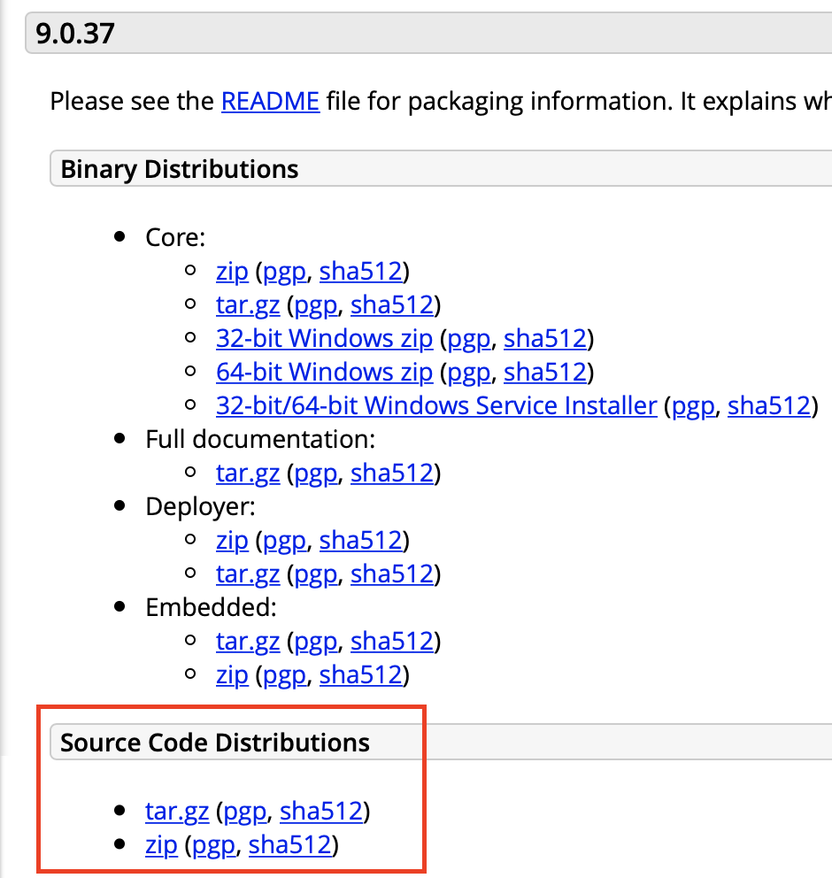
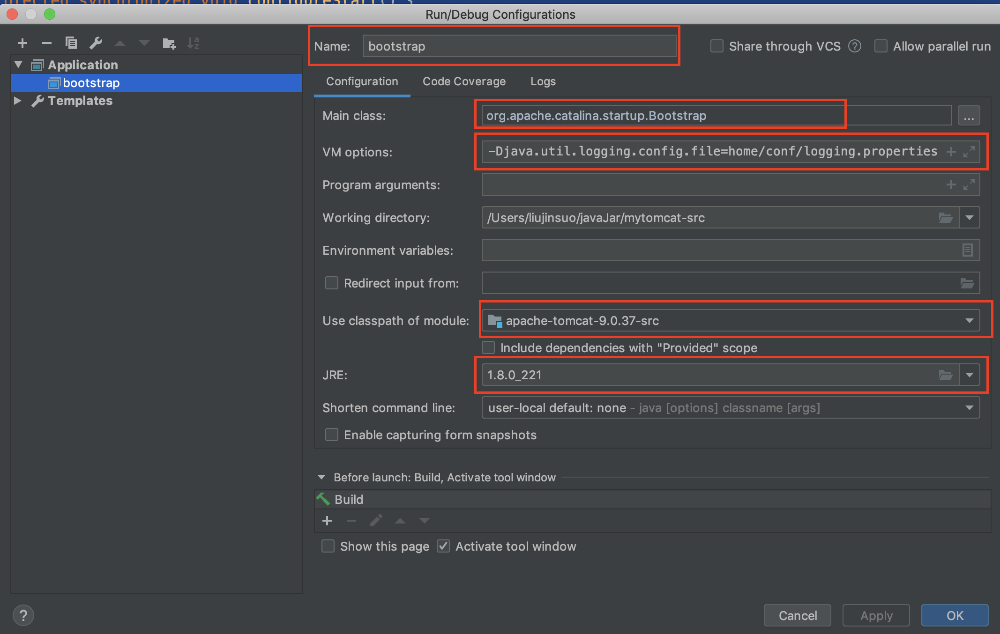
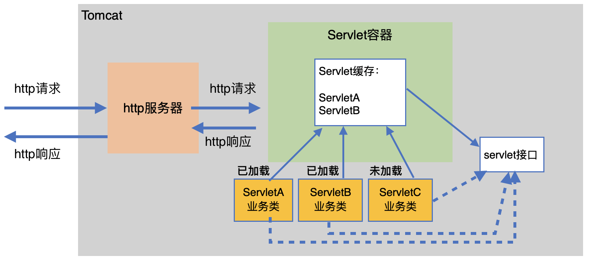

<span id="catalog"></span>
- 参考
    - https://www.bilibili.com/video/av67233983
    - 源码环境配置参考
        - https://blog.csdn.net/yangzl2008/article/details/43982747

### 目录
- [tomcat基础](#tomcat基础)
    - [web概念](#web概念)
    - [tomcat的目录结构](#tomcat的目录结构)
    - [安装tomcat](#安装tomcat)
    - [tomcat的启动与停止](#tomcat的启动与停止)
    - [tomcat源码安装](#tomcat源码安装)
- [Tomcat架构](#Tomcat架构)
    - [Tomcat整体架构](#Tomcat整体架构)
        - [http请求处理](#http请求处理)
        - [Servlet容器工作流程](#Servlet容器工作流程)
        - [Tomcat架构图](#Tomcat架构图)
    - [连接器--Coyote](#连接器--Coyote)
        - [Coyote介绍](#Coyote介绍)
        - [Coyote支持的IO模型与协议](#Coyote支持的IO模型与协议)
        - [连接器组件](#连接器组件)
- [](#)


# tomcat基础
## web概念
[top](#catalog)
- 软件架构
    - C/S: 客户端/服务端
    - B/S: 浏览器/服务器端
- 资源分类
    - 静态资源
        - 所有用户访问的结果都是一样的，称为静态资源
        - 静态资源可以直接被浏览器解析
        - 如：html、JS、图片等
    - 动态资源
        - 每个用户访问相同资源后，得到的结果可能不一样
        - 动态资源需要先转换为静态资源，然后再返回给浏览器，通过浏览器进行解析
        - 如：servlet、jsp等
- 网络通信的三要素
    - IP ：计算机在网络中的标识
    - 端口：应用程序在计算机中的唯一标识
    - 传输协议
        - tcp，安全协议
        - udp，不安全协议，但是速度快

## tomcat的目录结构
[top](#catalog)
  
|目录|文件|说明|
|-|-|-|
|bin|`/`|存放tomcat的启动、停止的批处理脚本文件|
|bin|`startup.bat`<br>`startup.sh`|用于在 windows 和 linux下启动服务|
|bin|`shutdown.bat`<br>`shutdown.sh`|用于在 windows 和 linux下停止服务|
|conf|`/`|保存tomcat的配置文件|
|conf|Catalina|保存针对每个虚拟机的`Context`配置|
|conf|context.xml|定义web应用需要加载的**公共**`Context`配置<br>如果web应用有自己的 `context.xml`，会覆盖公共配置中的内容|
|conf|catalina.properties|tomcat的环境变量配置|
|conf|catalina.policy|tomcat 运行的安全策略配置|
|conf|logging.properties|tomcat的日志配置文件<br>可以配置日志级别、日志路径等|
|conf|server.xml|tomcat服务器的核心配置文嘉安|
|conf|tomcat-users.xml|定义tomcat默认的用户及角色映射信息配置|
|conf|web.xml|tomcat中所有应用的默认`部署描述文件`，定义了基础`servlet`和`MIME`映射|
|lib|/|tomcat服务器的依赖包|
|logs|/|tomcat默认的日志输出目录|
|webapps|/|tomcat默认的web应用部署目录|
|work|/|JSP代码生成和编译的临时目录|

## 安装tomcat
[top](#catalog)
- 官网下载: https://tomcat.apache.org
    - 下载页面的 `Binary Distributions` 下的 `Core` 中的包
- 安装
    1. 下载 `tar.gz` 包
    2. 需要保证已经安装了jdk: `java -version`
    3. 添加环境变量:  `CATALINA_HOME`
        ```shell
        export CATALINA_HOME=<tomcat目录的根目录>/apache-tomcat-a.b.c
        export PATH=$PATH:$CATALINA_HOME/bin
        ```
    
## tomcat的启动与停止
[top](#catalog)
- 通过两个批处理文件来启动与停止tomcat
    - 启动tomcat: `startup.bat`、`startup.sh`
        - 启动后可以通过 `ctrl + c` 或 `control+c` 来停止
    - 停止tomcat: `shutdown.bat`、`shutdown.sh`

- 使用 `catalina.sh`、`catalina.bat` 命令
    - `catalina run`: 在同一个命令行窗口下启动服务器
        - 通过`ctrl+c` 或 `control+c` 来关闭服务器
    - `catalina start`: 开启一个新的窗口，并启动服务器
    - `catalina stop`: 开启一个新的窗口，并关闭服务器

- 访问地址
    - `localhost:8080`

## tomcat源码安装
[top](#catalog)
- 官网下载: https://tomcat.apache.org
    - 下载页面的 `Source Code Distributions` 中的包
        - 

- 将压缩包导入到idea中
    1. 整理 tomcat 源码目录
        1. 创建外层目录 `mytomcat-src`
        2. 将解压后的 tomcat 源码目录移动到`mytomcat-src`下
        3. 在tomcat源码目录下添加pom.xml
        4. 在 `mytomcat-src` 目录下创建 `home`目录
        5. 将 tomcat 源码目录下的 `conf`、`webapps` 目录拷贝到 `home` 目录下
        6. 在 `mytomcat-src` 目录下添加 `pom.xml` 文件，将 `mytomcat-src` 改造成聚合maven工程
    2. 最终的目录结构
        ```
        - mytomcat-src
            - apache-tomcat-9.0.37-src
                - 原始代码内容
                - pom.xml
            - home
                - conf
                - webapps
            - pom.xml
        ```
    2. 通过`file ---> open` 将源码导入到 idea，并导入maven依赖
    3. 修改代码
        - `JDTCompiler.java`
        - `ContextConfig.java`
    4. 添加启动配置 和 `VM options`
        1. 点击添加配置
            - 
        2. 添加一个 application
            - 
        3. 将 main class 设置为: `org.apache.catalina.startup.Bootstrap`
            - 这个类中包含 `main` 方法，所以可以用来启动项目
            - 
    5. 编译并启动项目

- 最好使用jdk1.8编译，13及以上可能会有`sun.rmi.registry`找不到的问题

- maven pom.xml 文件参考
    - 聚合工程 pom.xml
        - [src/pom/modules-pom.xml](src/pom/modules-pom.xml)
    - tomcat源码 pom.xml
        - [src/pom/tomcat-src-pom.xml](src/pom/tomcat-src-pom.xml)

- `VM options` 配置内容。`home` 就是创建的 `home`目录
    ```
    -Dcatalina.home=home
    -Dcatalina.base=home
    -Djava.endorsed.dirs=home/endorsed
    -Djava.io.tmpdir=home/temp
    -Djava.util.logging.manager=org.apache.juli.ClassLoaderLogManager
    -Djava.util.logging.config.file=home/conf/logging.properties
    ```

- 需要修改的代码
    1. `JDTCompiler.java` 文件会有两部分问题代码，需要注释掉
        - 问题原因: 
            - `org.eclipse.jdt.core.compiler` 找不到对应的版本的常量，需要手动删除
        - 删除部分
            ```java
            } else if(opt.equals("9") || opt.equals("1.9")) {
                settings.put(CompilerOptions.OPTION_Source,
                                CompilerOptions.VERSION_9);
            } else if(opt.equals("10")) {
                settings.put(CompilerOptions.OPTION_Source,
                                CompilerOptions.VERSION_10);
            } else if(opt.equals("11")) {
                settings.put(CompilerOptions.OPTION_Source,
                                CompilerOptions.VERSION_11);
            } else if(opt.equals("12")) {
                settings.put(CompilerOptions.OPTION_Source,
                                CompilerOptions.VERSION_12);
            ```
            ```java
                        } else if(opt.equals("9") || opt.equals("1.9")) {
                settings.put(CompilerOptions.OPTION_TargetPlatform,
                                CompilerOptions.VERSION_9);
                settings.put(CompilerOptions.OPTION_Compliance,
                        CompilerOptions.VERSION_9);
            } else if(opt.equals("10")) {
                settings.put(CompilerOptions.OPTION_TargetPlatform,
                        CompilerOptions.VERSION_10);
                settings.put(CompilerOptions.OPTION_Compliance,
                        CompilerOptions.VERSION_10);
            } else if(opt.equals("11")) {
                settings.put(CompilerOptions.OPTION_TargetPlatform,
                        CompilerOptions.VERSION_11);
                settings.put(CompilerOptions.OPTION_Compliance,
                        CompilerOptions.VERSION_11);
            } else if(opt.equals("12")) {
                settings.put(CompilerOptions.OPTION_TargetPlatform,
                        CompilerOptions.VERSION_12);
                settings.put(CompilerOptions.OPTION_Compliance,
                        CompilerOptions.VERSION_12);
            ```
    2. 在 `ContextConfig.java` 中初始化 JSP 解析器，否则 `localhost:8080` 无法正常显示
        - 在 `configureStart` 方法下添加
            ```java
            protected synchronized void configureStart() {
                // Called from StandardContext.start()

                if (log.isDebugEnabled()) {
                    log.debug(sm.getString("contextConfig.start"));
                }

                if (log.isDebugEnabled()) {
                    log.debug(sm.getString("contextConfig.xmlSettings",
                            context.getName(),
                            Boolean.valueOf(context.getXmlValidation()),
                            Boolean.valueOf(context.getXmlNamespaceAware())));
                }

                webConfig();

                // 需要添加的内容
                // VVVVVVVVVVVVVVVVV
                context.addServletContainerInitializer(new JasperInitializer(),null);
                ...
            }
            ```

# Tomcat架构
## Tomcat整体架构
### http请求处理
[top](#catalog)
- http服务器请求处理与Servlet的关系图
    - 

- 最原始的处理http请求的方式
    - 服务器根据请求内容调用不同的业务类进行处理
    - 这样会导致http服务器与业务过度耦合

- Tomcat架构的处理方式
    - http服务器不直接调用业务类，而是将请求交给 `Servlet容器` 处理
    - 通过 `Servlet容器` 将 http服务器 与 业务解耦
        - `Servlet容器` 通过`Servlet接口`调用业务类
        - 如果某个业务类已经使用过，会被暂时缓存在容器中；如果没有，会在使用时进行加载

- Servlet规范
    - Servlet容器和Servlet接口这一整套规范称为 `Servlet规范`
- Tomcat 自身
    - 按照 `Servlet规范` 实现了 `Servlet容器`
    - tomcat 同时具有http服务器的功能
    - 开发时，一个业务类就是一个 Servlet
    - 每个Servlet类需要注册到 Servlet 容器中，其余问题有 tomcat 负责

### Servlet容器工作流程
[top](#catalog)
- Servlet容器工作流程
    - 

- 详细工作流程

    ||流程|详细内容|
    |-|-|-|
    |1|封装请求，并发送给Servlet容器|http服务器用`ServeltRequest`封装请求信息，并调用Servlet容器的`service`方法|
    |2|搜索Servlet|Servlet 容器得到请求后，根据 URL 和 Servlet 的映射关系，找到对应的Servlet|
    |3|调用Servlet处理请求|<ol><li>Servlet 未加载，通过反射创建Serlvet，并调用 Servlet 的 `init` 方法来初始化</li><li>Servlet 已加载完成，调用 Servlet 的 `service` 方法处理请求</li></ol>|
    |4|Servlet 将请求结果封装在 `ServletRequest` 中，返回给http服务器||

### Tomcat架构图
[top](#catalog)
- Tomcat 是由一些可配置的组件构成的 Web 容器
- Tomcat 的两个核心功能与对应的处理组件

    |处理组件|核心功能|备注|
    |-|-|-|
    |连接器 Connector|处理 Socket 连接，负责网络字节流与 Request、Response 对象的转化|负责与外部交流|
    |容器Contatiner|加载和管理 Servlet，处理 Request 请求|负责内部的处理|

- tomcat主要架构
    - 

## 连接器--Coyote
### Coyote介绍
[top](#catalog)
- Coyote 是 tomcat 的`连接器框架`，<spaan style='color:red'>负责具体协议的解析</span>
- coyote 与 caatalina 的交互
    - 

- Coyote 的功能
    - 面向客户端，Coyote 的功能
        - 是 tomcat 服务器提供客户端访问的外部接口
        - 客户端通过 Coyote 与服务器建立连接、发送请求、并接收响应
    - 面向Catalina容器，Coyote的功能
        1. 提供统一接口，使 Catalina 容器 与 请求协议、IO操作 完全解耦
        2. 将输入封装为 `Request` 对象，交给 Catalinaa 容器进行处理
        3. Catalina 容器通过 Coyote 将响应封装成 `Reqsponse` 并写入输出流
- Coyote 是一个独立的模块
    - 只负责
        1. 底层的网络通信: Socket 请求与响应处理
        2. IO操作
    - Coyote 与 Servlet规范实现没有直接关系
    - Coyoye 的 `Request`、`Reqsponse` 没有实现 `Servlet` 规范，是 Catalina 将其封装为 `ServletRequest`、`ServletResponse`

### Coyote支持的IO模型与协议
[top](#catalog)
- 支持的IO模型

    |IO模型|描述|
    |-|-|
    |NIO（默认）|非阻塞I/O，使用NIO库实现|
    |NIO2|异步I/O，使用NIO2库实现|
    |APR|使用Apache可以可移植运行库实现，由c/c++编写的本地库。需要安装APR库|
- tomcat 8.5/9.0 开始，移除了对 BIO 的支持
    - NIO 比 BIO 的性能要好

- tomcat 支持的应用层协议

    |应用层协议|描述|
    |-|-|
    |HTTP/1.1 （默认）|大部分web采用的都是 http 协议|
    |HTTP/2|HTTP 2.0 提升了web性能。tomcat 8.5/9.0以后支持|
    |AJP|用于和web服务器集成，来实现对静态资源的优化以及集群配置|

- 协议分层
    ```
    应用层  HTTP  HTTP2 AJP
        --------
    传输层 NIO  NIO2  AJR
    ```

- 一个Servlet可以**对接多个连接器**
- `Service` 组件
    - 连接器、Servlet容器需要组合成 `Service` 组件才能工作
    - `Service` 组件没有做特殊处理，只是在连接器和容器外部包了一层
    - tomcat中可以有多个 `Service`
    - 配置多个 Service，能实现用**不同的端口**访问**同一台机器**上部署的**不同应用**

### 连接器组件
[top](#catalog)
- 连接器组件示意图
    - 

- 各个组件的作用
    1. EndPoint
        - coyote 的**通信端点**
        - 功能
            - 使传输层的抽象
            - 接收 socket 请求并发送给处理器 Process
            - 用于处理 TCP/IP 协议
        - 抽象类 `AbstractEndPoint` 中的两个主要内部类
            1. `Acceptor` ，监听 Socket 连接请求
            2. `SocketProcessor`，处理接收到的 socket
                - 实现了 `Runnable` 接口
                - 在 `run()` 方法中，调用协议处理组件 `Processor` 进行处理
                -  为了提高处理能力，`SocketProcessor` 被提交到线程池中执行，这个线程池被交哦做**执行器 Excutor**
    2. Processor
        - coyote 的**协议处理接口**
        - 功能
            - 使应用层的抽象
            - 用来处理 http 协议
        - 工作流程
            1. 接收来自 `AbstractEndPoint` 的socket
            2. 读取字节流解析成 `Request`、`Response`对象
            3. 通过`Adapter`将请求提交到容器处理
    3. ProtocolHandler
        - coyote 的**协议接口**
        - 功能
            - 组合 `Endpoint`、`Processor`，提供对具体协议的处理
            - 监听、解析请求，并生成 `Request` 对象
        - 按照协议和I/O提供了6个实现类
            - AjpNioProtocol
            - AjpAprProtocol
            - AjpNio2Protocol
            - Http11NioProtocol
            - Http11Nio2Protocol
            - Http11AprProtocol
        - 需要在 `conf/server.xml` 中配置
            - 可以指定具体的 `ProtocolHandler`
            - 可以指定协议名称，如 `HTTP/1.1`
                - 如果安装了 APR，使用 Http11AprProtocol
                - 未安装 APR，使用 Http11NioProtocol。
    4. Adapter
        - 功能
            - 将 `Request` 转换成 `ServletRequest`
            - 调用容器的 `service` 方法

## 容器--Catalina
[top](#catalog)
- Catalina 是 Servlet 容器实现
- Catalina 的功能
    - 以松耦合的方式集成 Coyote，按照请求协议进行数据读写
    - 包括启动入口、shell等程序

[top](#catalog)